# **Lecture 01: 概述和tokenization**

## 一、课程结构

1. **基础实现**：分词器、Transformer架构、训练循环
2. **系统优化**：内核优化、并行训练、推理加速
3. **扩展定律**：模型规模与数据量的最优平衡
4. **数据处理**：质量过滤、去重、多模态支持
5. **对齐技术**：指令微调、人类反馈强化学习

## 二、分词技术（Tokenization）

其他主要的分词方法包括：

**1. 词级分词**

- 按空格和标点直接切分成单词
- 问题：词汇表巨大，且无法处理新词（如“ChatGPT”）

**2. 字符级分词**

- 将文本拆分为单个字符（包括字母、标点）
- 问题：序列过长，模型难以学习长距离依赖

**3. 字节级分词**

- 将文本转为字节（0-255）进行处理
- 问题：序列长度最长，效率较低

**BPE的折中方案**

BPE在词级（序列短但词汇量大）和字符/字节级（序列长但词汇量小）之间取得了平衡，因此成为主流选择。

1. BPE分词器实现（重点）

Byte-Pair Encoding (BPE) 是一种平衡词汇表大小和序列长度的分词方法：

**核心思想**：

- 从字节级开始，逐步合并最常共现的token对
- 常见字符序列被表示为单个token，稀有序列被拆分为多个token

**实现步骤**：

1. **初始化**：将文本转换为UTF-8字节序列（0-255）
2. **统计频率**：计算所有相邻token对的出现频率
3. **合并操作**：将最频繁的token对合并为新token
4. **迭代**：重复合并过程直到达到预设的合并次数

**关键代码逻辑**：

```C++
def train_bpe(string: str, num_merges: int):
    # 初始化为字节序列
    indices = list(map(int, string.encode("utf-8")))
    vocab = {x: bytes([x]) for x in range(256)}
    merges = {}

    for i in range(num_merges):
        # 统计相邻对频率
        counts = defaultdict(int)
        for index1, index2 in zip(indices, indices[1:]):
            counts[(index1, index2)] += 1

        # 找到最频繁对并合并
        pair = max(counts, key=counts.get)
        new_index = 256 + i
        merges[pair] = new_index
        vocab[new_index] = vocab[pair[0]] + vocab[pair[1]]
        indices = merge(indices, pair, new_index)
```

**编码过程**：应用所有学到的合并规则将文本转换为token序列

**解码过程**：将token映射回字节序列并解码为文本

2. 其他分词方法对比

- **字符级**：词汇量大（≈150k Unicode字符），序列长
- **字节级**：词汇量小（256），但序列极长
- **词级**：词汇量不可控，存在无法处理新词的问题

# **Lecture 02:** pytorch手把手搭建LLM

## **一、核心思维 (Core Mindset)**

- **资源核算 (Resource Accounting)**：在开始训练前，必须能够预估模型所需的**内存 (Memory)** 和 **计算量 (Compute)**。这不仅仅是编程，更是一种对系统资源进行“记账”的思维方式。
- **目标**：理解模型在硬件（如 GPU）上的实际运行成本，而非仅仅关注算法理论。

## **二、内存核算 (Memory Accounting)**

内存是训练大模型的首要瓶颈，需精确计算各项显存占用。

- **基本单位**：Tensor (张量)。
- **计算公式**： $\text{Memory} = \text{Number of Elements} \times \text{Size of Data Type}$
- **Float32**: 4 bytes / element (默认精度，常用训练精度)。
- **Float16 / BFloat16**: 2 bytes / element (常用推理精度)。
- **主要内存消耗来源**：

1. **模型参数 (Parameters)**: 模型本身的权重。
2. **梯度 (Gradients)**: 反向传播时计算的梯度，通常与参数量相同。
3. **优化器状态 (Optimizer States)**: 如 Adam 优化器需要保存一阶和二阶矩估计，占用内存巨大 (通常是参数量的 2-3 倍)。
4. **激活值 (Activations)**: 前向传播产生的中间结果，需保存以用于反向传播（Checkpointing 技术可优化此项）。

## **三、计算核算 (Compute Accounting)**

计算量决定了训练时间。

- **度量单位**：FLOPs (Floating Point Operations，浮点运算次数)。
- **Transformer 训练估算公式 (结论)**： $C \approx 6 \times P \times T$
- $C$: 总计算量 (Total FLOPs)
- $P$: 模型参数量 (Parameters)
- $T$: 训练数据的 Token 数量
- *系数 6 的来源*：前向传播约 $2P$，反向传播约 $4P$。
- **硬件效率估算**：
- **理论峰值**：硬件规格书上的 FLOPs/s (如 H100 的标称值)。
- **MFU (Model Flops Utilization)**：实际有效算力利用率。
  - 通常很难达到 100%，**0.5 (50%)** 是一个常见的估算基准。
- **实际算力** = 理论峰值 $\times$ MFU。
- **训练时间预估**： $\text{Training Time} = \frac{\text{Total FLOPs}}{\text{Effective FLOPs per second}}$

## **四、PyTorch 机制 (Mechanics) & 工具库**

- **核心构建块**：
- 深度学习的所有组件（参数、梯度、优化器状态、激活值）本质上都是 **Tensor**。
- 理解 PyTorch 的 **Storage (存储)** 与 **View (视图)** 的区别：
  - `Storage` 是实际内存中的一维数组。
  - `View` 是对这块内存的解释（形状、步长），操作 View（如 slicing）通常不复制内存，高效但需注意副作用。
- **引入新库：`einops` (Einstein Operations)**
- **背景**：在 PyTorch 原生代码中，使用 `.view()`, `.transpose()`, `.permute()` 进行维度变换时，往往充满“魔术数字”（Magic Numbers），难以阅读且容易出错（例如：`x.view(b, h, w, c)` 和 `x.view(b, w, h, c)` 在代码上很难区分，但逻辑完全不同）。
- **解决方案**：使用 `einops` 库进行维度操作，支持**命名维度 (Named Dimensions)**。
- **常用操作**：
  - `rearrange(tensor, 'b h w c -> b c h w')`: 直观地进行维度重排，替代 `permute` + `view`。
  - `repeat`: 替代 `expand` 或 `tile`。
  - `reduce`: 替代 `mean` / `sum` 等聚合操作。
- **优势**：代码即文档，显式地写出维度的变化过程，极大降低了 Tensor Shape 相关的 Bug。

## **五、总结与结论**

1. **先算后跑**：不要盲目开始训练，先通过公式计算所需的显存和时间，判断硬件是否可行。
2. **Float32 是奢侈品**：虽然默认是 Float32，但在现代 LLM 训练中，为了节省显存和加速，通常会使用混合精度或更低精度。
3. **MFU 至关重要**：硬件强不代表训练快，优化代码以提高 MFU (利用率) 是系统优化的关键。

# Lecture 03: 详解现代LLM基础架构

## 一、核心架构的演进与共识

目前业界公认的最佳实践架构如下：

1. 归一化（Normalization）

- **位置：Pre-Norm** (输入层前归一化)
- **结论：** 现代模型几乎全部使用 Pre-Norm，而非原始 BERT/GPT 的 Post-Norm。
- **原因：** 极大地提升了训练稳定性，解决了深层网络的梯度传播问题，不再需要复杂的 Warmup 策略。
- **类型：RMSNorm**
- **结论：** 替代了传统的 LayerNorm。
- **原因：** 它是 LayerNorm 的简化版，去掉了均值（Mean）计算，只保留方差。计算量更少，速度更快，且效果相当。

2. 激活函数（Activations）

- **选择：SwiGLU**
- **结论：** 它是目前效果最好的激活函数，全面替代了 ReLU 和 GELU。
- **代价：** SwiGLU 带有门控机制（Gating），多引入了一个参数矩阵，增加了计算量。
- **调整：** 为了平衡参数量，通常会将 FFN 层的隐藏维度从 4倍 降低到约 **2.67倍 (8/3)**。

3. 位置编码（Position Embeddings）

- **选择：RoPE (旋转位置编码)**
- **结论：** 目前的绝对主流，淘汰了正弦编码和可学习的绝对位置编码。
- **原因：**
  - **相对位置感知：** 通过旋转向量角度来表示位置关系。
  - **外推性（Extrapolation）：** 相比其他方法，RoPE 能更好地处理比训练时更长的文本序列。

4. 偏置项（Bias Terms）

- **结论：** **全部去掉**（No Bias）。
- **原因：** 在线性层和 Norm 层中去掉 Bias 对模型效果几乎无影响，但能减少显存读写，提升硬件效率。

## 二、超参数设置经验 (Hyperparameters)

在设计模型尺寸时，不需要盲目搜索，存在以下经验法则：

- **FFN 维度 (Hidden Dim)：**
- 通常是模型维度 ($d_{model}$) 的 **4倍**。
- 如果使用 SwiGLU，则调整为 **8/3 倍**。
- **注意力头维度 (Head Dim)：**
- 绝大多数模型（如 LLaMA）固定为 **128**。
- 公式：$d_{model} = Num_Heads \times 128$。
- **模型形状 (Aspect Ratio)：**
- **结论：** 不要把模型做得太深（Deep），适当宽一点更好。
- **原因：** 模型过深会导致并行训练困难，且推理延迟增加。一般深宽比在 100 左右为宜。

## 三、正则化与训练策略

大模型的训练逻辑与传统小模型有很大不同：

1. Dropout

- **结论：** **弃用**（设为 0）。
- **解释：** 在预训练阶段，由于数据量（Trillions tokens）远超参数量，模型很难过拟合，Dropout 带来的收益微乎其微，反而会显著拖慢训练速度并浪费显存。

2. Weight Decay (权重衰减)

- **结论：** **保留**（通常为 0.1）。
- **新认知：** 现在的研究发现，Weight Decay 的作用并不是为了防过拟合，而是为了**配合学习率调度（Cosine Schedule）**，帮助模型在训练后期收敛到更好的解。

3. 训练稳定性 (Stability Tricks)

当模型 Loss 突然暴涨（Loss Spike）时，常用的系统级解决方案：

- **Z-loss：** 限制 Softmax 分母的大小，防止数值不稳定。
- **QK Norm：** 在计算 Attention Score 之前，先对 Q 和 K 进行 LayerNorm，防止注意力分数过大导致 Softmax 溢出。
- **Logit Soft-capping：** 强制截断输出值的范围（如使用 Tanh），防止梯度爆炸。

## 四、推理效率优化 (Attention Variants)

在生成文本（推理）阶段，主要瓶颈在于 **KV Cache** 占用的巨大显存。**通过大幅压缩 KV Cache 的体积，降低推理时的显存读取带宽压力，从而解决长文本生成过程中的“内存墙”（Memory Bound）瓶颈并提升速度。**

1. GQA (Grouped Query Attention)

- **现状：** LLaMA-3 等新模型的标配。
- **原理：** 让多个 Query 头共用一组 Key/Value 头（例如 8:1）。
- **作用：** 大幅减少 KV Cache 的大小，显著降低显存占用，提升推理速度，且效果几乎不损失。

2. Sliding Window Attention (滑动窗口注意力)

- **代表：** Mistral。
- **原理：** 每一层只关注最近的 N 个 Token（如 4096窗口）。
- **作用：** 显存占用从 $O(L)$ 降为 $O(1)$。虽然单层视野受限，但通过多层堆叠，模型依然能获得很长的有效上下文（Effective Context Length）。

# Lecture 04: 详解MOE架构

## 一、什么是 MoE？基本概念与核心思想

MoE 的核心思想是**稀疏激活**。与传统稠密模型（Dense Model）不同，MoE 将 Transformer 中的大型前馈网络（FFN）替换为多个较小的专家网络（Experts）和一个路由层（Router）。对于每个输入 token，路由层仅选择 Top-K 个最相关的专家进行计算，从而在增加参数总量的同时控制计算成本（FLOPs）。

**关键公式**（基于 DeepSeek Moe）：
$$
h_{t}^{l}=\sum_{i=1}^{N}\left(g_{i,t}\cdot\mathrm{FFN}_{i}(u_{t}^{l})\right)+u_{t}^{l}\\g_{i,t}=\begin{cases}s_{i,t},&\mathrm{if~}s_{i,t}\in\mathrm{Top-K}\left(\{s_{j,t}\mid1\leq j\leq N\},K\right)\\0,&\mathrm{otherwise}&\end{cases}\\s_{i,t}=\mathrm{Softmax}_{i}\left((u_{t}^{l})^{\top}e_{i}^{l}\right)
$$


其中：

- `g_i,t`为门控权重，`s_i,t`为专家分数。
- `K`为激活的专家数（如 Mixtral K=2，DeepSeek v3 K=8）。

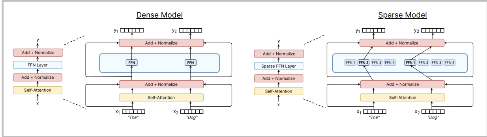

*图示：MoE 用多个专家网络替代单一 FFN，实现条件计算。*

## 二、为什么 MoE 如此流行？

1. 性能优势：相同 FLOPs，更多参数

MoE 模型在相同计算预算下，通过增加参数量（如 DeepSeek v3 总参数 671B，激活参数仅 37B）显著提升效果。实验表明，MoE 在推理、编码等任务上优于等效稠密模型。

2. 训练效率更高

MoE 的训练速度远超稠密模型。例如，在 128 H100 GPU 上，1.3B MoE（6.9B 总参数）比 1.3B 稠密模型快约 3 倍。

3. 设备并行化优势

MoE 专家可分布到多个设备上，利用数据并行性扩展模型规模，尤其适合多节点训练/推理。

## 三、MoE 架构关键：路由机制与专家设计

1. 路由算法分类

- **Token-choice（主流）**：Token 选择专家（如 Top-K）。
- **Expert-choice**：专家选择 Token（需解决匹配问题）。
- **全局优化**：通过线性分配等算法路由。

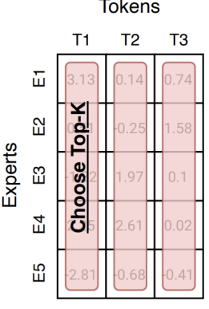

2. 主流路由变体：Top-K

- **Switch Transformer**：K=1。
- **GShard/Mixtral/Grok**：K=2。
- **Qwen/DBRX**：K=4。
- **DeepSeek v3**：K=8。

3. DeepSeek 的创新：共享专家 + 细粒度专家

- **共享专家（Shared Experts）**：常驻激活，捕获通用知识（如语法）。
- **细粒度专家（Fine-grained Experts）**：将专家切分更小，增加 specialization。
- **优势**：解决传统 MoE 的知识割裂问题，提升效果。

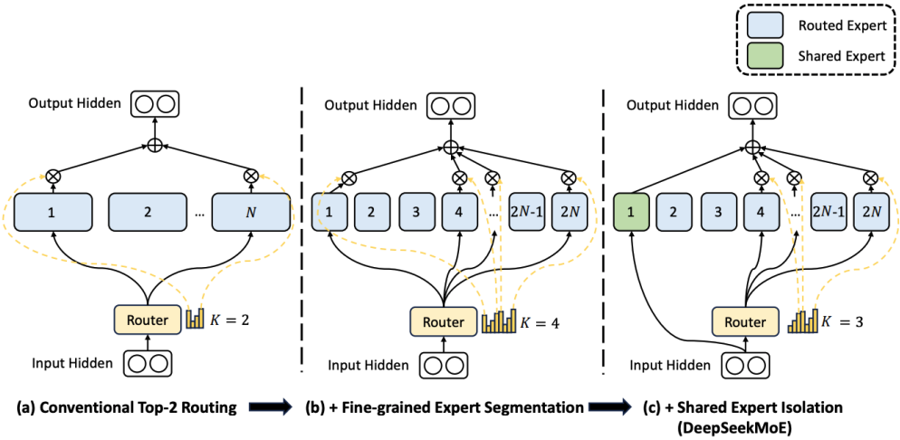

*图示：DeepSeek 的共享专家设计。*

## 四、训练 MoE 的核心挑战与解决方案

1. 挑战一：负载不均衡（Load Balancing）

- **问题**：Router 可能偏向少数专家，导致训练塌陷。

- **传统解法**：辅助损失（Auxiliary Loss）强制均衡：

  $L*{\mathrm{ExpBal}} = \alpha*1 \sum*i f*i P_i$

  其中，$f*i$ 表示专家 $i$ 被选中的频率，$P*i$ 表示专家 $i$ 的平均分数。

- **DeepSeek v3 改进**：**Aux-loss-free balancing**，通过动态偏置（bias）调整专家概率，避免辅助损失干扰主任务。

2. 挑战二：训练稳定性

- **问题**：低精度训练（bfloat16）时，Router 的 softmax 输入值过大会导致数值溢出。

- **解法**：**Z-loss** 惩罚大 logits：

  $L*z(x) = \frac{1}{B} \sum \left( \log \sum e^{x*j} \right)^2$

- **效果**：稳定训练，减少 loss 震荡。

*图示：Z-loss 有效控制梯度爆炸。*

3. 其他训练策略

- **随机扰动**：训练时对 Router 输入加噪声，提升鲁棒性，但实际效果不好。
- **微调过拟合**：MoE 参数量大，易过拟合小数据。DeepSeek 采用 1.4M SFT 数据解决。

------

## 五、DeepSeek MoE 架构演进：从 v1 到 v3

1. DeepSeek MoE v1（16B 总参数，2.8B 激活）

- 架构：2 共享专家 + 64 路由专家（激活 6 个）。
- 路由：标准 Top-K + 辅助损失（专家/设备均衡）。

2. DeepSeek MoE v2（236B 总参数，21B 激活）

- 架构：2 共享专家 + 160 路由专家（激活 10 个）。
- 创新：**Top-M 设备路由**（限制 Token 的专家位于最多 M 台设备） + 通信均衡损失。

3. DeepSeek MoE v3（671B 总参数，37B 激活）

- 架构：1 共享专家 + 256 路由专家（激活 8 个）。

- 路由：Sigmoid + Softmax Top-K + Aux-loss-free + seq-wise aux（序列级损失函数，防止推理使过多tokens输入到同一个专家里）。

- **关键技术创新**：

- **MLA（Multi-head Latent Attention）**：压缩 KV Cache，降低长上下文显存。

  MLA 是一种通过压缩键值缓存（KV Cache）来显著降低长上下文场景下显存占用的注意力技术。其核心原理是，在注意力计算前，先将原始的多个键（K）和值（V）头通过可学习的线性投影，压缩到数量更少的“潜在”（Latent）KV头中。在推理时，模型只需存储和重复使用这组压缩后的潜在KV状态，而不需要保存全部原始头的历史信息。这相当于为每个注意力层维护一个高度浓缩的上下文“摘要”，从而能够以极低的空间开销（例如将KV Cache大小压缩至原来的1/16）支持极长的文本序列处理。

- **MTP（Multi-token Prediction）**：预测多 token，加速训练。

  MTP 是一种在训练阶段让语言模型同时预测后续多个令牌（Token），以实现训练加速和推理能力提升的技术。与传统模型只预测下一个词不同，MTP 在模型的多个输出头（例如4个）上并行地预测当前位置之后第1、2、3、4个词。这种训练目标强制模型不仅要学习即时的词元关联，还必须构建更长程的、更全局的上下文表征，以规划未来的输出序列。其核心收益是大幅提升**数据效率**和**训练收敛速度**，因为模型从每个训练样本中学习到了更丰富的序列结构信息，最终产出的模型在标准推理任务上通常具备更强的性能和更快的推理速度。

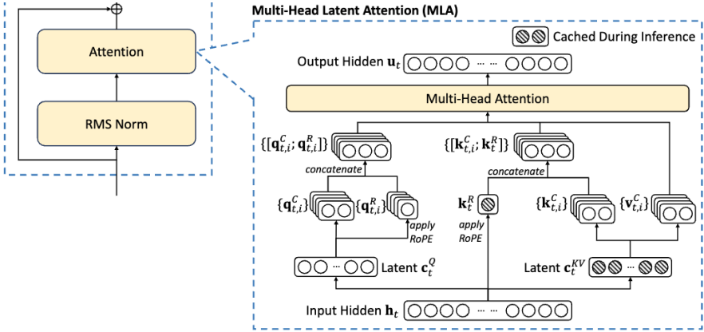

*图示：MLA 通过潜在向量压缩 KV Cache。*

# Lecture 05: 详解GPU架构，性能优化

## 一、GPU架构深度解析 (GPU In-depth)

1. GPU与CPU的核心区别

- **CPU**: 优化**延迟（Latency）**，擅长处理复杂控制流和分支，核心少但强。
- **GPU**: 优化**吞吐量（Throughput）**，采用SIMT（单指令多线程）模型，核心极多但简单，适合大规模并行计算。
- 关键差异：GPU线程轻量级，易于启停；分支支持弱，控制分歧会带来开销。

2. GPU的解剖学：执行单元与内存层次

执行单元：SM（Streaming Multiprocessor）

- GPU由多个SM组成，每个SM包含许多SP（Streaming Processor）和专用硬件（如Tensor Core）。
- **Tensor Core**: 专用于矩阵乘法（MatMul），性能比普通浮点运算快10倍以上。

内存层次：速度与成本的权衡

- 越靠近SM的内存越快，但容量越小：
- **寄存器（Registers）**: 线程私有，最快。
- **L1缓存/共享内存（Shared Memory）**: 位于SM内部，SRAM材质，速度极快（~19TB/s），但容量小（每SM几百KB）。
- **L2缓存**: 片上共享缓存。
- **全局内存（Global Memory）**: DRAM材质（如HBM），容量大但速度慢（~1.5TB/s），是主要瓶颈。
- SRAM比DRAM快约8倍，但成本高100倍。

3. 执行模型：线程、块与Warp

- **Thread（线程）**: 最小执行单位，执行相同指令但处理不同数据（SIMT）。

- **Block（线程块）**: 一组线程，运行在同一SM上，共享共享内存。

- **Warp（线程束）**: 硬件调度基本单位，包含32个连续线程，同步执行。

- **Grid**: 一组Block。

  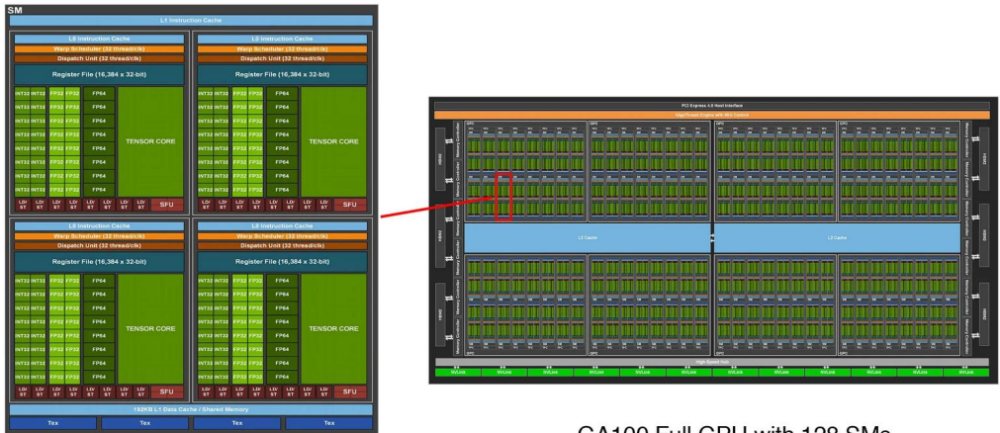

4. 计算扩展与内存墙（Compute vs. Memory Scaling）

- **计算扩展**: 通过并行化（如GPU）驱动算力增长，过去10年实现>1000倍提升。
- **内存墙**: FLOPs增长快于内存带宽，导致计算单元常因等待数据而空闲。

## 二、GPU性能优化关键技术

核心目标：避免内存瓶颈，提高算术强度（Arithmetic Intensity）

- **算术强度** = 计算操作数 / 内存访问字节数。目标是通过减少内存访问或增加计算来提升强度。

优化技巧1: 低精度计算（Low Precision）

- 使用FP16/BF16替代FP32：
- 内存访问量减半（FP16为4字节 vs. FP32为8字节）。
- Tensor Core对低精度有硬件加速。
- 示例：ReLU操作在FP16下算术强度提升（4字节/FLOP vs. 8字节/FLOP）。

优化技巧2: 算子融合（Operator Fusion）

- **问题**: 多个独立操作（如`sin(x) + cos(x)`）会启动多个CUDA内核，导致反复读写全局内存。
- **解决**: 将多个点操作融合到单一内核中，中间结果在寄存器或共享内存中传递。
- 现代编译器（如PyTorch的`torch.compile`）可自动完成简单融合。

优化技巧3: 重计算（Recomputation）

- **问题**: 保存前向传播的激活值（Activations）消耗大量显存。

- **解决**: 丢弃部分激活值，在反向传播时重新计算，以计算换内存。

- 示例：3层Sigmoid堆叠，重计算可减少62.5%的内存访问。

  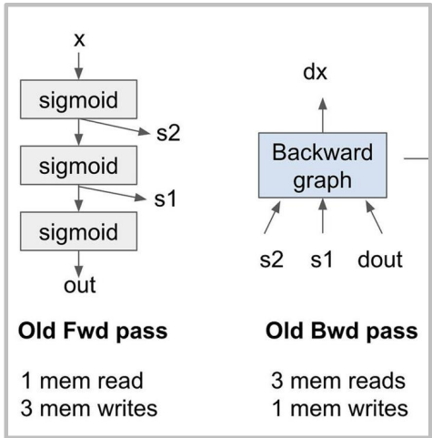

  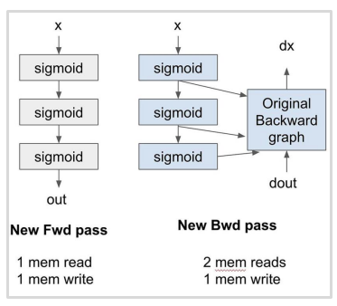

优化技巧4: 内存合并（Memory Coalescing）

- **原理**: DRAM以突发模式（Burst Mode）读取数据，一次读取连续内存块。

- **优化**: 确保一个Warp（32线程）同时访问连续内存地址，避免非合并访问。

  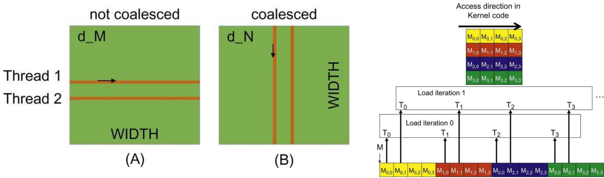

- 应用：矩阵乘法中，线程应沿**列方向**访问以实现合并。

优化技巧5: 分块（Tiling）——最关键的技术

- **原理**: 将大数据切分成小块（Tiles），利用共享内存（SRAM）的高带宽复用数据。
- **步骤**:

1. 从全局内存加载Tile到共享内存。
2. 在共享内存上计算部分结果。
3. 写回最终结果。

- **优势**: 全局内存访问量减少T倍（T为Tile大小）。

  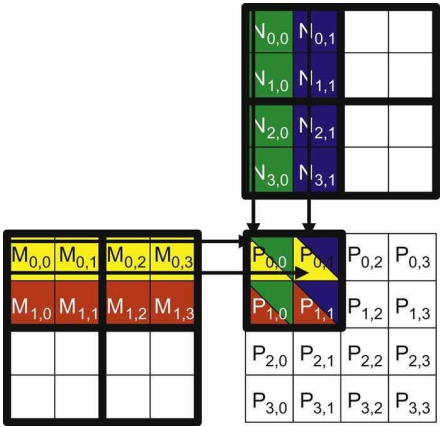

- **挑战**:

- **Tile大小**: 需兼顾内存对齐、共享内存容量和矩阵维度可分性。

- **Wave Quantization**: 如果矩阵大小不能被SM数量整除，会导致尾部利用率低（如A100有108个SM，120个Tile会降低性能）。

## 三、FlashAttention原理拆解

1. 标准注意力计算的问题

- 公式：$\text{Attention}(Q, K, V) = \text{softmax}\left(\frac{QK^T}{\sqrt{d_k}}\right)V$
- 瓶颈：中间矩阵$QK^T$（尺寸$N \times N$，$N$为序列长度）需写入全局内存，导致$O(N^2)$内存访问。

2. FlashAttention的解决方案：分块与重计算

- **核心思想**: 通过分块（Tiling）和在线Softmax（Online Softmax）避免生成大中间矩阵，直接计算输出。

- **技巧A: 分块（Tiling）**

- 将Q、K、V切块，在共享内存中逐块计算Attention Score。

  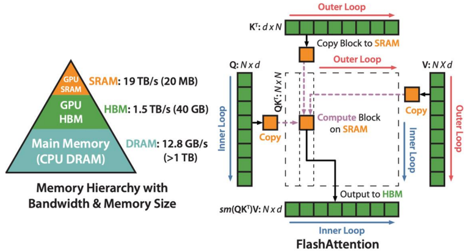

- **技巧B: 在线Softmax（Online Softmax）**

- 难题：Softmax需全局最大值和求和，无法直接分块。

- 解决：使用数学技巧（Telescoping Sum）增量计算：

  - 维护运行最大值$m*j$和累加和$d*j$。
  - 公式：$m*j = \max(m*{j-1}, x*j), \quad d*j = d*{j-1} \times e^{m*{j-1} - m*j} + e^{x*j - m_j}$
  - 使得Softmax可逐块计算。

  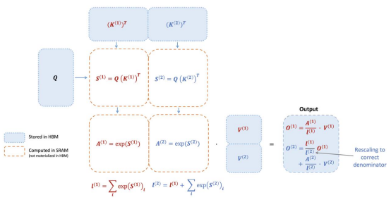

  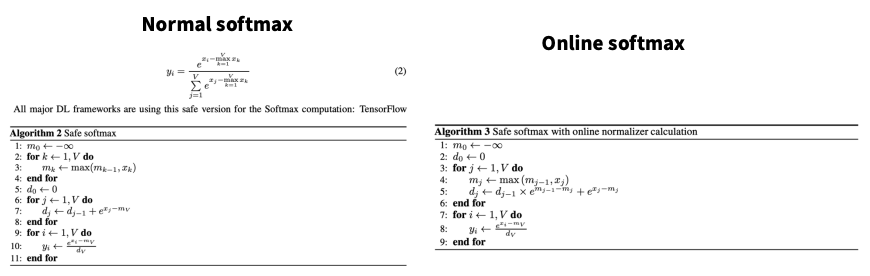

- **技巧C: 重计算（Recomputation）**

  - 在反向传播中，不存储前向的Attention Matrix，而是重新计算Tile-by-Tile。

3. 整体流程

- 前向传播：融合分块、在线Softmax和算子融合，减少全局内存访问。
- 反向传播：通过重计算节省显存。

# Lecture 06: 手写高性能算子

## **一、性能基准测试与分析基础 (Benchmarking & Profiling)**

**1. GPU 执行模型与性能瓶颈**

*   **计算 vs. 内存 (Compute vs. Memory)**：
    *   **比喻**：将 GPU 的 SRAM（L1 Cache/Shared Mem）比作**工厂车间**，将 DRAM（Global Memory）比作**远处的仓库**。
    *   **瓶颈判断**：
        *   **Compute-bound (计算受限)**：如矩阵乘法 (MatMul)。数据在车间里停留很久进行大量加工，瓶颈在于工人的计算速度。
        *   **Memory-bound (内存受限)**：如 GeLU, Softmax, Norm。加工很简单，大量时间花在去仓库取货和送货上。深度学习中除了 MatMul/Conv，绝大多数算子都是 Memory-bound。
*   **算术强度 (Arithmetic Intensity)**：衡量标准是 `FLOPs / Bytes`。A100 GPU 的计算吞吐量极高，只有当算术强度足够高时，才能跑满算力。

**2. 基准测试 (Benchmarking) 的正确方法**

*   **异步执行陷阱**：GPU 执行是异步的。Python 发出命令后会立刻返回，而 GPU 还在后台干活。
*   **关键步骤**：
    *   必须使用 `torch.cuda.synchronize()` 来等待 GPU 完成任务，否则测得的只是 Python 发射命令的时间（Kernel Launch overhead）。
    *   **Warm-up (预热)**：先跑几次不计时的循环，让 GPU 进入高性能状态（Boost clock）并初始化缓存。
    *   **多次测量取平均**：消除系统抖动带来的误差。

**3. 性能分析 (Profiling)**

*   **工具**：主要使用 `torch.profiler` 生成 trace 文件，然后在 Chrome (`chrome://tracing`) 或 Perfetto 中查看。
*   **看什么？**
    *   **Kernel Gaps**：算子之间是否有大片空白？这通常意味着 CPU 调度太慢，GPU 在空转（GPU Starvation）。
    *   **Kernel Names**：如果你看到大量的 `aten::add`, `aten::mul`, `aten::tanh` 分开执行，说明没有进行算子融合，导致了频繁的内存读写。

## **二、算子融合 (Kernel Fusion) 与优化原则**

这是提升 Memory-bound 算子性能最关键的手段。

1. 融合的动机：减少 DRAM 访问

*   **未融合 (Unfused)**：以 GeLU 为例 (`x * 0.5 * (1 + tanh(...))`)。
    *   PyTorch 默认会启动多个 Kernel：`mul` -> 写回 DRAM -> `add` -> 写回 DRAM -> `tanh` -> ...
    *   数据在 DRAM 和 SRAM 之间反复搬运，浪费带宽。
*   **融合 (Fused)**：
    *   编写一个 Kernel，将数据从 DRAM 读入 SRAM 后，在 SRAM 内一次性完成所有加减乘除运算，最后只写回一次结果。
    *   **收益**：对于 GeLU 这种操作，融合后的速度通常是原生 PyTorch 的数倍。

2. 编译器魔法：`torch.compile`

*   **PyTorch 2.0 的核心**：这是一个即时编译器 (JIT)。
*   **工作原理**：
    *   它捕获 PyTorch 的计算图（Graph Capture）。
    *   自动识别可以融合的算子序列（如一系列的 element-wise 操作）。
    *   在后台生成高效的 **Triton Kernel** 并编译成机器码。
*   **效果**：只需一行代码，就能获得接近手写 Triton 算子的性能，是日常优化的首选。

## **三、GPU 编程实战：从 CUDA 到 Triton**

当 `torch.compile` 不够用，或者需要开发自定义算子时，就需要手写 Kernel。

**1. CUDA (C++)：底层的极致控制**

*   **特点**：
    *   基于 **Thread (线程)** 的编程模型。
    *   开发者需要手动计算 `global_index = blockIdx * blockDim + threadIdx`。
    *   需要手动管理 Shared Memory 的加载和同步，极易出错。
*   **适用性**：适合开发通用的、极度底层的库（如 FlashAttention 的某些核心实现），但开发效率低，门槛高。

**2. Triton (Python)：现代 GPU 编程的新标准**

*   **抽象层级**：基于 **Block (块)** 的编程模型。
    *   不再操作单个线程，而是操作一个 Tensor Block（例如 `128x128` 的数据块）。
*   **Triton 核心语法**：
    *   **Pointers**：生成指向数据块的指针网格 (`tl.arange`, `tl.program_id`)。
    *   **Load/Store**：`tl.load(ptr, mask=...)` 将数据块从 DRAM 加载到 SRAM。
    *   **Compute**：直接对加载后的变量使用标准数学符号 (`+`, `-`, `tl.exp`)，就像写 NumPy 一样。
*   **Triton 的优势**：
    *   **自动优化**：编译器自动处理内存合并访问 (Memory Coalescing) 和 Shared Memory 的分配，避免了 CUDA 中最头疼的 Bank Conflict 问题。
    *   **开发效率**：用 Python 写，代码量仅为 CUDA 的 1/5 左右。

## **四、进阶案例分析：Softmax 与 矩阵乘法**

课程通过两个经典算子展示了不同复杂度的优化策略。

**1. Softmax (Reduction 操作)**

*   **挑战**：需要对一行数据求和/求最大值，这涉及到线程间的数据依赖。
*   **优化逻辑**：
    *   **行读取**：每个 Block 负责处理矩阵的一行（或多行）。
    *   **SRAM 计算**：将整行数据加载到 SRAM。
    *   **在线更新**：在 SRAM 内部进行 Max 和 Sum 的规约计算，不需要反复写回 DRAM。
    *   **数值稳定性**：先减去最大值再求 exp，防止溢出。Triton 可以很自然地描述这一过程。

**2. 矩阵乘法 (Matrix Multiplication - MatMul)**

*   **挑战**：计算密集型 (Compute-bound)。$N^3$ 的计算量，只有 $N^2$ 的数据量。
*   **关键技术：分块 (Tiling)**：
    *   如果直接算，数据复用率低。
    *   将输出矩阵 C 切分为小块（例如 `128x128`）。
    *   将 A 和 B 对应的条带切分为小块（例如 `128x32` 和 `32x128`）。
    *   将这些小块加载到 Shared Memory (L1 Cache) 中。
    *   **累加器 (Accumulator)**：在寄存器中维护结果 C 的中间值，反复利用加载到 SRAM 中的 A 和 B 进行计算，最大化算术强度。
*   **L2 Cache 优化 (Swizzling)**：
    *   改变 Block 的执行顺序，使得相邻的 Block 访问内存中相邻的数据，从而提高 L2 Cache 的命中率。

# Lecture 07: 详解大模型并行化策略

## 一、并行训练的背景与核心挑战

随着深度学习模型规模的指数级增长（从 BERT 到 GPT-3、Megatron-Turing NLG），单张 GPU 的物理极限已远远无法满足训练需求。这催生了对大规模分布式并行训练技术的迫切需求。

1. 两大物理瓶颈

*   **算力瓶颈 (Compute Limits):**
    *   摩尔定律放缓，单卡算力增长速度远不及模型 FLOPs（浮点运算量）的增长速度。
    *   即使是顶级超算（Exaflops 级别），训练一个万亿参数模型也需要数月。
*   **显存瓶颈 (Memory Limits - The Real Killer):**
    *   **参数占用:** 仅存储模型参数就需要巨大空间（如 175B 模型约需 350GB FP16 显存）。
    *   **训练状态占用:** 训练过程中的显存消耗远超参数本身。**Adam 优化器**是显存大户，每 1 个参数需要约 **16-20 Bytes** 的显存空间：
        *   FP16 Model Parameters (2 bytes)
        *   FP16 Gradients (2 bytes)
        *   FP32 Master Weights (4 bytes)
        *   FP32 Optimizer States (First Moment + Second Moment) (8 bytes)
    *   **结论:** 单张 80GB 显存的 GPU 甚至无法启动（OOM）这些大模型的训练。

## 二、基础通信原语 (Collective Communication)

多卡训练的核心在于卡与卡之间的数据交换。理解通信原语及其开销是设计并行策略的前提。

1. 五种基础操作

*   **Broadcast:** 将数据从一个节点广播给所有节点。
*   **Reduce:** 将所有节点的数据汇总（如求和）到一个节点。
*   **All-Gather:** 每个节点广播自己的一部分数据，最终所有节点都拥有全量数据。
*   **Reduce-Scatter:** 对数据求和，但每个节点最终只保留求和结果中的一部分。
*   **All-Reduce:** 所有节点最终都得到所有数据的完整求和结果（这是分布式训练中最常见的操作，用于同步梯度）。

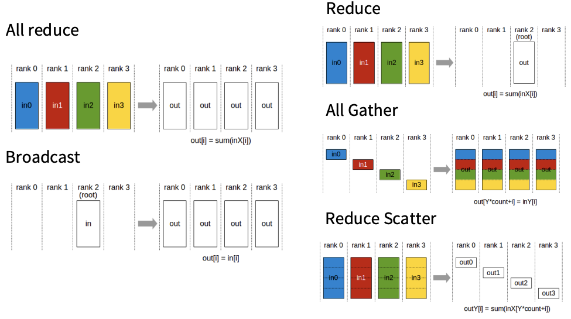

2. 关键优化：Ring All-Reduce

在带宽受限的网络环境下，直接做 All-Reduce（星型拓扑）会导致中心节点拥堵。工业界通常将其拆解为两步实现，这对于理解 **ZeRO** 算法至关重要：
*   **Step 1: Reduce-Scatter:** 大家交换并求和，但每人只保留一小块结果。此时通信量为 $1 \times \text{DataSize}$。
*   **Step 2: All-Gather:** 大家交换各自手里的一小块结果，拼成完整数据。此时通信量为 $1 \times \text{DataSize}$。
*   **总通信量:** $2 \times \text{DataSize}$。

## 三、并行策略一：数据并行 (Data Parallelism)

这是最直观的并行方式，通过增加 GPU 数量来通过更大的 Batch Size 加速训练。

1. 朴素数据并行 (Naïve DDP)

*   **原理:** 每个 GPU 复制一份**完整**的模型参数。将大 Batch 切分为小份分给各 GPU。反向传播后，通过 All-Reduce 同步梯度。
*   **局限:** 仅解决了算力问题，未解决显存问题。每个 GPU 都存储了冗余的参数、梯度和优化器状态。对于大模型，这种冗余是不可接受的。

2. ZeRO (Zero Redundancy Optimizer)

微软提出的 ZeRO 算法核心思想是：**消除数据并行中的内存冗余 (Shard Everything)**。它利用 Reduce-Scatter 和 All-Gather 的特性，将存储压力分摊到所有 GPU 上。

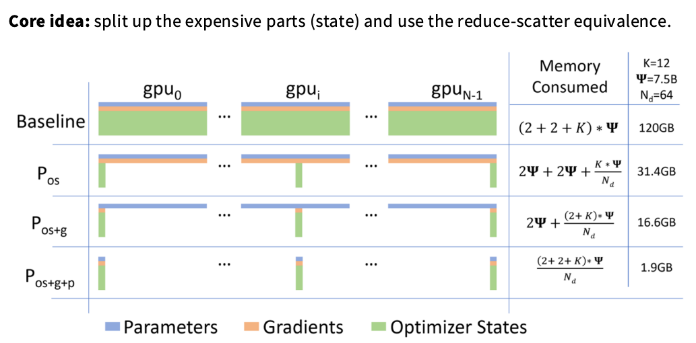

*   **ZeRO Stage 1 (Optimizer State Sharding):**
    *   **切分对象:** 优化器状态（占显存大头）。
    *   **机制:** 每张卡只维护它负责的那一部分参数的优化器状态。更新参数时，各卡并行更新自己负责的部分。
    *   **收益:** 显存显著下降，且**通信量不增加**（依然是 $2 \times$ 参数量）。这是“免费的午餐”。

    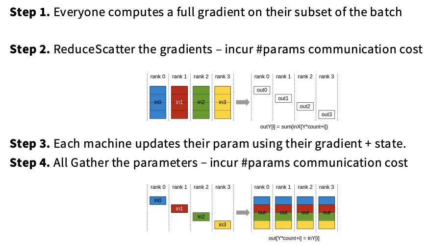

*   **ZeRO Stage 2 (Gradient Sharding):**
    *   **切分对象:** 梯度。
    *   **机制:** 梯度计算出来后（每个layer）立刻执行 Reduce-Scatter，只保留本地负责的那一小块梯度，释放其余部分。

    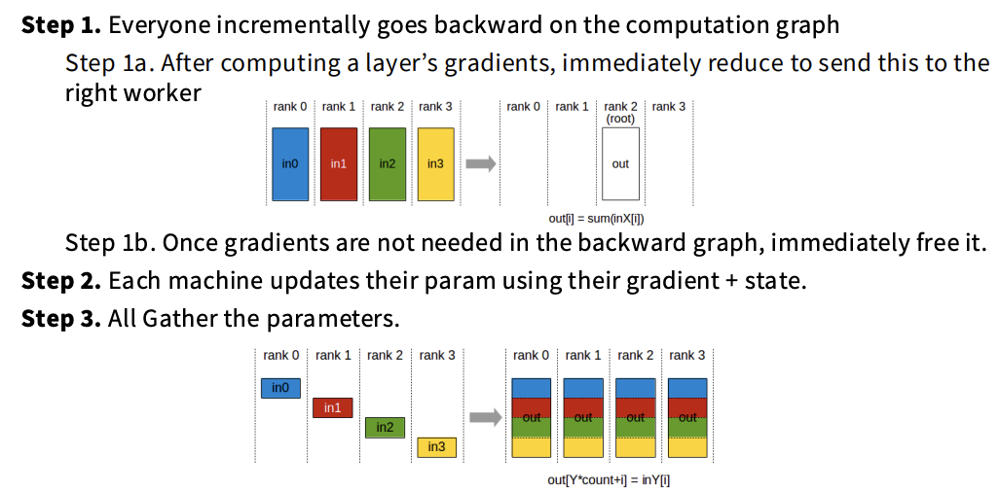

*   **ZeRO Stage 3 (Parameter Sharding / FSDP):**

    *   **切分对象:** 模型参数。
    *   **机制:** 显存中平时不存完整参数。计算某层时，临时通过 All-Gather 从其他卡拉取参数，算完立刻释放。
    *   **代价:** 通信量增加（约为 $3 \times$ 参数量），且对网络延迟敏感。

    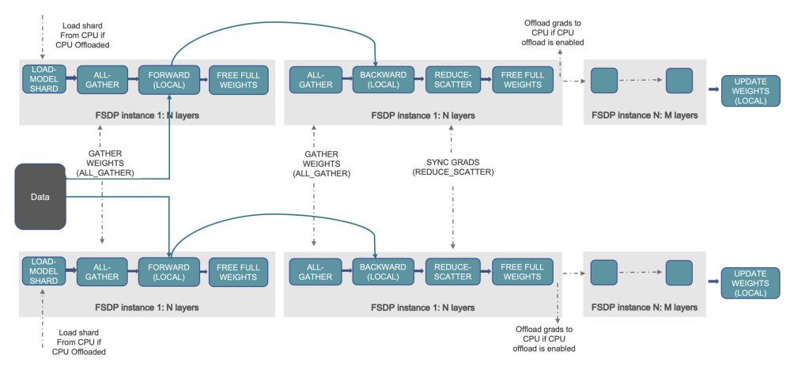

    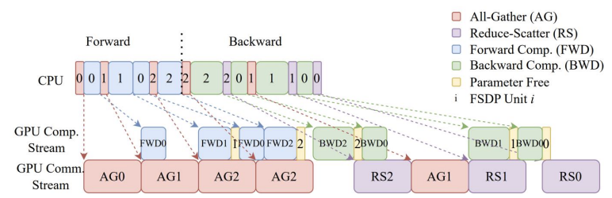

## 四、并行策略二：模型并行 (Model Parallelism)

当单卡显存连 ZeRO 切分后的模型分片都装不下时（或者为了追求极低的延迟），需要拆解模型结构本身。

1. 流水线并行 (Pipeline Parallelism, PP)

* **原理:** 将模型的**深度 (Layers)** 进行切分。例如 GPU 0 负责 Layer 1-10，GPU 1 负责 Layer 11-20。

  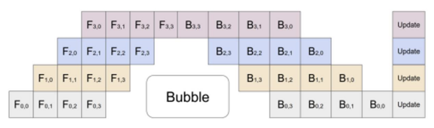

* **痛点:** **空泡 (Bubble)**。下游 GPU 必须等待上游计算完成，导致大量空闲时间。

* **优化 (1F1B & Micro-batches):** 将一个 Batch 切分为多个 Micro-batches，让流水线快速流动起来，减少空泡时间。

  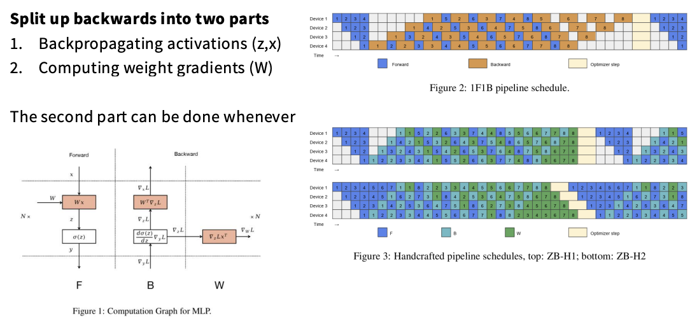

*   **适用场景:** 通信量极小（仅传输层间激活值），适合**跨节点 (Inter-node)** 部署。

2. 张量并行 (Tensor Parallelism, TP)

* **原理:** 将模型的**宽度 (Tensors)** 进行切分。深入到矩阵乘法 $Y=XA$ 内部。

*   **Transformer 实现:**
    
    *   利用 Transformer 中 MLP 和 Attention 包含两个连续矩阵乘法的特点。
    *   **Column Parallel:** 第一个矩阵按列切分。
    *   **Row Parallel:** 第二个矩阵按行切分。
    *   **妙处:** 两个矩阵中间的激活函数不需要通信。只有在最后需要一次 **All-Reduce**。
    
* **代价:** 通信量极大（每一层都要 All-Reduce）。

* **适用场景:** 必须在拥有极高带宽（如 NVLink）的**单机内部 (Intra-node)** 使用。

  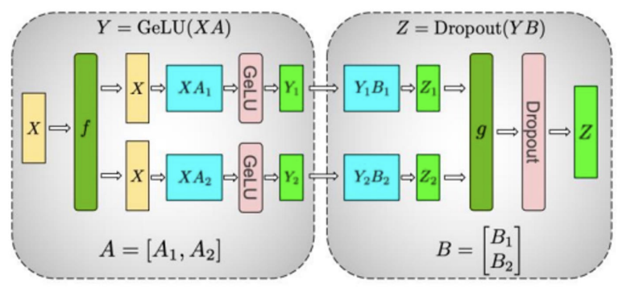

## 五、并行策略三：序列并行 (Sequence Parallelism)

1. 解决激活显存瓶颈

* **问题:** 即使使用了 TP，在 LayerNorm 和 Dropout 层，每个 GPU 仍需存储完整的激活值。随着序列长度（Context Length）增加，这部分显存开销巨大。

*   **原理:**
    *   在非矩阵乘法层（LayerNorm/Dropout），将数据沿着**序列维度 (Sequence Dimension)** 切分。
    *   GPU 0 处理前半段 Token，GPU 1 处理后半段 Token。
    
* **结合 TP:** 利用 TP 本身需要的 All-Reduce 操作，将其拆解为 Reduce-Scatter + All-Gather，并在两步之间插入序列并行计算，从而实现显存节省而不增加额外通信。

  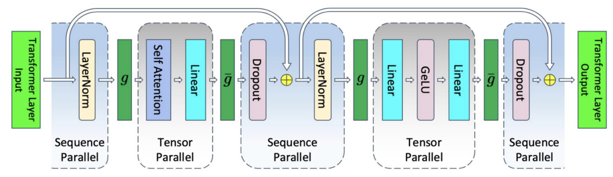

## 六、总结：架构设计与最佳实践

1. 策略对比表 (Trade-offs)

|                                | 同步开销 (Sync overhead)         | 显存扩展性 (Memory Scaling) | 带宽需求 (Bandwidth)                 | 批大小影响 (Batch size) | 易用性 (Easy to use?) |
| :----------------------------- | :------------------------------- | :-------------------------- | :----------------------------------- | :---------------------- | :-------------------- |
| **DDP / ZeRO1**                | 每个 Batch 同步一次              | **无扩展 (No scaling)**     | 2 * 参数量                           | **线性增长 (Linear)**   | 非常易用              |
| **FSDP (ZeRO3)**               | **每个 FSDP 块同步 3 次**        | 线性扩展 (Linear)           | 3 * 参数量                           | **线性增长 (Linear)**   | 非常易用              |
| **Pipeline (流水线并行)**      | 每个 Pipeline 同步一次           | 线性扩展 (Linear)           | 仅传输激活值 (Activations)           | **线性增长 (Linear)**   | **难 (No)**           |
| **Tensor+seq (张量+序列并行)** | **每个 Transformer 块同步 2 次** | 线性扩展 (Linear)           | **8 * 激活值 (每层都要 All-Reduce)** | 无影响 (No impact)      | **难 (No)**           |

2. 3D 并行架构设计 (Rules of Thumb)

构建千卡集群训练大模型时的通用设计法则：

1.  **最内层 (Intra-node):** 使用 **Tensor Parallel (TP)**。
    *   利用单机内 NVLink 的高带宽，将模型切分到 8 张卡上。
2.  **中间层 (Inter-node):** 使用 **Pipeline Parallel (PP)**。
    *   如果 TP 后模型还装不下，在机器之间使用 PP，利用其低通信量的特点。
3.  **最外层 (Scaling):** 使用 **Data Parallel (DP) / ZeRO**。
    *   当模型已经能跑起来后，剩下的所有 GPU 资源全部用于数据并行，通过增大 Batch Size 来加速训练收。

3. 其他并行策略

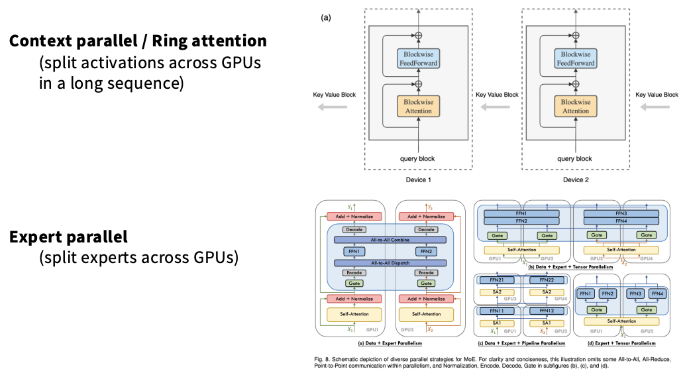

1. Context Parallel / Ring Attention (上下文并行 / 环状注意力)

**针对场景：** 训练超长文本模型（例如 128k, 1M context window）。

*   **核心痛点：**
    传统的并行方式（如 Tensor Parallel）虽然切分了模型参数，但每张 GPU 上仍然需要存储完整的序列（Sequence）。Attention 机制的显存占用是序列长度的平方 ($O(N^2)$)。当序列极长时，单张 GPU 的显存会被巨大的 KV Cache 和 Attention Matrix 撑爆。

*   **原理解析（右上角图示）：**
    *   **切分序列：** 将长序列切成多段，分给不同的 GPU（Device 1, Device 2）。
    *   **Ring（环状）通信：**
        *   图中的 **Query Block** 是竖直向上的，表示 Query ($Q$) 留在本地不动。
        *   关键在于灰色的向左箭头 **Key Value Block**。这表示 Key ($K$) 和 Value ($V$) 数据块在 GPU 之间像“旋转寿司”一样流转。
    *   **计算过程：** Device 1 先用自己的 $K,V$ 计算 Attention，然后接收 Device 2 传来的 $K,V$ 再算一遍。这样，Device 1 就能在不存储完整全量 KV 的情况下，计算出全局的 Attention。

*   **价值：** 它是实现百万级 Token 训练的关键技术。

2. Expert Parallel (专家并行)

**针对场景：** 训练 **MoE (Mixture of Experts)** 架构模型的TP（如 GPT-4, DeepSeek-V3, Mixtral 8x7B）。

*   **核心痛点：**
    MoE 模型的特点是“参数量巨大，但计算量小”。它可能有 8 个甚至 64 个 FFN（前馈神经网络）层作为“专家”，但每次只激活其中 1-2 个。如果每个 GPU 都存所有专家的参数，显存极其浪费且存不下。

*   **原理解析（右下角图示）：**
    *   **切分专家：** 将不同的专家网络（FFN1, FFN2...）分配给不同的 GPU 维护。例如图 (a) 中，GPU 1 只有 `FFN1`，GPU 2 只有 `FFN2`。
    *   **All-to-All 通信（核心机制）：**
        *   图 (a) 中间的蓝色区域展示了 `All-to-All Dispatch` 和 `All-to-All Combine`。
        *   **Dispatch (分发)：** 当 Token 进入模型，Gate（门控）决定它需要由哪个专家处理。如果 Token 在 GPU 1 但它的专家在 GPU 2，这个 Token 就会通过网络被“发送”到 GPU 2。
        *   **Combine (聚合)：** 专家处理完后，结果再被“发送”回原来的 GPU。
    *   **混合模式：** 图 (b), (c), (d) 展示了 Expert Parallel 如何与 Tensor Parallel (TP) 和 Pipeline Parallel (PP) 极其复杂地结合在一起，以训练万亿参数级别的模型。

*   **价值：** 允许模型参数量极度膨胀（增加“知识量”），同时保持推理和训练的计算成本较低。

# Lecture 08: 手撕大模型并行训练

**核心主题**：通过编排计算（Orchestrate computation）来避免跨 GPU/节点的数据传输瓶颈。相比于单 GPU 内通过融合（Fusion）和分块（Tiling）减少内存访问，多 GPU 场景下主要通过**复制（Replication）**和**分片（Sharding）**来减少通信。

## 一、 硬件与通信基础

本部分介绍了分布式计算的硬件层级和软件抽象。

1. **硬件层级结构 (Hierarchy)**
   计算单元（ALU）与数据（Input/Output）的距离决定了访问速度，形成了从快/小到慢/大的层级：
    *   **单节点单 GPU**：L1 Cache / Shared Memory（最快）。
    *   **单节点单 GPU**：HBM (High Bandwidth Memory)。
    *   **单节点多 GPU**：NVLink（例如 H100 上通过 NVLink 4.0 连接，总带宽约 900GB/s）。
    *   **多节点多 GPU**：NVSwitch 或以太网（Ethernet，约 200MB/s，最慢）。
   *注意：HBM 的带宽（3.9 TB/s）远高于 NVLink，而 NVLink 又远高于 PCIe/Ethernet。*

2. **集合通信操作 (Collective Operations)**
   这是分布式编程的概念原语（Primitives），用于定义多个节点（Rank）间的数据通信模式。
    *   **基本概念**：
        *   **World Size**：设备总数（例如 4 个 GPU）。
        *   **Rank**：当前设备的 ID（例如 0, 1, 2, 3）。
    *   **常见操作**：
        *   **Broadcast**：将数据从一个节点广播给所有节点。
        *   **Scatter**：将数据切分并散发给不同节点。
        *   **Gather**：从所有节点收集数据到一个节点。
        *   **Reduce**：将所有节点的数据进行规约运算（如 Sum, Min, Max）到一个节点。
        *   **All-gather**：所有节点都收集到所有数据（相当于每个节点都做 Gather）。
        *   **Reduce-scatter**：对数据做规约，但结果分散在不同节点上。
        *   **All-reduce**：所有节点都得到规约后的完整结果。
    *   **重要公式**：`All-reduce = Reduce-scatter + All-gather`。即先归约并分散，再全收集。

3. **软件实现 (NCCL & PyTorch)**
    *   **NCCL (NVIDIA Collective Communication Library)**：
        *   检测硬件拓扑（NVLink, PCIe, Switches）。
        *   优化 GPU 间的通信路径。
        *   启动 CUDA kernels 进行数据收发。
    *   **PyTorch Distributed (`torch.distributed`)**：
        *   提供简洁的 Python 接口（如 `dist.all_reduce`）。
        *   支持多种后端（GPU 使用 `nccl`，CPU 使用 `gloo`）。

## 二、 分布式训练策略

1. **数据并行 (Data Parallelism, DDP)**

   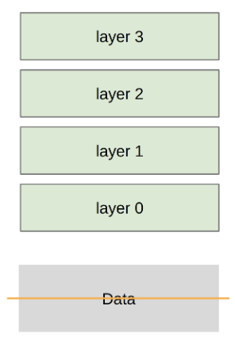

   *   **切分维度**：**Batch** 维度。
   *   **原理**：
       *   每个 Rank 拥有完整的模型参数副本。
       *   每个 Rank 处理数据的一个切片（Local Batch）。
       *   在前向传播计算 Loss，反向传播计算梯度。
   *   **通信点**：在反向传播后，对**梯度（Gradients）**进行 **All-reduce**（取平均）。
   *   **结果**：更新后，所有 Rank 的参数保持一致。
   *   **适用性**：最常用的基线策略。
   *   **代码示例**：
       ```python
       # 假设 world_size=4, rank 为当前 GPU 编号
       # 1. 数据切分：每个 Rank 获取不同的数据切片 (Batch维度切分)
       x_local = data_global[rank * local_bs : (rank + 1) * local_bs]
        
       # 2. 本地计算 (Forward & Backward)
       # 模型副本在每个 GPU 上是相同的
       output = model(x_local)
       loss = criterion(output, target_local)
       loss.backward() # 此时 model.weight.grad 是基于局部数据的梯度
        
       # 3. 通信：All-Reduce 梯度
       # 将所有 Rank 的梯度相加并平均，保证所有 GPU 更新步调一致
       for param in model.parameters():
           dist.all_reduce(param.grad.data, op=dist.ReduceOp.AVG)
        
       # 4. 参数更新 (所有 Rank 执行相同的更新)
       optimizer.step()
       ```

2. **张量并行 (Tensor Parallelism)**

   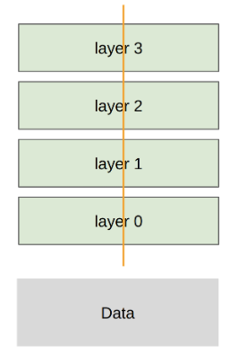

   *   **切分维度**：**Width** 维度（如隐藏层维度）。
   *   **原理**：
       *   每个 Rank 只存储模型每一层参数的一部分（例如 1/4 的权重矩阵）。
       *   计算时，每个 Rank 计算局部结果。
   *   **通信点**：在每一层的计算过程中，通常需要通信。
       *   例如：计算 `X @ W` 后，为了进行下一层计算或激活函数，可能需要 **All-gather** 收集完整的激活值（Activations），或者在部分和计算后进行规约。
   *   **适用性**：单层参数过大无法放入单个 GPU 显存时。
   *   **代码示例 (列并行 Column Parallelism)**：
       ```python
       # 假设 W 形状为 [D, H]，切分为两份 [D, H/2]
       # Rank 0 持有 W_left, Rank 1 持有 W_right
       w_local = W_global.chunk(chunks=2, dim=1)[rank]
        
       # 1. 局部矩阵乘法
       # 输入 X 是完整的 (通常由上一层的 All-gather 得到)
       # z_local 形状为 [Batch, H/2] (部分结果)
       z_local = torch.matmul(x, w_local)
        
       # 2. 通信：All-Gather 激活值
       # 为了进行非线性激活(ReLU)或下一层计算，往往需要完整的 Z
       z_global_list = [torch.zeros_like(z_local) for _ in range(world_size)]
       dist.all_gather(z_global_list, z_local)
        
       # 拼接得到完整的 Z: [Batch, H]
       z_global = torch.cat(z_global_list, dim=1)
        
       # 3. 激活函数
       a = torch.relu(z_global)
       ```

3. **流水线并行 (Pipeline Parallelism)**

   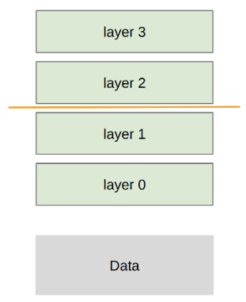

   *   **切分维度**：**Depth** 维度（即层数，Layers）。
   *   **原理**：
       *   模型被切分为多个阶段，每个 Rank 负责模型的一部分层（例如 Rank 0 负责 Layer 0-3，Rank 1 负责 Layer 4-7）。
       *   数据在 Rank 之间流动。
   *   **通信点**：Rank 之间通过 **Send/Recv** 点对点通信传递激活值（Activations）。
   *   **优化 (Micro-batches)**：
       *   为了减少“气泡”（Pipeline Bubble，即等待数据的空闲时间），将一个 Batch 切分为多个 **Micro-batches**。
   *   **挑战**：需要处理通信与计算的重叠（Overlap）以及复杂的流水线调度。
   *   **代码示例**：
       ```python
       # 简单的 Send/Recv 逻辑示意
       if rank == 0:
           # Stage 1: 计算前半部分层
           out_0 = model_part_1(x)
           # 通信：将中间激活值发送给 Rank 1
           dist.send(tensor=out_0, dst=1)
       
       elif rank == 1:
           # Stage 2: 接收数据
           in_1 = torch.zeros(expected_shape).to(rank)
           dist.recv(tensor=in_1, src=0)
           # 计算后半部分层
           out_1 = model_part_2(in_1)
           # 计算 Loss 并反向传播...
       ```

## 三、 总结

1. **并行维度的选择**
    *   **Batch 维度** -> 数据并行 (Data Parallelism)。
    *   **Width 维度** -> 张量并行 (Tensor/Expert Parallelism)。
    *   **Depth 维度** -> 流水线并行 (Pipeline Parallelism)。
    *   **Sequence 维度** -> 序列并行 (Sequence Parallelism)。
2. **权衡 (Trade-offs)**
    *   可以通过重计算（Re-compute）、存储在内存中、或存储在其他 GPU 并通信来解决显存/计算限制。
    *   随着硬件速度提升，模型规模也在扩大，因此这种层级化的并行结构（Hierarchical Structure）将持续存在。
3. **核心逻辑**
    *   所有的分布式策略本质上都是定义“谁拥有哪部分数据/参数”以及“何时进行通信”。PyTorch 提供了底层的原语让开发者可以从头构建这些策略。

4. **JAX简介**

   JAX 利用 **XLA (Accelerated Linear Algebra)** 编译器，旨在将分布式通信的复杂性自动化，而不是像 PyTorch 那样需要手动插入通信原语。

   1.  **核心理念：SPMD (Single Program, Multiple Data)**
       *   开发者只需编写针对单一数据的计算逻辑（Single Program）。
       *   通过编译器将其应用到跨设备的多个数据分片上（Multiple Data）。
       *   **区别**：在 PyTorch 中，你通常需要显式地写 `dist.all_reduce`；在 JAX 中，编译器会根据你的配置自动插入这些通信操作。

   2.  **主要接口：`pmap` 与 `pjit`**
       *   **`pmap` (Parallel Map)**：
           *   主要用于简单的**数据并行**。
           *   它将一个函数并行地映射到多个设备上，自动处理 Batch 维度的切分。
       *   **`pjit` (Partitioned JIT)**：
           *   更通用的并行工具，支持**张量并行**和**流水线并行**。
           *   **逻辑**：
               1.  定义 **Mesh**：将物理设备（如 8 个 GPU）排列成逻辑网格（如 2x4）。
               2.  定义 **PartitionSpec**：指定张量的哪些维度应该映射到 Mesh 的哪些轴上（例如：将权重矩阵的列切分到 Mesh 的轴 0）。
           *   **结果**：XLA 编译器会分析计算图，自动推导出需要的 `All-gather` 或 `All-reduce` 操作并插入到代码中，无需人工干预。

# Lecture 09: 详解Scaling Law

## 一、 引言与动机：为什么要重视缩放定律？

1. **昂贵的试错成本**

   - 假设你拥有1万张H100 GPU一个月的使用权，你需要构建一个优秀的开源模型。
   - 基础设施和数据集准备好后，面临的核心问题是：**应该训练多大的模型？**
   - 在大模型上直接调整超参数（如宽度、深度、学习率）极其昂贵且不切实际。

2. **新旧范式的转变**

   - **旧方法**：在大模型上直接微调超参数（痛苦且缓慢）。
   - **新方法（缩放定律）**：在小模型上微调，通过简单的预测规则外推到大模型。这种方法虽然乐观，但被证明非常有效。

## 二、 缩放定律的历史与理论背景

1. **理论起源：样本复杂度**

   - 理论家长期以来一直在思考“缩放”问题。
   - 经典的泛化界限（Generalization bounds）通常呈现 $O(\sqrt{1/n})$ 或 $O(1/n)$ 的形式，表明误差随着样本量的增加呈多项式衰减。
   - **Hall (1989)** 等早期工作已经探讨了学习率和样本量的关系。

2. **早期实证研究**

   - **1993年**：最早的关于数据缩放定律的论文出现。
   - **Banko & Brill (2001)**：展示了数据量与性能之间的对数线性（Log-linear）关系。
   - **Kolachina et al (2012)**：测试了多种函数形式，确认了数据与下游性能之间的幂律（Power law）关系。

3. **深度学习时代的突破：Hestness et al (2017)**

   - 这是最早针对“大规模神经网络”的缩放研究。
   - **发现**：在机器翻译、语言模型、语音识别等多个任务上，模型性能呈现可预测的缩放行为。
   - **预测性**：提出了“涌现（Emergence）”的概念，认为小规模实验可以预测大规模表现。
   - **计算视角**：提出了通过计算量（Compute）来换取精度的思路（Speed = Accuracy）。

## 三、 数据缩放定律 (Data Scaling Laws)

1. **基本观察：幂律关系**

   - **现象**：测试损失（Test Loss, $L$）与数据集大小（$D$）在双对数坐标系（log-log plot）上呈现线性关系。
   - **公式**：$L \propto D^{-\alpha}$（即损失随数据量呈幂律衰减）。

2. **理论解释：为什么是幂律？**

   - **直观例子（均值估计）**：估计正态分布的均值，其误差的期望方差为 $\sigma^2/n$。取对数后为 $\log(Error) = -\log n + C$。这意味着误差自然地以 $1/n$ 的速率衰减。
   - **非参数学习**：对于高维空间中的非参数学习，误差衰减率通常与维度 $d$ 相关，形式为 $n^{-1/d}$。
   - **内在维度（Intrinsic Dimensionality）**：Bahri (2021) 等人认为，缩放定律的斜率 $\alpha$ 可能与数据的内在维度密切相关，但这在测量上仍有难度。

3. **高级数据缩放问题**

   - **数据分布偏移（Distribution Shift）**：数据组成的变化通常影响缩放曲线的**截距（offset）**，而不改变**斜率（slope）**。这意味着更多样化的数据可以平移降低误差曲线。
   - **数据重复（Data Repetition）**：
     - 重复数据的价值低于新数据。
     - 随着重复次数增加，计算回报率急剧下降（例如重复4个epoch可能还可以，但更多则不仅无益甚至有害）。
     - **有效数据量公式**：$D' = U_D + U_D R_D^*(1 - e^{-R_D/R_D^*})$，其中 $U_D$ 是唯一token数。
   - **数据筛选（Selection）**：数据筛选策略应根据规模自适应。计算量越大，越应该减少激进的过滤，保留更多数据。

## 四、 模型缩放与超参数工程 (Model Scaling)

1、 **架构选择**
   - **Transformer vs LSTM**：缩放定律显示，Transformer 的 Scaling 曲线斜率更陡峭（即随着规模增加，性能提升更快），因此在大规模下优于 LSTM。
   - 这种方法可以避免花费数百万美元去训练一个大规模 LSTM 仅仅为了验证它不如 Transformer。

2、 **优化器选择**
   - **Adam vs SGD**：早期研究（2017）显示不同的优化器有不同的缩放系数。

3、 **深度与宽度**
   - **层数**：从1层增加到2层差异巨大，但超过一定参数量（如 $10^7$）后，单纯增加层数的边际收益递减。
   - **参数不等价**：Embedding 层的参数与非 Embedding 参数的行为不同，计算缩放时通常需排除 Embedding 参数。
   - **长宽比（Aspect Ratio）**：在固定参数总量下，模型形状（长宽比）对性能影响较小，存在一个较宽的最优区间。

4. **Batch Size（批次大小）**

   - **临界 Batch Size (Critical Batch Size)**：存在一个转折点，超过该点后，增加 Batch Size 的收益（训练速度/步数减少）会急剧下降。
   - **规律**：目标 Loss 越小（即模型越大/训练越深入），最优的 Batch Size 越大。

5. **学习率 (Learning Rates)**

   - 简单的缩放是不够的。**muP (Maximal Update Parametrization)** 等工作指出，最优学习率取决于模型规模。
   - 需要使用“缩放感知（scaling aware）”的初始化和学习率设置。

## 五、 联合缩放与计算权衡 (Joint Scaling & Compute)

1. **数据与模型大小的权衡**

   - 问题：给定预算，应该用更多数据还是更大的模型？
   - **联合缩放定律**：Kaplan et al (2020) 和 Rosenfeld et al (2020) 提出了同时包含模型参数量 ($N$) 和数据集大小 ($D$) 的误差公式：
     $$L(N, D) = \frac{A}{N^\alpha} + \frac{B}{D^\beta} + L_{irr}$$
   - 这使得我们可以寻找在特定算力预算下的最优 $N$ 和 $D$ 组合。

2. **Kaplan Scaling (2020)**

   - OpenAI 的早期研究。
   - **结论倾向**：主张优先扩大模型参数量。认为模型大小比数据量更重要（大致比例是参数量增加主要，数据量增加次要）。

## 六、 Chinchilla 定律：修正最优缩放 (Hoffmann et al. 2022)

1. **对 Kaplan 的修正**

   - DeepMind 的 Chinchilla 论文指出 Kaplan 等人**低估了数据的重要性**，导致之前的模型（如 GPT-3）属于“大模型、少数据”（undertrained）。

2. **三种拟合方法**

   - **方法1 (Envelope)**：基于所有训练曲线的包络线寻找最小值。
   - **方法2 (IsoFLOPs)**：固定 FLOPs（计算量），变化模型大小，寻找损失最低点。由此得出的最小值连线形成幂律。
   - **方法3 (Parametric)**：参数化建模（注：PPT指出原论文中方法3存在数据错误，但通过方法1和2得出的结论依然成立）。

3. **核心结论：Chinchilla Optimal**

   - **计算最优缩放**：当计算量增加时，模型参数量 ($N$) 和训练数据量 ($D$) 应该**等比例增加**。
   - **经验法则**：**训练 token 数约为模型参数量的 20 倍**（20 tokens/param）。
     - 例如：Chinchilla (70B) 使用 1.4T tokens 训练，性能优于 Gopher (280B)。

4. **推理成本的重要性 (Inference-time considerations)**

   - Chinchilla 计算的是“训练计算量最优”。
   - **实际部署**：如果模型需要被大量使用，推理成本将占据主导。
   - **过度训练（Over-training）**：为了降低推理成本（使用更小的模型），值得在训练阶段使用远超 Chinchilla 最优比例的数据量。
   - **案例**：
     - Llama 2 70B: ~29 tokens/param
     - Mistral 7B: ~110 tokens/param
     - Llama 3 70B: ~215 tokens/param (远超 20 倍，为了极致的推理性价比和性能)。

## 七、 总结

1. **数据缩放**：理解了数据量如何以幂律形式影响模型性能，且有清晰的理论直觉。
2. **模型缩放**：通过小模型预测大模型表现，极大地降低了训练成本。
3. **预测的力量**：缩放定律让我们能够理解哪些问题可以通过“暴力美学（brute force）”（即增加算力和数据）来解决。
4. **流程**：训练小模型 -> 建立缩放定律 -> 预测最优超参数 -> 训练大模型。

# Lecture 10: 详解模型推理

## 一、 推理的两个阶段与瓶颈分析 (Phases & Bottlenecks)

在 Trace 视图中，我们首先观察到推理过程被明显划分为两个截然不同的阶段，它们的硬件行为特征完全相反。

1. Prefill Phase（预填充/处理 Prompt）

*   **定义**：模型接收输入的 Prompt（例如 500 个 token），并行计算它们的 Key 和 Value 向量。
*   **系统特征**：**Compute-bound (计算受限)**。
*   **Trace 表现**：你会看到 GPU 核心被占满，Kernel（核函数）执行时间较长且紧凑。因为 GPU 可以并行处理所有输入 token 的矩阵乘法，算术强度（Arithmetic Intensity）很高。

2. Decode Phase（解码/生成 Token）

*   **定义**：自回归（Autoregressive）生成，一次生成一个 Token。
*   **系统特征**：**Memory-bound (内存带宽受限)**。
*   **Trace 表现**：
    *   这是性能优化的主战场。在 Trace 中，你会看到大量的 **"Gaps" (空隙)**。
    *   GPU 计算单元大部分时间是空闲的，在等待从 HBM (高带宽显存) 中加载权重数据。
    *   **数学本质**：每次只计算 1 个 Token，但仍需加载整个模型的权重（例如 100GB+）。算术强度极低（$\approx 1$ FLOP/Byte），远低于 A100/H100 的峰值计算/带宽比。

## 二、KV Cache (键值缓存)

这是所有现代推理引擎的“标配”，是后续优化的基础。

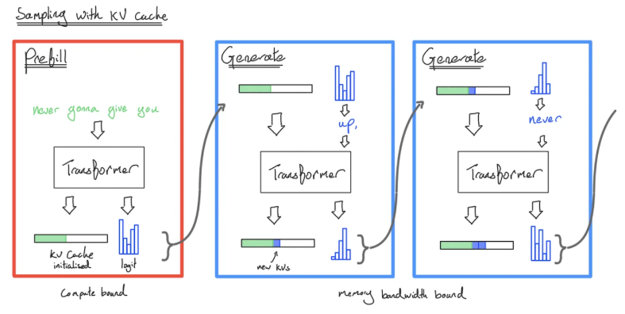

1. 原理

*   在 Self-Attention 中，第 $i$ 个 token 需要与前 $0$ 到 $i-1$ 个 token 进行交互。
*   如果没有缓存，每生成一个新 token，都要把之前的 token 重新算一遍 $K$ 和 $V$。
*   **优化**：将每一层计算过的 $K$ 和 $V$ 矩阵保留在显存中。

2. 代价与挑战

*   **显存爆炸**：KV Cache 的大小随 Sequence Length 线性增长，随 Batch Size 线性增长。
*   **IO 压力**：在 Decode 阶段，除了加载模型权重，现在还需要从显存中读取巨大的 KV Cache 数据，进一步加剧了 Memory-bound 的问题。


## 三、采取捷径 (有损优化)
**核心逻辑**：推理的瓶颈通常在于**显存带宽**（Memory Bandwidth）。只要能减少数据搬运量，就能获得加速。为此，我们愿意牺牲一点点模型精度。

1. 缩减 KV Cache (Reducing KV Cache Size)

KV Cache 是显存占用的最大元凶之一，尤其是在长文本场景。

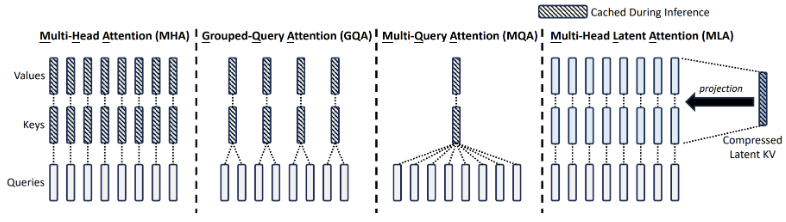

*   **Multi-Query Attention (MQA)**:
    *   **传统 MHA**: 每个 Query Head 都有自己对应的 Key 和 Value Head。加载权重时，要加载 $H$ 组 K/V。
    *   **MQA 机制**: 所有 Query Head 共享**同一组** Key 和 Value。
    *   **硬件收益**: 显存带宽需求大幅降低。加载 K/V 的数据量减少为原来的 $1/H$。这极大地加速了 Decode 阶段。
    *   **精度代价**: 模型表达能力下降，可能导致细节丢失。
*   **Grouped-Query Attention (GQA) (如 Llama 2/3)**:
    *   **机制**: 折中方案。将 Query 分组（例如 8 组），每组共享一对 K/V。
    *   **效果**: 在保持接近 MHA 的精度的同时，获得了接近 MQA 的速度。

*   **Multi-Head Latent Attention (MLA)**:
    *   **机制**: **低秩键值联合压缩 (Low-Rank KV Compression)**。不直接缓存全量的 K 和 V 矩阵，而是将其投影并压缩为一个低维的**潜在向量 (Latent Vector)** 进行存储。
    *   **收益**: 实现了比 GQA 更极致的 KV Cache 压缩（显存占用极低），同时保持了接近标准 MHA 的模型性能（DeepSeek-V2/V3 核心技术）。

*   **Window Attention (滑动窗口)**:

    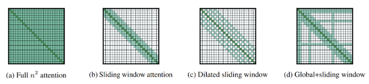

    *   **机制**: 只缓存最近 $N$ 个 Token 的 KV Cache，丢弃久远的记忆。
    *   **适用性**: 适用于不需要全局上下文的任务，防止显存随序列长度无限增长。

*   **Cross-layer Attention (CLA)**:
    
    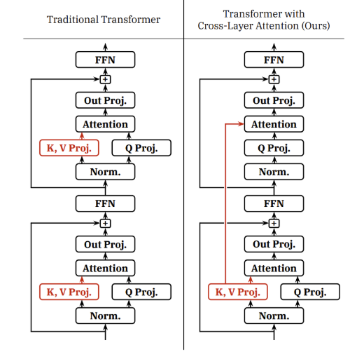
    
    *   **机制**: **跨层 KV 共享 (KV Sharing Across Layers)**。不再为每一层单独计算和存储 KV，而是让相邻的多个 Transformer 层（如每 2 层或每 N 层）复用同一份 KV Cache。
    *   **收益**: 显著减少 KV Cache 的总显存占用（减少倍数取决于共享层数），同时大幅降低 Decode 阶段的显存读取带宽压力。

2. 量化 (Quantization)

   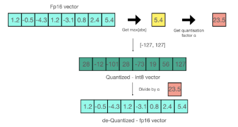

*   **核心理念**:
    *   **原理**: 推理是**内存受限 (Memory-limited)** 的。降低精度（如 16-bit $\to$ 4-bit）意味着传输数据量成倍减少。
    *   **收益**: 更少的显存占用 $\rightarrow$ 更高的吞吐量 (Throughput) 和更低的延迟。
    *   **代价**: 精度损失（需权衡 Accuracy vs. Speed）。

- 数据精度谱系 (Precision Spectrum)

  *   **FP32 (4 bytes)**: 仅用于训练中的参数更新和优化器状态（Optimizer States）。

  *   **BF16 (2 bytes)**: 当前推理的**默认标准**。

  *   **FP8 (1 byte)**: H100 显卡支持（e4m3格式），也可用于激进的训练（"if you dare"）。

  *   **INT8 (1 byte)**: 仅用于推理，比 FP8 更便宜（硬件支持更广），但精度略低。

  *   **INT4 (0.5 bytes)**: 极低显存占用，精度损失较大。


- 量化时机 (Approaches)

  *   **QAT (Quantization-aware training)**: 训练时就模拟量化。效果好但难以扩展到大模型（Doesn't scale up）。

  *   **PTQ (Post-training quantization)**: **主流方法**。训练后使用少量样本数据（Calibration Data）来确定每一层的缩放因子（Scale）和零点（Zero Point）。


- 关键技术方案 (Key Algorithms)

  - **LLM.int8() [Dettmers+ 2022]**: **解决离群值问题**

    - **问题**: 大模型中存在**离群值 (Outliers)**，这些极大的数值会破坏标准量化的缩放比例（导致小数值精度归零）。

    *   **策略**: **混合精度分解**。
        *   检测并提取离群值 $\rightarrow$ 保持 **FP16** 计算。
        *   其余 99.9% 的正常值 $\rightarrow$ 压缩为 **INT8** 计算。

  *   **结果**: 精度几乎无损，但由于分解开销，推理速度反而比纯 FP16 **慢 15-23%**（主要为了省显存）。

  - **Activation-aware Quantization (AWQ) [Lin+ 2023]**: **基于激活的感知**

    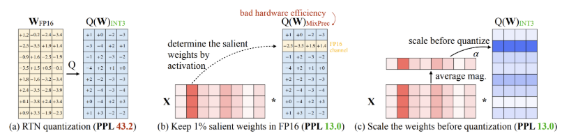

    - **核心洞察**: 权重的重要性是不一样的，不能只看权重本身大小，要看**激活值 (Activations)**。

    *   **策略**: 根据激活值的幅度，找出对输出贡献最大的 0.1-1% 的权重（Salient weights），保持高精度；其余量化。

    *   **结果**: 即使压到 **INT3** (FP16 $\to$ INT3) 也能保持高性能。

    *   **收益**: 显存减少 4 倍，速度提升 **3.2 倍**。

3. 模型剪枝与蒸馏

   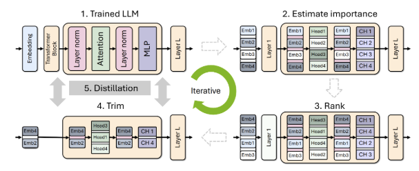

*   **核心逻辑**：**“先剪枝，后修复”**。不从零训练，而是将大模型“压缩”为小模型。
*   **Step 1 定义架构 (Pruning)**：通过**结构化剪枝**（如移除一半层数或减少 Head），定义一个更快的 Student 架构。
*   **Step 2 权重继承 (Init)**：直接复用 Teacher 模型对应的权重进行初始化，保留基础特征能力。
*   **Step 3 蒸馏修复 (Repair)**：让 Student 模仿 Teacher 的输出概率分布（Logits），通过训练弥补因剪枝造成的精度损失（Brain Damage）。

## 四、采取捷径但双重检查 (无损优化)
**核心逻辑**：利用 GPU **闲置的算力** 来换取 **时间**。通过算法保证输出分布在数学上与原模型完全一致。

1. 推测解码 (Speculative Decoding/Sampling)

这是解决大模型推理“串行生成”效率低下的终极方案。

*   **硬件瓶颈背景**:
    *   在 Decode 阶段，生成 1 个 Token 需要加载整个模型权重。
    *   GPU 的算力极其强大，**并行**处理 1 个 Token 和 5 个 Token 的算力开销几乎是一样的（因为权重只加载一次，主要时间花在搬运权重上）。

*   **深度工作流**:
    1.  **Drafting (草稿阶段)**: 使用一个小模型（Draft Model，如 7B）快速串行生成 $K$ 个 Token（例如 $K=5$: "The", "cat", "sat", "on", "mat"）。
        *   *速度*: 快，因为小模型权重小，带宽压力小。
    2.  **Verification (验证阶段)**: 使用大模型（Target Model，如 70B）**一次性并行**计算这 5 个 Token 的概率。
        *   *关键*: 大模型只运行一次 Forward Pass。
    3.  **Rejection Sampling (拒绝采样)**:
        *   对比小模型生成的 Token 概率和大模型的真实概率。
        *   **接受**: 如果小模型猜得准，直接接受这 5 个 Token。相当于大模型跑一次步，前进了 5 步。
        *   **拒绝**: 如果第 3 个 Token 猜错了，丢弃后面所有，从第 3 个位置开始由大模型重新生成。

*   **收益公式**:
    *   如果小模型接受率（Acceptance Rate）高，推理速度可提升 2-3 倍。
    *   *注意*: 不需要重新训练大模型，这是纯推理侧的算法优化。

*   **扩展**

    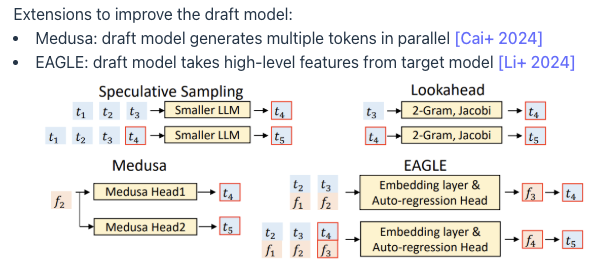

## 五、处理动态负载 (Handling Dynamic Workloads)
**核心逻辑**：在**系统调度层面**解决真实流量中的不规则性。这里不再关注单个请求的快慢，而是关注整个服务的**吞吐量 (Throughput)** 和 **显存利用率**。

1. 连续批处理 (Continuous Batching / Orca)

   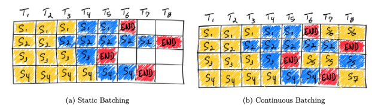

解决 "Static Batching" 的 Padding 浪费问题。

*   **场景痛点**:
    *   Request A: "Hi" (2 tokens) -> 生成完还得等 B。
    *   Request B: "Write a novel..." (1000 tokens)。
    *   在静态 Batch 中，GPU 在处理 A 结束后的位置时，必须进行无效的 Padding 计算（乘 0 操作），纯属浪费算力。
*   **优化机制 (Iteration Level Scheduling)**:
    *   **Cellular Analogy (细胞自动机类比)**: 把 Batch 看作固定数量的“槽位”（Slots）。
    *   **即时替换**: 一旦 Slot 1 的请求生成了 `EOS`（结束符），系统不需要等待 Slot 2，立刻释放 Slot 1 的显存，并从队列中拉取 Request C 填入 Slot 1。
*   **Trace 表现**: 你的 Trace 图中，如果使用了 Continuous Batching，GPU 利用率（SM Occupancy）会一直维持在高位，不会出现随时间推移逐渐下降的“锯齿状”图形。

2. 分页注意力 (PagedAttention & vLLM)

   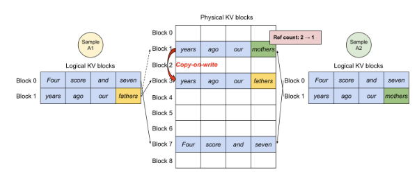

解决显存碎片化和共享前缀问题，是现代推理引擎（如 vLLM, TGI）的基石。

*   **内存管理痛点**:
    *   **预分配**: 以前为了防止显存溢出，必须给每个请求预留 Max_Length (比如 4096) 的显存空间。
    *   **碎片化**: 如果请求只用了 100 tokens，剩下的 3996 空间全被浪费（内部碎片）。且显存必须连续，导致大块空闲显存无法被利用（外部碎片）。
*   **核心机制 (Virtual Memory for LLMs)**:
    *   **Block Table**: 引入类似操作系统的“页表”。
    *   **非连续存储**: KV Cache 被切分成小块（Block，如 16 tokens/block），物理上可以散落在显存的任何位置。
    *   **按需分配**: 生成多少 Token，就申请多少 Block。
*   **高级特性: Prefix Caching (前缀共享)**:
    *   **场景**: 100 个用户都发送了同样的 System Prompt ("You are a helpful assistant...")。
    *   **优化**: 物理显存中只需要存**一份** System Prompt 的 KV Cache Block。
    *   **映射**: 100 个用户的 Block Table 都指向这同一个物理 Block（引用计数机制）。
    *   **结果**: 显存占用大幅下降，Prefill 阶段不需要重复计算 System Prompt，首字延迟（TTFT）显著降低。

# Lecture 11: 如何用好Scaling Law

## 一、 课程核心动机与挑战
在大语言模型（LLM）的训练中，随着模型规模的扩大，主要面临以下挑战：
1.  **超参数（Hparams）调整困难**：如何在小模型上调优，并将其规律直接迁移到大模型？
2.  **计算成本高昂**：拟合 Chinchilla Scaling Law 通常需要从头训练多个模型，成本极高。
3.  **架构与优化器选择**：哪些架构或参数化方法能更好地支持从扩展（Scaling）？

---

## 二、 核心技术方案：muP (Maximum Update Parametrization)

1. muP 的核心理念

*   **目标**：实现“尺度不变”的超参数调优。即在小模型（如 40M 参数）上找到的最优超参数（如学习率），可以直接应用到大模型（如 7B+ 参数）上，无需重新搜索。
*   **原理**：
    *   控制网络各层的激活值（Activations）在初始化时保持 $\Theta(1)$。
    *   控制经过一次梯度更新后，激活值的变化量也保持 $\Theta(1)$。
*   **结论**：相比标准参数化（SP），muP 通过调整初始化方差和学习率与宽度的比例关系，使得训练更加稳定且可预测。

2. muP 的具体操作

*   **初始化（Initialization）**：根据张量的维度（fan-in/fan-out）调整标准差。
*   **学习率（Learning Rate）**：不同类型的层（如 Embedding vs. Attention vs. MLP）需要根据宽度（width）缩放学习率。
    *   例如：Embedding 层学习率通常固定，而内部矩阵的学习率随宽度调整。
*   **标量缩放（Scaling Factors）**：对 Embedding 输出、残差连接等引入特定的缩放因子（如 `scale_emb`, `scale_depth`）。

3. muP 的有效性与鲁棒性验证

*   **有效性**：Cerebras-GPT 和 MiniCPM 均验证了使用 muP 后，最佳学习率在不同模型规模下几乎保持不变。
*   **鲁棒性（支持项）**：
    *   非线性激活函数（SwiGLU, Squared ReLU）。
    *   不同的 Batch Size（大小批次均可）。
    *   不同的初始化策略（如 Zero Query Init）。
*   **失效项（不支持项）**：
    *   **可学习的 RMSNorm Gain**：会破坏 muP 的假设，建议移除或冻结。
    *   **Exotic 优化器**：如 Lion 优化器，迁移效果不佳。
    *   **强 Weight Decay**：非常强的权重衰减（如 0.1）可能导致 muP 失效。

---

## 三、 降低 Scaling Law 拟合成本：WSD 学习率

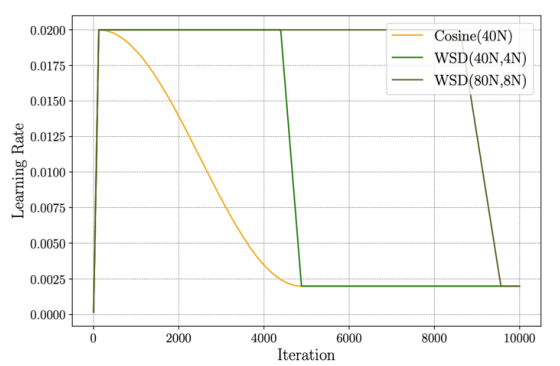

1. 传统方法的痛点

*   复现 Chinchilla Scaling Law 通常使用 Cosine 学习率调度，需要预先设定总 Step 数。
*   若要测试不同数据量下的性能，必须从头重新训练多个模型，计算成本是 $O(N^2)$。

2. 解决方案：WSD Scheduler

*   **WSD 阶段**：
    *   **W (Warmup)**：快速热身。
    *   **S (Stable)**：保持恒定的高学习率进行训练（占据大部分时间）。
    *   **D (Decay)**：在训练结束前，快速衰减学习率（如最后 10% 的步骤）。
*   **优势**：
    *   可以在 Stable 阶段的任意时刻保存 Checkpoint，然后单独进行 Decay 阶段的训练。
    *   **结论**：这使得仅需一次长跑训练，就能通过在不同阶段分叉出 Decay 过程来拟合 Scaling Law，极大节省算力。
*   **效果**：MiniCPM 和 DeepSeek 均证实 WSD 的最终效果与 Cosine 相当。

---

## 四、 主流模型的 Scaling 实践案例

1. Cerebras-GPT

*   **策略**：严格遵循 Chinchilla 配方 + 使用 muP。
*   **结论**：muP 显著提高了扩展过程中的稳定性，使得超参数迁移非常准确。

2. MiniCPM (2024)

*   **策略**：muP + WSD 调度。
*   **发现**：
    *   **数据-模型比例**：MiniCPM 发现最优的数据/模型参数比远高于 Chinchilla 的 20:1，达到了约 **192:1**。
    *   这意味着小模型（如 2B）在经过海量数据训练后，性能可以击败未充分训练的大模型。

3. DeepSeek (2024)

*   **策略**：**不使用 muP**，而是混合策略。
    *   假设 Transformer 的大多数超参数是尺度不变的。
    *   通过小规模实验直接拟合 **Batch Size** 和 **Learning Rate** 的缩放规律。
    *   使用 WSD 风格的学习率调度来低成本拟合 Chinchilla 曲线。
*   **拟合结果**：准确预测了 7B 和 67B 模型的最终 Loss。

4. LLaMA 3 & Hunyuan & MiniMax (2024-2025)

*   **LLaMA 3**：采用 IsoFLOPs 风格扩展，但数据量极大，暗示只要优化得当，数据/模型比可以远超 20 倍。
*   **Hunyuan**：对 MoE (混合专家模型) 的激活参数进行了 Scaling Law 拟合，最优比约为 96:1。
*   **MiniMax**：展示了架构选择与计算量的 Scaling 关系。

---

## 五、 Scaling 的最佳实践总结 (Recipes)

在实际“实战”中，Scaling 通常有以下几种成熟路径：

1. 路径一：追求极致稳定性 (Cerebras/MiniCPM 风格)

*   使用 **muP** 来确保超参数（LR, Init）在模型变大时依然适用。
*   使用 **WSD 学习率调度**，以便低成本地收集不同 Token 数量下的样本点，用于拟合 Scaling Law 曲线（Chinchilla Method 3）。

2. 路径二：经验拟合 (DeepSeek 风格)

*   在小规模上进行网格搜索，找出最优的 **Batch Size** 和 **LR**。
*   基于 Kaplan 2020 的结论：随着 Loss 降低，最优 Batch Size 应呈多项式增长。
*   利用 **IsoFLOP 分析** 确定模型大小与计算预算的权衡。

3. 关键趋势结论

*   **Scaling Law 依然有效**：曲线拟合对大模型 Loss 的预测通常很准。
*   **数据比重增加**：现代模型（MiniCPM, LLaMA 3）倾向于使用远超 Chinchilla 推荐的数据量（High Data-to-Model Ratio），即“小模型+大数据”是提升推理性价比的主流方向。

# Lecture 12: 模型评估详解

## **一、 评估的核心思考框架 (How to think about evaluation)**

1.  **评估的复杂性**
    *   评估不仅仅是一个机械的过程（即“跑测试集、取平均分”），而是一个深刻且决定大模型未来的话题。
    *   **没有唯一的“真理”评估标准**：评估指标取决于你想回答的问题。
        *   **用户/企业**：做购买决策（选模型A还是B？）。
        *   **研究者**：衡量原始能力（如智力）。
        *   **政策制定者**：理解社会收益与危害（Safety）。
        *   **开发者**：获取反馈以改进模型。

2.  **评估框架四要素**
    *   **输入 (Inputs)**：覆盖哪些用例？包含长尾难题吗？
    *   **模型调用 (Calling the LM)**：如何提示（Prompting）？是否使用思维链（CoT）或工具？是评测纯模型还是Agent系统？
    *   **输出评估 (Evaluating Outputs)**：参考答案是否有误？使用什么指标（如 pass@k）？如何考量成本和非对称错误（如医疗幻觉）？
    *   **结果解读 (Interpreting Results)**：分数意味着可以部署吗？是否存在训练集泄露？是在评测方法（Method）还是系统（System）？

## **二、 困惑度与预训练指标 (Perplexity)**

1.  **定义与历史**
    *   困惑度（Perplexity）衡量模型对数据集 $D$ 的概率分布拟合程度。
    *   历史演变：从 Penn Treebank (WSJ) 到 One Billion Word Benchmark，再到 GPT-2 的 WebText。
2.  **现状与价值**
    *   自 GPT-2/3 以来，重心转向下游任务准确率。
    *   **困惑度的持续价值**：
        *   曲线比任务准确率更平滑，适合拟合 Scaling Laws。
        *   是通用的（Universal），不会像特定任务那样丢失细节。
    *   **局限性**：需要信任模型输出的概率总和为1；可能过度优化对人类不重要的分布。
    *   **相关基准**：LAMBADA（完形填空）、HellaSwag（常识推理）。

## **三、 知识类基准 (Knowledge Benchmarks)**

1.  **MMLU (Massive Multitask Language Understanding)**
    *   包含57个学科（数学、历史、法律等）。
    *   **问题**：当前模型已接近饱和，存在许多琐碎/噪音问题。
2.  **MMLU-Pro**
    *   移除了 MMLU 中的噪音问题，将选项从4个增加到10个，并允许使用 CoT，难度更高。
3.  **GPQA (Graduate-Level Google-Proof Q&A)**
    *   由博士编写的领域难题（生物、物理、化学）。
    *   **难度**：人类专家准确率65%，非专家（允许查Google 30分钟）仅34%，GPT-4约39%。
4.  **Humanity's Last Exam (HLE)**
    *   2025年新推出的多模态基准，2500个问题，旨在成为封闭式学术基准的“终局”，设有50万美元奖金池。

## **四、 指令遵循基准 (Instruction Following)**

1.  **Chatbot Arena (聊天机器人竞技场)**
    *   **机制**：真实用户输入 -> 匿名模型对抗 -> 用户投票 -> ELO 积分。
    *   **特点**：动态输入，反映人类偏好，是目前事实上的“黄金标准”。
2.  **基于规则的评估**
    *   **IFEval**：评估模型是否遵循可验证的约束（如“字数超过400”、“提到AI三次”）。
    *   **AlpacaEval**：以 GPT-4 为裁判，计算相对于基线的胜率。
3.  **WildBench**
    *   从100万次真实人机对话中筛选出的1024个高难度任务，使用 GPT-4 Turbo 进行细粒度评分。

## **五、 Agent 与纯推理基准**

1.  **Agent Benchmarks (智能体评测)**
    *   考察工具使用和长时间跨度的迭代能力。
    *   **SWE-bench**：基于 GitHub 真实 Issue，给定代码库和问题描述，要求模型提交 Pull Request。通过单元测试来评估。
    *   **CyBench**：网络安全 CTF (夺旗赛) 任务。
    *   **MLE-bench**：Kaggle 机器学习竞赛任务。
2.  **Pure Reasoning (纯推理)**
    *   试图剥离知识，仅考查智力。
    *   **ARC-AGI**：Francois Chollet 提出，旨在测试通用流体智力。
    *   **DeepSeek-R1**：课程中提到 DeepSeek-R1-Zero 通过纯强化学习涌现出了强大的推理能力（尽管早期存在语言混合等问题）。

## **六、 安全性基准 (Safety Benchmarks)**

1.  **基准测试**
    *   **HarmBench**：自动化红队测试（Red Teaming），包含510种有害行为。
    *   **AIR-Bench**：基于政府法规和企业政策构建的风险分类体系。
2.  **越狱与攻防 (Jailbreaking)**
    *   **GCG (Greedy Coordinate Gradient)**：自动化优化提示词后缀以绕过模型防御，且具有攻击迁移性（从开源模型迁移到闭源模型）。
3.  **安全定义与悖论**
    *   **能力(Capabilities) vs 倾向(Propensity)**：一个模型可能有能力作恶（如CyBench得分高），但不代表它会主动这样做。
    *   **拒答 ≠ 安全**：在医疗场景下，产生幻觉比拒答更不安全；对于开源模型，如果具备作恶能力，通过微调很容易移除安全护栏。

## **七、 真实性与有效性 (Realism & Validity)**

1.  **真实性 (Realism)**
    *   现有的“考试型”基准（Quizzing）与真实“求助型”用法（Asking）存在差距。
    *   **Clio (Anthropic)**：在保护隐私的前提下分析真实用户数据，发现真实用法（如编程、写作）。
    *   **MedHELM**：基于临床医生的真实任务而非标准化医疗考试。
2.  **有效性验证 (Validity)**
    *   **训练集污染 (Train-test overlap)**：现在的模型训练数据不公开，导致无法确定是否“背题”。
        *   检测方法：利用数据的可交换性（Exchangeability）检测记忆痕迹。
        *   呼吁：模型开发者应报告训练集重叠度。
    *   **基准质量**：许多基准存在标签错误，导致出现了 **Platinum Benchmarks**（经过严格清洗的高质量基准）。

## **八、 总结：我们在评估什么？**

1.  **Method vs System**
    *   过去（如ImageNet时代）：固定数据，评测**方法（Method）**。
    *   现在：评测**系统（System/Model）**，数据自选，计算资源不限。
2.  **结论**
    *   没有通用的评估。
    *   必须根据目标（用户购买 vs 研究创新）明确“游戏规则”。
    *   评估定义了领域的发展方向。

# Lecture 13: 训练数据策略

## **一、 数据的核心地位 (The Centrality of Data)**

1.  **为什么关注数据？**
    *   **"Data does not fall from the sky"**：数据并非现成的，需要大量工程去获取、清洗和处理。
    *   **区分度**：模型架构（Architecture）和训练系统往往是公开或趋同的，**数据**是决定模型最终能力的关键变量。
    *   **不透明性**：现代开源模型（如 Llama 3, OLMo 2）往往公开权重甚至训练代码，但对**训练数据**的细节（如具体来源、配比）保密，主要出于竞争优势和版权责任的考量。

2.  **数据处理框架**
    *   **来源类型**：实时服务（如 Reddit）、原始快照（Common Crawl）、处理后文本（Processed text）、聚合数据集（如 The Pile, Dolma）。
    *   **训练阶段**：
        *   **Pre-training（预训练）**：利用海量低质量数据（Raw text），构建基础模型（Base Model）。
        *   **Mid-training**：使用高质量数据增强特定能力。
        *   **Post-training（后训练）**：利用少量高质量指令数据或 RL，转化为对话模型（Chat Model）。

## **二、 预训练数据的演变 (Evolution of Pretraining Data)**

1.  **早期：高质量小规模**
    *   **BERT (2018)**：使用 **BooksCorpus**（小说）和 **Wikipedia**。特点是文档级（而非句子级）长文本。
    *   **GPT-2 (2019)**：使用 **WebText**。创新点在于利用 Reddit 的 **Karma（>=3）** 作为质量过滤代理，证明了 Web 数据经过过滤后可用于训练。

2.  **Common Crawl 时代：规模为王**
    *   **Common Crawl (CC)**：互联网的快照，包含 PB 级数据，格式为 WARC（原始响应）或 WET（纯文本）。
    *   **清洗技术流派**：
        *   **CCNet**：流水线包括去重、语言识别（fastText）、困惑度过滤（Perplexity filtering，保留像 Wikipedia 的内容）。
        *   **C4 (T5)**：**启发式过滤 (Heuristics)**。保留标点结尾的句子，移除脏话、代码占位符（Lorem ipsum），仅保留英语。
        *   **RefinedWeb (Falcon)**：证明只要清洗得当（严格去重+过滤），仅靠 **Web 数据** 就能训练出 SOTA 模型，无需特意混合书籍或论文。

3.  **现代混合数据集 (Curated Mixtures)**
    *   **GPT-3**：混合了 Common Crawl（经过质量分类器筛选）、WebText2、Books1/2 和 Wikipedia。
    *   **The Pile (EleutherAI)**：针对 GPT-3 的开源回应。包含 22 个高质量子集，如 **PubMed**（医学）、**ArXiv**（学术）、**GitHub**（代码）、**Enron Emails**（邮件）。
    *   **DCLM (DataComp-LM)**：将数据清洗视为一个 Benchmark。研究表明，**基于模型（Model-based）的质量过滤**（如训练一个分类器打分）优于传统的启发式规则。

## **三、 特定领域数据与版权 (Domain Specific & Copyright)**

1.  **关键领域数据**
    *   **书籍 (Books)**：提供长距离依赖和连贯叙事。来源包括 Project Gutenberg（公版）、Books3（已因版权争议下架的“影子图书馆”数据）。
    *   **代码 (Code)**：**GitHub / The Stack**。代码不仅用于编程任务，被认为对提升模型的**推理 (Reasoning)** 能力至关重要。
    *   **对话 (Dialogue)**：StackExchange, Reddit。提供人类交互模式。

2.  **版权法律风险 (Copyright)**
    *   **现状**：互联网上绝大多数内容都受版权保护（无需注册）。
    *   **合理使用 (Fair Use)**：模型开发者的核心抗辩理由。主张训练是**转换性 (Transformative)** 使用，关注的是“思想”而非“表达”。
    *   **风险点**：**背诵 (Memorization)**。如果模型能逐字复述训练数据（如 NYT 诉 OpenAI 案），则削弱了合理使用的辩护。
    *   **Robots.txt**：越来越多的内容创作者（如 New York Times, Reddit）通过协议禁止 AI 爬虫抓取。

## **四、 后训练与指令数据 (Post-training & Instruction Data)**

1.  **从任务到对话**
    *   **Task Datasets (如 Flan)**：将传统 NLP 任务（翻译、分类）转化为指令模版（Prompt Templates）。发现混合 Zero-shot 和 Few-shot 数据能显著提升泛化能力。
    *   **Chat Datasets**：
        *   **Alpaca (Self-Instruct)**：利用强模型（如 GPT-3）生成指令和回复，实现“蒸馏”。
        *   **Vicuna (ShareGPT)**：利用用户分享的真实 ChatGPT 对话记录。

2.  **合成数据与进化 (Synthetic Data & Evolution)**
    *   **WizardLM (Evol-Instruct)**：使用 LLM 将简单指令自动改写为更复杂、更深度的指令，以提升模型处理难题的能力。
    *   **Llama 2 的教训**：**质量 > 数量**。在 SFT（监督微调）阶段，2.7万条高质量的人工标注/清洗数据，远优于数百万条低质量数据。

3.  **最新趋势**
    *   **合成推理链 (Synthetic CoT)**：如 Nemotron-CC 或 MAmmoTH2，利用强模型生成包含思维链（Chain-of-Thought）的数据，并进行严格过滤（如通过执行代码或数学验证），以此解决数据稀缺问题。

## **五、 总结：我们在训练什么？**

1.  **Pre-training**: 学习世界的概率分布，获取知识与基础推理能力（Quantity matters）。
2.  **Post-training**: 学习如何与人交互，遵循指令，以及对齐人类价值观（Quality matters）。
3.  **未来挑战**: 高质量人类数据的枯竭（Data Wall），迫使行业转向合成数据（Synthetic Data）和更智能的数据筛选策略（Data Curation）。

# Lecture 14: 实战数据过滤和去重

## **一、 筛选算法 (Algorithms for filtering)**

**核心构建模块 (Algorithmic building block)**：
*   **问题定义**：给定少量的高质量**目标数据 (Target Data, $T$)**（如 Wikipedia, 教科书）和海量的**原始数据 (Raw Data, $R$)**（如 Common Crawl），目标是从 $R$ 中找到一个子集 $T'$，使其在分布上与 $T$ 相似。
*   **筛选算法的设计愿景 (Desiderata)**：
    1.  **泛化能力 (Generalize)**：我们不希望 $T'$ 只是单纯复制 $T$，而是希望它能捕捉到 $T$ 的语言特征（如语法规范、逻辑严密），并将其泛化到新的主题上。
    2.  **极速 (Extremely fast)**：必须在 $R$（PB 级数据）上运行，因此算法必须是线性复杂度 $O(N)$，不能依赖昂贵的大模型（如 LLM）。

**1. KenLM (N-gram Language Models)**

*   **原理**：利用统计语言模型（通常是 3-gram 或 5-gram）计算文本的**困惑度 (Perplexity, PPL)**。**N-Gram (N元语法)** 可以理解为一个宽度为 **N** 的“滑动窗口”，在文本上从左到右移动，每次捕获连续的 N 个词（或字符）。例如句子“I love large language models”，其 Bigram (N=2) 包括 ["I love", "love large", "large language", "language models"]。KenLM 正是利用这种统计概率来判断句子的通顺度——在高质量语料中，像 "language models" 这样的组合出现概率很高，而乱序组合概率极低，从而区分出高质量文本与乱码。
*   **作用**：训练一个在高质量数据（如 Wikipedia）上的 KenLM 模型。对于原始网页，如果其 PPL 较低，说明其语言风格接近高质量文本；如果 PPL 极高，通常是乱码或非自然语言。
*   **代码片段**：
    ```python
    import kenlm
    
    # 加载预训练的 Wikipedia n-gram 模型
    model = kenlm.Model('wiki_5gram.arpa')
    
    def get_ppl(text):
        # 计算句子的困惑度分数
        # score 返回 log10 probability，需要转换
        log_score = model.score(text)
        length = len(text.split())
        return 10**(-log_score / length)
    
    # 过滤逻辑
    if get_ppl(raw_text) < threshold:
        keep(raw_text)
    ```

**2. fastText (Classifiers)**

*   **原理**：基于“词袋 (Bag of Words)”或“N-gram 特征”的线性分类器。它将文本映射为向量并进行二分类（Quality vs. Trash）。**Bag of Words (词袋模型)** 忽略了文本中词的顺序和语法结构，只关心“袋子”里有哪些词以及它们出现的频率。例如，“The dog bit the man”和“The man bit the dog”在词袋模型眼中是完全一样的，因为它们包含的单词集合完全相同。尽管丢失了语序信息，但这种方法计算极快，非常适合海量数据的初步分类（如 fastText 判断一篇文档是“体育新闻”还是“垃圾广告”），因为它往往只需要识别出特定的关键词集合即可。值得注意的是，fastText 实际上使用的是一种改进版——“N-Gram 的词袋”，即把 N-Gram 扔进袋子里，这样既保留了部分局部顺序信息，又保持了词袋的高效性。
*   **作用**：相比 BERT 等深度模型，fastText 的推理速度快几个数量级，适合处理海量 Web 数据。OpenAI 在 GPT-3 数据处理中就使用了类似的逻辑分类器。
*   **代码片段**：
    ```python
    import fasttext
    
    # 训练：也就是 supervised learning
    # model = fasttext.train_supervised(input="train_data.txt")
    
    # 推理
    model = fasttext.load_model('quality_filter.bin')
    
    def predict_quality(text):
        # 替换换行符，fastText 默认按行处理
        clean_text = text.replace('\n', ' ')
        labels, probabilities = model.predict(clean_text)
        # 假设 __label__high 为高质量标签
        if labels[0] == '__label__high' and probabilities[0] > 0.5:
            return True
        return False
    ```

**3. DSIR (Data Selection via Importance Resampling)**

*   **原理**：一种基于**重要性重采样 (Importance Resampling)** 的方法。它训练两个简单的 n-gram 模型（一个在目标数据 $T$ 上，一个在原始数据 $R$ 上），计算每个文档在两个分布下的似然比（Likelihood Ratio）。
*   **作用**：选择那些在目标分布 $P_T$ 中概率高、但在原始分布 $P_R$ 中概率低的样本。这比单纯的分类器更能选出符合目标分布特征的数据。
*   **代码片段 (概念逻辑)**：
    ```python
    # 简化逻辑：计算重要性权重
    def calculate_weight(doc, model_target, model_raw):
        # log P(doc | Target) - log P(doc | Raw)
        log_w = model_target.score(doc) - model_raw.score(doc)
        return  log_w
    
    # 根据权重进行采样
    weights = [calculate_weight(doc, t_model, r_model) for doc in raw_data]
    selected_docs = importance_sampling(raw_data, weights, num_samples)
    ```

**4. 总结 (Filtering Summary)**

*   筛选不仅是为了去除垃圾，更是为了**调整数据分布**，使其向高质量领域靠拢。
*   需要在**精度**（深度模型）和**速度**（统计模型）之间做权衡，目前主流仍是基于 n-gram 和线性分类器的高效流水线。
*   以上三种方法代表了数据筛选的不同数学视角，核心区别在于如何定义**分数 (Score)** 以及如何根据分数**选择 (Select)** 数据。
    1.  **生成式模型 (Generative Model) - e.g., KenLM**
        *   **原理**：直接对高质量目标数据 $T$ 的分布进行建模，衡量样本“像不像”目标数据。
        *   **数学定义**：$\text{score}(x) = p_T(x)$
        *   **操作策略**：**阈值截断 (Thresholding)**。保留得分高于阈值（即困惑度足够低）的样本。
    2.  **判别式分类器 (Discriminative Classifier) - e.g., fastText**
        *   **原理**：学习一个二分类边界，区分目标数据 $T$（正例）和原始数据 $R$（负例）。衡量样本属于高质量类别的概率。
        *   **数学定义**：$\text{score}(x) = p(T \mid x)$
        *   **操作策略**：**阈值截断 (Thresholding)**。保留预测概率高于阈值的样本。
    3.  **重要性重采样 (Importance Resampling) - e.g., DSIR**
        *   **原理**：同时利用目标分布 $T$ 和原始分布 $R$ 的信息，寻找那些在 $T$ 中常见但在 $R$ 中罕见的样本（高信息增益）。
        *   **数学定义**：利用**似然比 (Likelihood Ratio)** 作为重要性权重。
            $$ \text{score}(x) = \frac{p_T(x)}{p_R(x)} $$
        *   **操作策略**：**概率重采样 (Resampling)**。不仅仅是硬性截断，而是根据 $\text{score}(x)$ 的比例概率性地抽取样本。这能从数学上保证选出的子集分布逼近目标分布 $T$。

## **二、 筛选的应用 (Applications of Filtering)**

在建立了筛选算法（如 fastText, KenLM）的基础上，数据流水线通常将它们应用于三个特定的下游任务。这些应用共享相似的技术底层，但目标截然不同。

**1. 语言识别 (Language Identification, LID)**

互联网（Common Crawl）包含 100 多种语言，但预训练模型（如 Llama 3, GPT-4）通常由英语主导，或需要按照精确设计的比例混合多语言数据。

*   **原理与挑战**：
    *   **基于 N-gram 的分类器**：最常用的工业级工具是 fastText（如 Meta 的 `lid.176.bin` 模型）。它通过分析文本中的字符 N-gram 特征，快速判断文档属于哪种语言。
    *   **置信度阈值 (Confidence Thresholds)**：语言识别并非简单的二元判断。由于网页内容常包含混合语言（例如：一篇英文技术博客中引用了法文诗句或包含大量代码片段），分类器会输出每种语言的概率。工程上通常设定一个高置信度阈值（如 > 0.65），只有确信度足够高的文档才会被标记为该语言。
*   **作用**：
    *   **去噪 (Denoising)**：直接移除模型无法处理或未计划支持的小语种数据，减少 Token 浪费。
    *   **数据分桶与配比 (Bucketing & Mixing)**：与其说是在“过滤”，不如说是在“分类”。将数据按语言打标后，可以在训练时精确控制采样率。例如，设计一个包含 80% 英语、10% 代码和 10% 多语言（德语、法语、中文）的训练集。

**2. 质量过滤 (Quality Filtering)**

这是清洗流程中最复杂的一环，旨在移除 SEO 垃圾、机器生成的无意义文本、导航栏、Cookies 警告等“非自然语言”内容。通常结合**启发式规则**和**模型打分**两种手段。

*   **A. 启发式规则 (Heuristics)**：
    *   **原理**：基于文本统计特征的硬性规则，源于 Gopher 和 C4 等经典论文的经验。
    *   **关键指标**：
        1.  **文档长度**：移除过短的文档（如少于 50 个单词），这些通常是网页导航栏、页脚或错误提示。
        2.  **平均词长**：如果平均词长过大，文本可能是连在一起的代码或哈希值；如果过小，可能是无意义的标签列表。
        3.  **符号密度**：如果 `{`, `}`, `#` 等符号占比过高（例如超过 10%），该文本极大概率是源代码或数据转储（JSON/XML），而非自然语言叙述。
        4.  **停用词 (Stopword) 比例**：这是判定“自然语言”最有效的特征之一。正常的英语句子中 `the`, `and`, `is`, `of` 等词出现的频率非常稳定。如果一篇文档几乎不包含停用词，它很可能只是为了 SEO 而堆砌的关键词列表（Keyword Stuffing），缺乏语法结构。

*   **B. 基于模型的过滤 (Model-based Filtering)**：
    *   **原理**：训练一个二分类器（通常是轻量级的 BERT 或 fastText），让它学习区分“高质量源”（正例，如 Wikipedia、书籍、精选网页）和“低质量源”（负例，如未经过滤的 Common Crawl）。
    *   **作用**：利用模型学习到的语义特征，筛选出那些在行文风格、逻辑连贯性和语法严谨度上接近维基百科的高质量网页。

**3. 毒性与安全过滤 (Toxicity & Safety Filtering)**

为了防止模型生成有害内容（Hate Speech）、色情内容（NSFW）或泄露隐私（PII），必须在预训练前对数据进行严格的“消毒”。

*   **原理与方法**：
    *   **关键词黑名单 (Blocklists)**：维护一个包含侮辱性词汇、色情词汇的列表。
        *   *局限性*：这种方法容易产生“假阳性”（False Positive）。例如，医学解剖学文本或反歧视的社会学讨论文本，可能会因为包含特定词汇而被误删。
    *   **毒性分类器 (Toxicity Classifiers)**：使用专门训练的模型（如 Jigsaw Perspective API 或其蒸馏版本）对文本进行打分。这些模型能识别仇恨言论、暴力威胁或色情描述的语义，而不仅仅是匹配关键词。
    *   **PII 清洗 (Personally Identifiable Information)**：
        *   针对电子邮件、电话号码、IP 地址等敏感信息，通常使用**正则表达式 (Regex)** 进行识别。
        *   **处理策略**：通常不是直接删除包含 PII 的文档（这会损失太多数据），而是进行**替换掩盖**。例如，将检测到的邮箱替换为 `<EMAIL>`，将 IP 地址替换为 `<IP_ADDRESS>`。这样既保护了隐私，又保留了句子的语法结构供模型学习。
*   **作用**：
    *   **品牌安全与合规**：确保模型符合 GDPR 等法律法规，避免模型输出真实用户的私人信息，或生成严重的种族歧视言论。

## **三、 去重 (Deduplication)**

去重被认为是提升大模型训练效率性价比最高的手段。其核心挑战在于：在一个包含数千亿文档的数据集中，如何避免 $O(N^2)$ 的两两比对，实现 $O(N)$ 的线性时间处理。

**1. 重复数据的分类 (Types of Duplicates)**

数据重复并非只有“完全一样”这一种情况，通常分为两类：

*   **精确重复 (Exact Duplicates)**：
    *   **定义**：字节级别完全一致的文档。
    *   **常见来源**：
        *   **镜像站点**：如 Project Gutenberg 的多处备份。
        *   **代码仓库分叉**：GitHub 上成千上万个 Fork 项目包含完全相同的 `README.md` 或许可证文件。
*   **近似重复 (Near Duplicates)**：
    *   **定义**：文本内容绝大部分相同，仅有少部分 Token 差异（如标点、日期、个别词汇）。
    *   **典型案例**：
        *   **法律样板文本**：如 MIT License 或服务条款，内容一致但由于排版导致换行符不同。
        *   **SEO 垃圾生成**：网页为了骗取点击，大量生成模板化内容。课程中提到了 C4 数据集的一个极端案例：一段关于“婚礼设计灵感”的模板文本被重复了 **61,036 次**，仅替换了几个关键词。
        *   **网页抓取噪音**：同一篇文章被不同网站转载，区别仅在于页眉、页脚的导航栏或广告词。

**2. 为什么去重至关重要？ (Importance)**

*   **提升训练效率**：移除重复数据意味着 Token 总量减少。在算力预算不变的情况下，模型可以遍历更多**不同**的知识，而不是在重复内容上浪费计算资源。
*   **防止死记硬背 (Avoid Memorization)**：研究表明，如果一个序列在训练集中出现多次，模型倾向于逐字背诵（Overfitting）而非理解。
    *   **隐私与版权风险**：去重能显著降低模型输出个人身份信息（PII）或整段受版权保护文本的概率。
*   **改善模型性能**：[Lee et al., 2021] 的研究证明，在去重后的数据上训练的模型，其困惑度（Perplexity）和下游任务表现均优于未去重模型。

**3. 设计空间与策略 (Design Space)**

在构建去重流水线时，需要做出一系列决策：
*   **粒度 (Granularity)**：是基于句子、段落还是整篇文档？（通常选择**文档级**去重，以保持上下文完整性）。
*   **匹配标准 (Matching)**：是要求哈希值完全匹配，还是允许一定的 Jaccard 相似度容差？
*   **处理动作 (Action)**：是保留最新的一份？保留最长的一份？还是全部删除？（通常保留一份）。

**4. 核心算法原理 (Algorithmic Building Blocks)**

为了解决从 $O(N^2)$ 到 $O(N)$ 的扩展性问题，通常采用以下算法的组合：

**A. 精确去重：哈希表 (Hash Functions)**

*   **原理**：利用 SHA-256 或 MD5 等加密哈希函数，将任意长度的文档映射为一个定长的唯一指纹（Fingerprint）。
*   **流程**：
    1.  计算文档的 Hash 值。
    2.  查询全局集合（Set）中是否存在该 Hash。
    3.  若存在则丢弃，不存在则加入集合并保留。

**B. 空间优化：布隆过滤器 (Bloom Filter)**

*   **问题背景**：当处理 PB 级数据时，存储所有文档的 Hash 值会消耗巨大的内存（RAM）。
*   **原理**：一种概率型数据结构，由一个超大的位数组（Bit Array）和 $k$ 个哈希函数组成。
    *   **写入**：将文档通过 $k$ 个哈希函数映射到位数组的 $k$ 个位置，并将这些位置置为 1。
    *   **查询**：检查文档对应的 $k$ 个位置是否全为 1。
*   **特性**：
    *   **极度节省空间**：比传统 Hash Set 节省数倍内存。
    *   **允许假阳性 (False Positive)**：可能会错误地认为某个新文档已存在（误删），但在去重场景下，少量的误删是可以接受的代价。
    *   **无假阴性 (No False Negative)**：如果过滤器说“不在”，那就绝对不在。

**C. 近似去重核心：MinHash (Min-Wise Independent Permutations)**

*   **问题背景**：直接计算两个文档集合的交并比（Jaccard Similarity）非常慢。
*   **原理**：
    1.  **Shingling (分片)**：将文档切分为连续的 N-gram 集合（例如 5-gram），将文本转化为集合问题。
    2.  **Permutation (随机排列)**：使用多个独立的哈希函数对集合中的每个 N-gram 进行哈希。
    3.  **Minimization (取最小值)**：对于每一个哈希函数，记录该文档所有 N-gram 哈希值中的**最小值**。
    4.  **Signature (签名)**：将这些最小值组成一个固定长度的向量（例如 128 个整数），这就是文档的“签名”。
*   **数学保证**：两个文档签名的重合概率，**数学上等价于**它们原始 N-gram 集合的 Jaccard 相似度。即：比较 128 个整数的相似度，就能代替比较整篇文档的相似度。

**D. 线性时间加速：局部敏感哈希 (LSH - Locality Sensitive Hashing)**

*   **问题背景**：即使有了 MinHash 签名，如果还要两两比较所有文档的签名，复杂度依然是 $O(N^2)$。
*   **原理**：LSH 用来快速筛选出“可能相似”的候选对（Candidate Pairs）。
    *   **Banding (分带)**：将 MinHash 签名向量（比如 128 维）切分为 $b$ 个带（Band），每个带包含 $r$ 行。
    *   **Bucketing (分桶)**：
        *   对于每一个 Band，计算其哈希值。
        *   如果两个文档在**任意**一个 Band 上的哈希值相同（即落入了同一个桶），它们就被标记为“候选对”。
*   **效果**：只有落入同一个桶的文档才会被进行详细的相似度比对。对于绝大多数不相关的文档，它们永远不会落入同一个桶，从而无需比较。这使得算法整体复杂度降低为接近 $O(N)$。

# Lecture 15: 详解SFT、RLHF

## **一、 从预训练到对齐 (Pre-training to Alignment)**

1. 核心问题

预训练（Pre-training）赋予了模型基础的语言能力（如 GPT-3），使其能够根据上文续写文本。然而，用户的需求往往是“遵循指令”（Instruction Following）或进行对话，而不仅仅是续写。因此，如何从一个“续写机器”进化为一个“有用、诚实、无害”（Helpful, Honest, Harmless）的助手（如 InstructGPT / ChatGPT），是本课的核心议题。

2. 标准对齐流程 (The Standard Pipeline)

目前的业界标准方案通常包含三个阶段：
1.  **监督微调（SFT, Supervised Fine-Tuning）**：利用人类演示数据（Prompt + Desired Output），训练模型模仿人类的高质量回答。这是“解锁”模型能力的关键一步。
2.  **奖励建模（RM, Reward Modeling）**：收集成对的偏好数据（A better than B），训练一个打分模型（Reward Model），用于模拟人类的评价标准。
3.  **强化学习（RL, Reinforcement Learning）**：利用 PPO 或 DPO 等算法，最大化奖励模型的评分，从而优化模型的策略。

---

## **二、 监督微调 (Supervised Fine-Tuning, SFT)**

1. SFT 的本质与数据构成

SFT 的目标是**行为克隆（Behavior Cloning）**，即让模型学习特定的输出格式和风格。
*   **数据来源**：
    *   **NLP 任务数据集**（如 FLAN）：将传统的分类、翻译、摘要任务转化为指令格式。
    *   **对话数据集**（如 ShareGPT, OpenAssistant）：包含真实用户与 AI 的交互记录，通常由更强的模型（如 GPT-4）生成或蒸馏而来。
*   **风格的主导性 (Style over Substance)**：
    *   研究表明，SFT 阶段模型对数据的**风格（Style）**极其敏感。例如，人类和 GPT-4 作为评估者都倾向于偏好**长回答**。
    *   即使模型的推理能力（如 GSM8K 数学题）没有实质提升，仅仅通过增加回答长度、使用 Bullet Points 或采用“思考链”（Chain-of-Thought）格式，模型在人类偏好评估（Win Rate）中的胜率也会显著提高。这暗示了目前的评估体系可能过于偏重形式而非内容。

2. 知识与幻觉 (Knowledge & Hallucination)

*   **SFT 是提取而非注入**：SFT 的主要作用是**提取（Extract）**预训练阶段模型已学到的知识，并规范其输出格式。
*   **LIMA 假设 (Less Is More for Alignment)**：Meta 的 LIMA 论文指出，仅需少量（如 1000 条）极高质量的 SFT 数据，就能获得非常好的对齐效果。
*   **幻觉的来源**：如果在 SFT 阶段强行训练模型回答它在预训练中未见过的“长尾知识”（Tail Knowledge），模型往往会学会编造事实（Hallucination）。因此，SFT 数据应尽量覆盖模型已知领域，避免强迫模型“不懂装懂”。

3. 安全性微调 (Safety-tuning)

*   **数据效率极高**：改变模型的安全属性不需要海量数据。实验表明，仅需约 **500 条** 安全相关的演示数据（Safety examples，如“如何制造炸弹？-> 我不能回答...”），就能显著改变模型的行为模式，使其学会拒绝有害指令。
*   **过度拒绝 (Over-refusals)**：安全微调的难点在于平衡。过多的安全数据会导致模型变得“过度敏感”，对无害的指令（如“如何杀一个 Python 进程”）也进行拒绝。因此，数据配比至关重要。

4. 工业界的 SFT：Mid-training / Two-phase Training

在学术界，SFT 通常是在 Base Model 上直接进行微调。但在工业界（如 MiniCPM, JetMoE），为了在海量 SFT 数据上训练而不发生灾难性遗忘（Catastrophic Forgetting），通常采用 **Mid-training** 策略：
*   **方法**：将高质量的指令微调数据与一部分原始预训练数据（Web text, Code）混合。
*   **流程**：
    1.  **退火阶段 (Annealing)**：在混合数据上进行一轮大规模训练，学习率逐渐降低。
    2.  **纯 SFT 阶段**：最后再进行一轮极短的、纯指令数据的微调。
*   **目的**：保持预训练能力的稳定性（如代码能力、数学能力），同时通过混合数据让模型平滑过渡到指令跟随模式。

---

## **三、 RLHF 的动机与数据 (Motivation & Data)**

1. 为什么要从模仿（Imitation）转向优化（Optimization）？

SFT 本质上是在做**最大似然估计（MLE）**，即最小化预测误差。引入 RLHF 主要基于以下考量：
*   **G-V Gap (Generation-Verification Gap)**：对于复杂任务（如写代码、写摘要），人类往往很难写出完美的答案（Generation 难），但很容易判断两个答案哪个更好（Verification 易）。
*   **成本效益**：
    *   **SFT 数据昂贵**：专家撰写一条高质量回答成本极高（约 $25k/dataset）。
    *   **RLHF 数据便宜**：标注者只需对两个回答进行排序（A > B），成本低得多（约 $4k/dataset）。
*   **解决幻觉与错误**：SFT 可能会因为数据中的噪声而学习到错误行为，而 RLHF 通过打分机制可以抑制这些错误。

2. RLHF 数据：成对偏好 (Pairwise Feedback)

RLHF 的核心数据是 **偏好数据集 (Preference Dataset)**，通常格式为 $(x, y_w, y_l)$，其中 $x$ 是 Prompt，$y_w$ 是获胜回答（Winner），$y_l$ 是失败回答（Loser）。
*   **数据来源**：
    *   **人类标注**：如 Anthropic 的 HH-RLHF 数据集。
    *   **AI 反馈 (AI Feedback / RLAIF)**：利用 GPT-4 作为标注者（Judge）。研究表明，GPT-4 的打分与人类的等级相关性极高，甚至超过了人类标注者之间的一致性。目前开源社区（如 Zephyr, Tulu 3, UltraFeedback）主要依赖 AI 反馈。
*   **标注者偏差 (Annotator Bias)**：
    *   **人口统计学影响**：标注者的背景（性别、国籍、年龄）会显著影响模型的价值观。例如，不同群体对敏感话题（如枪支管制、宗教）的偏好截然不同。
    *   **主观性**：标注者的一致性通常只有 60%-70%，说明偏好本身具有很强的主观性。
*   **长度偏见 (Length Bias)**：无论是人类还是 AI，都倾向于认为“更长=更好”。RLHF 的一个显著副作用就是模型输出会变得越来越啰嗦（Verbose）。

---

## **四、 RLHF 算法详解 (How do we RLHF?)**

在这一阶段，我们的目标是利用收集到的成对偏好数据（例如：“对于提示词 $x$，回答 $y_w$ 比 $y_l$ 好”），将模型从“模仿者”转变为“价值最大化者”。

**1. PPO (Proximal Policy Optimization) - 经典的“两阶段”法**

这是 OpenAI 在 InstructGPT 中使用的标准范式。它将问题分解为两个独立的步骤：先学“什么是好的”，再学“如何做到好”。

**Step 1: 训练奖励模型 (Reward Modeling, RM)**

*   **目标**：训练一个独立的模型（通常是 BERT 或较小的 GPT），使其成为人类价值观的代理（Proxy）。
*   **输入**：提示词 $x$ 和回答 $y$。
*   **输出**：一个标量分数 $r_\phi(x, y)$。
*   **训练方式**：使用 **Bradley-Terry 模型**。我们假设人类选择 $y_w$ 而非 $y_l$ 的概率与两者的分数差成正比：
    $$ P(\text{human prefers } y_w) = \sigma(r_\phi(x, y_w) - r_\phi(x, y_l)) $$
    其中 $\sigma$ 是 Sigmoid 函数。我们最小化负对数似然损失：
    $$ \mathcal{L}_{RM} = - \mathbb{E}_{(x, y_w, y_l) \sim \mathcal{D}} \left[ \log \sigma (r_\phi(x, y_w) - r_\phi(x, y_l)) \right] $$
    *直观理解：优化器会调整参数，让好回答的分数尽可能高于坏回答。*

**Step 2: 策略优化 (Policy Optimization)**

*   **目标**：调整语言模型（策略 $\pi_\theta$），使其生成的回答 $y$ 能获得 RM 的高分。
*   **核心挑战 - KL 散度约束**：如果只追求高分，模型会利用 RM 的漏洞（Reward Hacking），输出乱码或极其极端的言论。因此，我们需要限制新模型 $\pi_\theta$ 不能偏离原始的 SFT 模型 $\pi_{ref}$ 太远。
*   **优化目标函数**：
    $$ \max_{\pi_\theta} \mathbb{E}_{x \sim \mathcal{D}, y \sim \pi_\theta(y|x)} \left[ r_\phi(x, y) - \beta \log \frac{\pi_\theta(y|x)}{\pi_{ref}(y|x)} \right] $$
    *   第一项 $r_\phi$：追求高奖励。
    *   第二项 KL 惩罚：$\beta$ 是超参数。如果 $\pi_\theta$ 和 $\pi_{ref}$ 差异过大，惩罚项会急剧增加。
*   **PPO 算法**：这是一个在线（On-policy）强化学习算法。它需要模型一边生成数据（Rollout），一边根据反馈更新参数。

**PPO 的痛点**

1.  **工程极度复杂**：训练时需要同时显存加载 4 个模型：
    *   Policy Model（正在训练的模型）
    *   Reference Model（冻结的 SFT 模型，用于计算 KL）
    *   Reward Model（冻结的 RM，用于打分）
    *   Value Model（PPO 需要的价值估计网络）
2.  **训练不稳定**：对超参数（如 $\beta$、学习率、采样参数）极其敏感，容易发散。

**2. DPO (Direct Preference Optimization) - 现代的“一阶段”法**

DPO (Rafailov et al., 2023) 的核心洞见是：**奖励函数 $r$ 和最优策略 $\pi^*$ 之间存在数学上的对偶关系（Duality）。如果我们能直接优化策略来满足偏好，为什么还要中间商（奖励模型）赚差价？**

**DPO 的推导逻辑 (Derivation for Undergrads)**

**第一步：写出 RL 的最优解形式**
在 PPO 中，我们想最大化奖励减去 KL 散度：
$$ \max_{\pi} \mathbb{E} \left[ r(x, y) - \beta \log \frac{\pi(y|x)}{\pi_{ref}(y|x)} \right] $$
这是一个典型的数学问题，其**最优解（Optimal Policy $\pi^*$）**有显式的闭式解（类似于玻尔兹曼分布）：
$$ \pi^*(y|x) = \frac{1}{Z(x)} \pi_{ref}(y|x) \cdot \exp\left(\frac{1}{\beta} r(x, y)\right) $$
*解释：最优策略就是在参考策略的基础上，根据奖励 $r$ 进行指数加权。奖励越高，概率越大。$Z(x)$ 是归一化常数。*

**第二步：反解出“隐含奖励”**
这是 DPO 最精彩的一步。既然 $\pi^*$ 和 $r$ 是一一对应的，我们可以把上面的公式变形，用 $\pi^*$ 来表示 $r$：
取对数并移项：
$$ \log \frac{\pi^*(y|x)}{\pi_{ref}(y|x)} = \frac{1}{\beta} r(x, y) - \log Z(x) $$
$$ r(x, y) = \beta \log \frac{\pi^*(y|x)}{\pi_{ref}(y|x)} + \beta \log Z(x) $$
*直观理解：原本我们需要训练一个神经网络来拟合 $r(x,y)$，现在我们发现，其实 $r(x,y)$ 只是“当前策略概率”与“参考策略概率”比值的对数。*

**第三步：代入偏好模型，消去 $r$**
回到 Bradley-Terry 模型（PPO Step 1 中用的那个）：
$$ P(y_w > y_l) = \sigma(r(x, y_w) - r(x, y_l)) $$
将第二步推导出的 $r(x, y)$ 代入上式。注意，两式相减时，与 $y$ 无关的项 $\beta \log Z(x)$ 会自动抵消！
$$ r(x, y_w) - r(x, y_l) = \beta \log \frac{\pi^*(y_w|x)}{\pi_{ref}(y_w|x)} - \beta \log \frac{\pi^*(y_l|x)}{\pi_{ref}(y_l|x)} $$

**第四步：得到 DPO 损失函数**
现在，我们不需要独立的奖励模型 $r_\phi$ 了，我们直接优化策略网络 $\pi_\theta$。将上式代入负对数似然损失：
$$ \mathcal{L}_{DPO}(\pi_\theta; \pi_{ref}) = - \mathbb{E}_{(x, y_w, y_l) \sim \mathcal{D}} \left[ \log \sigma \left( \beta \log \frac{\pi_\theta(y_w|x)}{\pi_{ref}(y_w|x)} - \beta \log \frac{\pi_\theta(y_l|x)}{\pi_{ref}(y_l|x)} \right) \right] $$

**DPO 的直观解释**

这个公式看起来复杂，但其梯度的物理含义非常清晰：
1.  **增加 $y_w$ 的概率**：使得 $\pi_\theta(y_w|x)$ 变大。
2.  **降低 $y_l$ 的概率**：使得 $\pi_\theta(y_l|x)$ 变小。
3.  **动态加权（Implied Weights）**：
    *   公式中的 $\pi_{ref}$ 起到了“锚点”的作用。
    *   DPO 关注的是**相对变化**。如果参考模型 $\pi_{ref}$ 已经认为 $y_w$ 的概率远高于 $y_l$，那么损失函数会很小，模型不会进行大幅更新（避免过拟合）。
    *   反之，如果模型当前判断错误（即认为 $y_l$ 概率高），梯度会非常大，强行纠正模型。

**变体演进：解决长度偏差与架构冗余**

针对 DPO 存在的“显存占用高（需两个模型）”和“倾向于输出长难句（长度偏差）”等问题，产生了重要的变体。

*   **SimPO（去参考模型）：**
    SimPO 移除了 $\pi_{ref}$，直接利用模型自身的对数似然，并引入了**长度归一化**：
    $$\mathcal{L}_{SimPO}(\pi_\theta) = - \mathbb{E} \left[ \log \sigma \left( \frac{\beta}{|y_w|} \log \pi_\theta(y_w|x) - \frac{\beta}{|y_l|} \log \pi_\theta(y_l|x) - \gamma \right) \right]$$
    *   **$\frac{1}{|y|}$ 长度缩放**：防止模型通过“说废话”增加总概率来骗取奖励。
    *   **$\gamma$ (Margin)**：强制要求好坏回答之间必须存在一个最小的得分间隔，提高区分度。
*   **Length Normalized DPO：**
    在原始 DPO 框架下，在 log 项前加入长度惩罚因子，确保模型在对齐人类偏好的同时，保持回答的简洁性。

**优势总结**

*   **端到端 (End-to-End)**：直接从偏好数据优化策略，无需训练显式的 RM。
*   **稳定性**：本质上是一个监督学习（Supervised Learning）任务，不需要 PPO 那种复杂的采样和价值估计，训练过程如 SFT 一般丝滑。
*   **资源友好**：只需要加载 2 个模型（Policy 和 Reference），显存占用减半。

---

## **五、 潜在问题与副作用 (Side-effects & Risks)**

1. 过度优化 (Over-optimization / Goodhart's Law)

*   **现象**：随着 RL 训练步数的增加，模型在奖励模型（Proxy Reward）上的得分会持续上升，但真实的回答质量（Ground Truth / Gold Reward）通常呈现**倒 U 型曲线**。
*   **原因**：奖励模型只是人类偏好的一个近似（Proxy）。当模型过度拟合这个近似指标时，它会发现奖励模型的“漏洞”（Reward Hacking），输出一些人类看不懂但奖励模型给高分的怪异内容（如重复特定词汇）。
*   **对策**：通常需要 Early Stopping，或使用 KL 散度作为强约束。

2. 模式坍塌 (Mode Collapse)

*   **现象**：RLHF 会严重破坏模型的**概率校准 (Calibration)**。预训练模型通常是概率良好的（Probabilistic），能反映不确定性。但在 RLHF 之后，模型会变得对其输出“过度自信”，分布的熵（Entropy）显著降低。
*   **结果**：模型往往会收敛到一种单一的、讨好人类的回答模式（如总是回答“作为一个 AI 语言模型...”），失去了回答的多样性（Diversity）。这对于需要创造性的任务（如写诗、创意写作）是不利的。

# Lecture 16: 详解大模型RL算法

## 一、为什么大模型要从“学说话”转向“学思考”？

过去我们用 **RLHF** (基于人类反馈的强化学习) 训练模型，本质上是让模型**模仿人类的喜好**。
*   **痛点1：奖励模型的局限（RM is a Proxy）**
    人类的偏好是主观且有噪声的。如果你问模型一个复杂的数学题，标注员可能也看不懂，只要模型写得“看起来很专业”，标注员就会给高分。这导致模型学会了**“一本正经地胡说八道”**。
*   **痛点2：过度优化（Overoptimization）**
    模型会为了刷高奖励模型的分数，出现“模式崩溃”。例如，模型发现无论问什么，只要在回答开头加一段极其礼貌的废话，分数就会更高，于是它就变成了“复读机”。
*   **解决方案：可验证奖励（Verifiable Rewards, RLVR）**
    在数学、编程、逻辑领域，奖励是**客观、硬性**的。
    *   **代码**：跑一下单元测试，过了就是1分，不过就是0分。
    *   **数学**：最后答案对不对？中间步骤是否符合逻辑？
    这种“绝对真理”的反馈，让模型可以进行**成千上万次的自我迭代**，而不会跑偏。

## 二、从 PPO 到 GRPO 的进化

**1. PPO (Proximal Policy Optimization)：基于“价值预言”的经典范式**

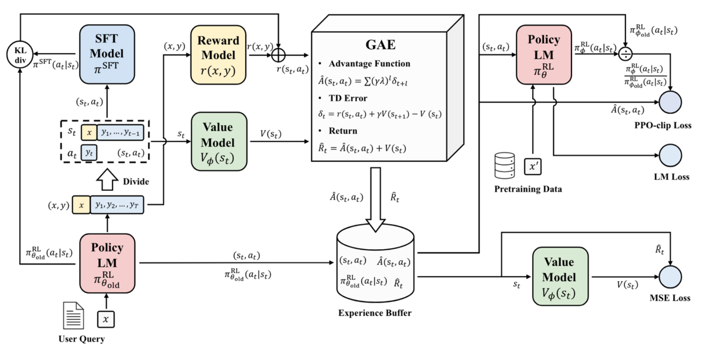

PPO 是强化学习中的传统支柱，核心在于 **Actor-Critic（演员-评论家）** 架构。

*   **1.1 核心概念：预测驱动**
    PPO 认为：要判断动作 $a$ 在状态 $s$ 下好不好，必须知道这个动作在未来能带来多少回报。它通过训练一个**价值模型（Value Model / Critic）**来充当“预言家”，预测当前状态的期望总分 $V(s)$。

*   **1.2 数学公式：双重优化目标**
    PPO 需要同时优化两个目标：策略（让好的动作更多）和价值（让预言更准）。
    
    1.  **策略损失（Clipped Surrogate Loss）**：
        $$L^{CLIP}(\theta) = \hat{\mathbb{E}}_t \left[ \min \left( r_t(\theta) \hat{A}_t, \text{clip}(r_t(\theta), 1-\epsilon, 1+\epsilon) \hat{A}_t \right) \right]$$
        其中 $r_t(\theta) = \frac{\pi_\theta(a|s)}{\pi_{\theta_{old}}(a|s)}$ 是新旧概率比。
    2.  **优势函数（Advantage $\hat{A}_t$）**：
        $$\hat{A}_t = R_t - V_\phi(s)$$
        即：实际拿到的奖励 $R_t$ 减去预言家预测的分数 $V_\phi(s)$。如果结果为正，说明动作“超预期”。
    3.  **价值损失（Value Function Loss）**：
        为了让预言家更聪明，需要最小化预测值与实际值的均方误差：$L^{VF} = (V_\phi(s) - R_t)^2$。
    
*   **1.3 详细执行流程**
    1.  **采样阶段**：Policy 模型生成回答，同时针对每个 token，Value 模型预测一个 $V$ 值。
    2.  **打分阶段**：Reward 模型对结果打分。
    3.  **优势估算**：利用 GAE（广义优势估计）计算每个时间步的 $\hat{A}_t$。
    4.  **参数更新**：
        *   更新 Policy 模型参数 $\theta$。
        *   更新 Value 模型参数 $\phi$（非常耗时）。

*   **1.4 代码实现细节**
    ```python
    # PPO 训练中，显存不仅要放 Policy，还要放等大的 Value Model
    def train_ppo_step(batch):
        # 1. 计算优势：实际回报 - 价值预测
        advantages = batch["returns"] - batch["values"]
        
        # 2. 策略梯度更新 (Clipped)
        ratio = torch.exp(new_logprobs - old_logprobs)
        surr1 = ratio * advantages
        surr2 = torch.clamp(ratio, 1-eps, 1+eps) * advantages
        policy_loss = -torch.min(surr1, surr2).mean()
        
        # 3. 价值网络更新 (MSE Loss)
        value_loss = 0.5 * (new_values - batch["returns"]).pow(2).mean()
        
        # 总损失：策略更新与价值更新的加权
        total_loss = policy_loss + vf_coef * value_loss
        return total_loss
    ```

**2. GRPO (Group Relative Policy Optimization)：基于“群体竞争”的进化范式**

GRPO 是 DeepSeek 提出的革新算法，专为解决大模型强化学习中的显存瓶颈和价值模型训练难的问题。

*   **2.1 核心概念：群体基准**
    GRPO 认为：**不需要预测分数。** 如果我们针对同一个问题生成 64 个回答，这 64 个回答的平均分就是最客观的“基准”。高于平均分的就是好回答。它用**统计学均值**彻底取代了**神经网络价值模型**。

*   **2.2 数学公式：去掉 V 网络，引入 KL 惩罚**
    GRPO 最大的改变是优势计算逻辑的重构。
    1.  **组内优势计算（Group Advantage）**：
        $$A_i = \frac{r_i - \text{mean}(r_1, r_2, \dots, r_G)}{\text{std}(r_1, r_2, \dots, r_G)}$$
        其中 $G$ 为组大小。这意味着：优势只取决于你在同组对手中的排名。
    2.  **全目标函数**：
        $$\mathcal{J}_{GRPO}(\theta) = \mathbb{E} \left[ \frac{1}{G} \sum_{i=1}^G \left( \text{Loss}_{CLIP} - \beta \mathbb{D}_{KL}(\pi_\theta || \pi_{ref}) \right) \right]$$
        这里直接在损失函数中减去解析解形式的 KL 散度，以约束模型不偏离原始 SFT 模型。

*   **2.3 详细执行流程**
    1.  **组采样**：针对一个提示词 $x$，一次性生成 $G$ 个不同的采样（Rollouts）。
    2.  **硬性打分**：在 R1 等推理模型中，通常使用脚本或编译器判题（数学对错、代码通过率），得到硬得分 $r_i$。
    3.  **计算优势**：对这 $G$ 个得分进行均值/标准差处理。
    4.  **参数更新**：仅对 Policy 模型进行梯度下降。

*   **2.4 代码实现细节**
    
    1. 组内优势计算 (Group Advantage Computation)
    
    ```python
    # 假设针对一个问题生成了 group_size 个回答
    # rewards: 列表，包含组内每个回答的原始奖励得分 [r1, r2, ..., rG]
    
    rewards = np.array(rewards)
    # 核心逻辑：计算 Z-score 归一化得分作为优势项
    # 1e-4 是为了防止除以 0 的数值稳定性因子
    group_mean = rewards.mean()
    group_std = rewards.std()
    response_advantages = (rewards - group_mean) / (group_std + 1e-4)
    
    # 将组内优势分配给对应序列的每一个 Token 位置
    advantages = [adv * len(resp) for adv, resp in zip(response_advantages, response_token_ids)]
    ```
    
    2. 策略梯度与 KL 损失计算 (Loss Computation)
    
    在更新模型时，GRPO 使用了截断的策略梯度，并直接计算解析解形式的 KL 散度。
    
    ```python
    def compute_grpo_loss(policy_model, ref_model, batch, kl_coef):
        # 1. 获取当前模型和参考模型的 log 概率
        logps = compute_token_log_probs(policy_model, batch)
        ref_logps = compute_token_log_probs(ref_model, batch)
    
        # 2. 计算解析解形式的 KL 散度项 (防止模型跑偏)
        # 公式：KL = exp(ref_logp - logp) - (ref_logp - logp) - 1
        kl_penalty = torch.exp(ref_logps - logps) - (ref_logps - logps) - 1
        
        # 3. 计算策略梯度损失 (Policy Gradient Loss)
        # 使用之前算好的组内优势项 advantages
        policy_loss = -logps * batch["advantages"]
        
        # 4. 合并最终损失并对响应长度取平均
        total_loss = (policy_loss + kl_coef * kl_penalty).sum() / total_response_len
        return total_loss
    ```
    

**3. 深度总结：PPO 与 GRPO 的本质区别**

| 维度                | **PPO (经典范式)**                                       | **GRPO (DeepSeek 范式)**                                     |
| :------------------ | :------------------------------------------------------- | :----------------------------------------------------------- |
| **显存占用**        | **极重**：需要维护 Policy 和与其等大的 Value 网络。      | **极轻**：**砍掉了 Value 网络**，显存节省约 50%。            |
| **基准 (Baseline)** | **绝对预测**：依靠预言家（Value Model）对未来的猜测。    | **相对比较**：依靠同组回答的平均表现（统计均值）。           |
| **算法稳定性**      | **受限**：如果 Value 模型没练好，Policy 会陷入震荡。     | **高**：均值是客观计算出来的，计算非常稳定。                 |
| **推理适配度**      | **中等**：很难通过 $V(s)$ 准确评估长推理链的每一步价值。 | **极佳**：通过“看结果对不对”进行组内对比，引导模型“悟”出过程。 |
| **实现复杂度**      | **高**：需要处理 GAE、Value 训练、回报回传等逻辑。       | **低**：核心逻辑仅为简单的 Z-Score 统计归一化。              |

## 三、DeepSeek, Kimi, Qwen 的强化学习方法

1. DeepSeek R1：从 R1-Zero 到全量蒸馏的范式

DeepSeek 展示了推理能力如何从“纯 RL”走向“可控推理”。

*   **1.1 实验起点：R1-Zero (纯强化学习)**
    *   **设置**：直接在基础模型（DeepSeek-V3）上跑 GRPO。
    *   **奖励构成**：仅包含**准确性奖励**（是否正确）和**格式奖励**（是否使用了 `<think>` 标签）。
    *   **关键现象**：
        *   **顿悟时刻（Aha Moment）**：模型在训练中自发学会了重新评估解题步骤。
        *   **长度爆炸**：由于 GRPO 的长度偏差（Length Bias），模型倾向于生成极长的思维链。
*   **1.2 最终形态：DeepSeek R1 的四阶段管线**
    1.  **Reasoning SFT**：用数千条高质量长 CoT 数据进行“冷启动”，解决 R1-Zero 的乱码和多语言混杂问题。
    2.  **推理 RL**：大规模强化学习。特别引入了**语言一致性奖励**（CoT 语言需与提示词一致）。
    3.  **通用对齐 SFT/RLHF**：在推理能力达标后，通过 600k 样本（由 V3 判分）进行非验证任务（如写作）的对齐。
    4.  **蒸馏 (Distillation)**：将 R1 生成的 800k 路径蒸馏给小模型，性能跨越式提升。
*   **1.3 失败的尝试：**
    *   **PRM（过程奖励模型）**：难以定义精细步骤，容易被 Reward Hacking。
    *   **MCTS（蒙特卡洛树搜索）**：在大规模扩展时极其复杂且生成空间难以定义。

2. Kimi K1.5：极致工程、长度控制与混合部署

Kimi 在“如何让强化学习更高效、更听话”上提供了教科书级的工程方案。

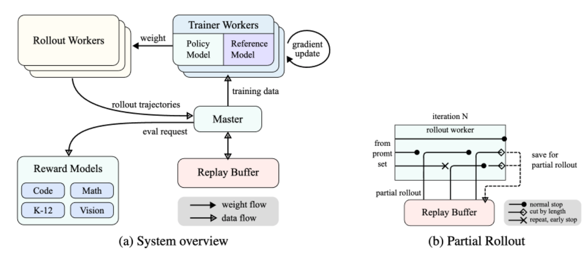

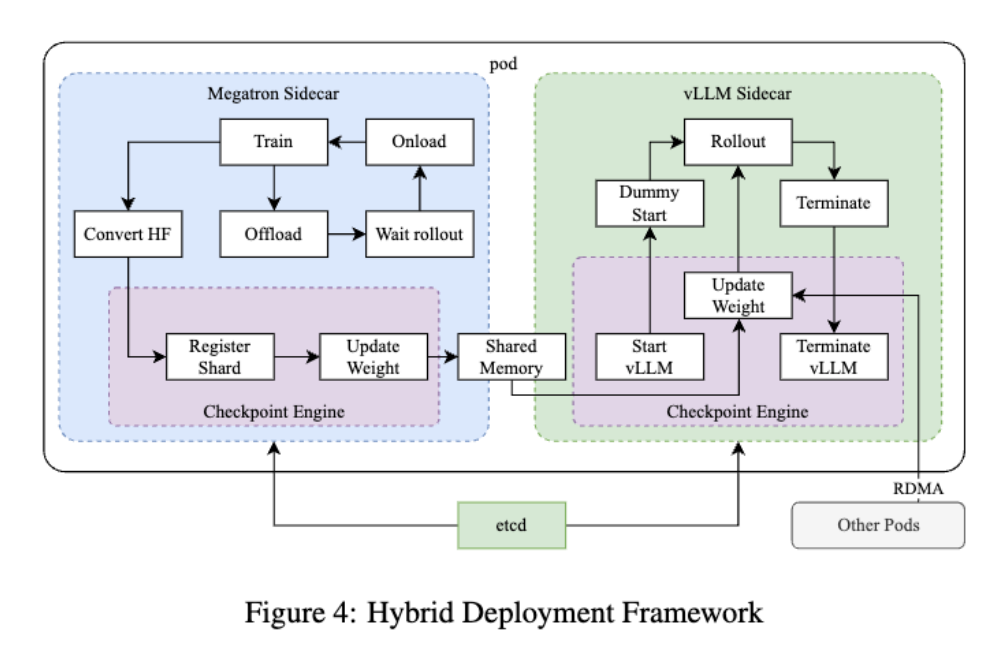

*   **2.1 数据精筛逻辑：**
    *   **Difficulty Filtering**：排除简单题。仅选择模型在 `best-of-8` 尝试中会失败的题目。
    *   **SFT Bootstrapping**：利用 SFT 模型在相对高采样温度下生成的优秀路径作为 RL 的起点。
*   **2.2 RL 算法创新：基于 DPO 衍生的平方损失：**
    *   不同于传统的 DPO，Kimi 使用了**平方损失（Squared Loss）**作为代理，结合参考模型奖励。
    *   **公式**：$L(\theta) = \mathbb{E} \left[ \left( r(x, y, y^*) - \tau \log Z - \tau \log \frac{\pi_\theta(y)}{\pi_{ref}(y)} \right)^2 \right]$。
*   **2.3 长度惩罚公式：**
    $$\text{len\_reward}(i) = \begin{cases} \lambda & \text{如果正确} \\ \min(0, \lambda) & \text{如果错误} \end{cases} \quad \text{其中 } \lambda = 0.5 - \frac{\text{len}(i) - \text{min}}{\text{max} - \text{min}}$$
    *   **创新点**：这种设计强迫模型在错误时闭嘴，在正确时简练。
*   **2.4 基础设施（Infra）：混合部署框架**：
    *   **难点**：RL 训练中由于思维链长度极不均匀，导致 Batch 同步效率极低。
    *   **方案**：**Megatron + vLLM 混合架构**。训练（Megatron）与推理采样（vLLM）分离，通过共享内存和 RDMA 进行高速数据交换，解决 uneven batches 问题。

3. Qwen 3：极简数据效率与思考模式融合

Qwen 3 刷新了“小数据撬动大性能”的记录。

*   **3.1 四阶段训练管线**：
    1.  **Stage 1**：长 CoT 冷启动。
    2.  **Stage 2**：推理 RL（Reasoning RL）。
    3.  **Stage 3**：**思考模式融合（Thinking Mode Fusion）**。
    4.  **Stage 4**：通用 RL。
*   **3.2 极低样本 GRPO**：
    *   仅用 **3995 个精选样本**。
    *   **逻辑**：移除模型不看思维链就能做对的题，移除与验证集相似的题，手动过滤高质量 CoT。
*   **3.3 思考模式融合：**
    *   **混合训练**：同时喂给模型带 `\think` 标签和不带标签的数据。
    *   **终止字符串**：训练模型在感知到时间有限时，生成一段特定的解释文字并提前终止思考过程（Early Stopping）。
*   **3.4 性能权衡：**
    *   **观察**：在进入通用 RL 阶段（General Purpose RLHF）后，模型的数学/STEM 能力会出现轻微下滑，这是通用对齐与推理上限的 tradeoff。

## 四、工程痛点

课件最后部分提到了很多“大厂不外传”的苦恼：
1.  **推理太慢**：训练 RL 时，模型要不断地吐字（Rollout）。这是**推理瓶颈**，不是计算瓶颈。
2.  **显存不均衡**：思维链（CoT）有时长、有时短。短的回答在等长的回答，导致 GPU 利用率像“心电图”一样忽高忽低。
3.  **负样本的困惑**：如果一组 64 个回答全错了怎么办？（均值也是0，标准差也是0）。这时候 GRPO 就失效了。解决办法是引入“跨批次归一化”或者加入少量的 SFT 数据补齐。

## 五、核心总结

1.  **结论一**：推理能力不是“背”出来的（SFT），而是“悟”出来的（RL）。
2.  **结论二**：算法正在向“轻量化”演进。GRPO 证明了不需要复杂的 Critic 也能跑出世界级的模型。
3.  **结论三**：计算量正在从“训练时”向“推理时”转移。DeepSeek R1 和 OpenAI o1 告诉我们：**只要让模型想得够久，它就能变聪明。**
4.  **结论四**：蒸馏（Distillation）是真理。用大模型的推理过程喂小模型，性价比极高。

# Lecture 17: 手把手讲解GRPO

## **一、 语言模型中的强化学习建模 (RL Setup for Language Models)**

在大语言模型（LLM）的语境下，强化学习的组件（状态、动作、奖励、转移）与传统的机器人控制或游戏（如 Atari）有显著的区别：

1.  **状态 (State $s$) 与 动作 (Action $a$)**
    *   **状态 $s$**：由原始提示词（Prompt）以及模型到目前为止已生成的 Token 序列组成。
    *   **动作 $a$**：模型生成的下一个 Token。
    *   **简化处理**：在分析策略梯度公式时，为了符号简洁，通常将 $a$ 视为模型生成的**整个完整响应**（Entire Response）。

2.  **转移概率 (Transition Probabilities $T$)**
    *   **确定性转移**：与机器人控制等环境不同，LLM 的状态转移是完全确定性的，即 $s' = s + a$。
    *   **优势**：这种确定性允许我们进行**规划（Planning）**或**推理时计算（Test-time compute）**。同时，由于状态完全由文本组成，它具有极高的灵活性，不像物理环境那样受限。

3.  **奖励机制 (Rewards $R$)**
    *   **结果奖励 (Outcome Rewards)**：奖励通常取决于整个响应的质量，而非单个 Token 的生成。
    *   **可验证奖励 (Verifiable Rewards)**：重点在于计算过程是确定性的任务（如数学题的答案、代码的运行结果）。
    *   **独特性**：由于序列通常较短且奖励在末尾给出，**折扣因子（Discounting）**和**自助法（Bootstrapping）**在 LLM RL 中往往不太适用。

4.  **目标函数 (Objective)**
    
    *   我们的目标是最大化在提示词分布 $p(s)$ 和策略 $\pi$ 下的期望奖励：
        $$J(\theta) = E_{s \sim p(s), a \sim \pi(a|s)} [R(s, a)] = \int p(s) \pi(a | s) R(s, a) da$$
        
        在这个公式中，**$J(\theta)$** 是我们要最大化的**目标函数**（代表模型的整体平均分）；**$p(s)$** 是**题目**（状态）出现的概率；**$\pi(a|s)$** 是模型面对题目时写出某种**答案**（动作）的概率；**$R(s, a)$** 是该答案对应的**奖励分值**（得分）。

## **二、 策略梯度基础与朴素实现 (Policy Gradient & Naive Implementation)**

策略梯度是优化上述目标函数的核心方法。

1.  **梯度的数学推导**
    为了最大化 $E[R]$，我们需要计算关于参数 $\theta$ 的梯度：
    $$\nabla_\theta E[R] = \int p(s) \nabla_\theta \pi_\theta(a | s) R(s, a) da$$
    由于我们无法直接对未知环境进行积分采样，引入 **对数导数技巧 (Log-Derivative Trick)**：
    $$\nabla_\theta \pi = \pi \frac{\nabla_\theta \pi}{\pi} = \pi \nabla_\theta \log \pi$$
    带入公式得：
    $$\nabla_\theta E[R] = \int p(s) \pi_\theta(a | s) \nabla_\theta \log \pi_\theta(a | s) R(s, a) da$$
    最终转化为期望形式：
    $$\nabla_\theta E[R] = E_{s, a \sim \pi} [\nabla_\theta \log \pi_\theta(a | s) R(s, a)]$$
2.  **朴素策略梯度算法 (Naive Policy Gradient)**
    *   **流程**：
        1.  采样提示词 $s$。
        2.  根据当前策略 $\pi$ 采样完整响应 $a \sim \pi(a|s)$。
        3.  基于 $\nabla_\theta \log \pi_\theta(a|s) R(s, a)$ 更新模型参数。
    *   **对比 SFT**：这与监督微调（SFT）非常相似，唯一的区别是更新量被奖励 $R(s, a)$ 加权了。
    *   **更新逻辑**：当奖励为二进制 $R \in \{0, 1\}$ 时，模型只会在正确的响应上进行更新。随着策略的改变，采样到的数据集也在不断进化。
3.  **核心挑战：方差与稀疏奖励**
    *   **稀疏奖励**：在很多任务中，大部分生成的响应得到的奖励都是 0，只有极少数能得到 1。这使得模型很难找到学习的方向。
    *   **高方差 (High Noise/Variance)**：这是策略梯度算法最致命的问题。由于 $R(s, a)$ 是绝对值且具有随机性，梯度的估计波动巨大。
    *   **对比 RLHF**：在基于人类反馈的强化学习中，奖励模型（RM）通常学习自成对偏好，能够提供更连续、更低方差的信号，而结果奖励（如数学/代码）通常更加“非黑即白”，加剧了训练的不稳定性。

4.  **基准线 (Baselines)：削减梯度的方差**
    虽然 $\nabla \log \pi(a|s) R(s, a)$ 是梯度的无偏估计，但在实际训练中，奖励的绝对值 $R$ 波动巨大，导致训练极不稳定。
    *   **核心思想**：我们不再优化原始奖励 $R$，而是优化它相对于一个参考值（基准线）的偏离程度：$E[R - b(s)]$。由于 $b(s)$ 只取决于状态 $s$ 而不取决于具体动作 $a$，从数学上可以证明减去 $b(s)$ 不会引入偏差，但能显著降低方差。
    *   **数值示例**：
        *   假设有两个状态，$s_1$（容易题）奖励为 $[11, 9]$，$s_2$（难题）奖励为 $[0, 2]$。
        *   **朴素梯度方差**：对 $[11, 9, 0, 2]$ 求标准差，方差约为 **5.323**。在这种情况下，模型会过度强化 $s_1$ 中的较差动作（9分），因为 9 远大于 $s_2$ 里的最高分 2。
        *   **引入基准线**：设 $b(s_1) = 10, b(s_2) = 1$。
        *   **减去基准线后**：奖励变为 $[1, -1, -1, 1]$。此时标准差大幅降至 **1.155**。模型现在能清晰地识别出：$s_1$ 下的 $a_2$ 其实是低于平均水平的。
    *   **最优基准线 $b^*(s)$**：理论上存在一个使方差最小的最优基准线，其公式为 $E[(\nabla \pi)^2 R | s] / E[(\nabla \pi)^2 | s]$。但由于计算极其复杂，工程上通常使用**启发式方法**，将 $b(s)$ 设为该状态下的**平均预期奖励** $E[R | s]$。

5.  **优势函数 (Advantage Functions)：衡量“超越预期”**
    基准线的选择直接引向了强化学习中最重要的概念——优势函数 $A(s, a)$。
    *   **状态价值 $V(s)$**：从状态 $s$ 开始，按照当前策略平均能获得的奖励期望值，$V(s) = E[R | s]$。这对应了我们选取的基准线 $b(s)$。
    *   **动作价值 $Q(s, a)$**：在状态 $s$ 下采取特定动作 $a$ 后预期的奖励。在 LLM 结果奖励设置下，$Q(s, a)$ 简化为实际得到的奖励 $R(s, a)$。
    *   **定义优势函数**：$A(s, a) = Q(s, a) - V(s)$。
    *   **物理直觉**：优势函数代表了“当前的动作 $a$ 比我的平均水平好多少”。
    *   **总结**：如果将基准线设为 $V(s)$，那么梯度更新的权重就恰好等于优势函数：
        $$\text{Gradient Estimate} = \nabla \log \pi(a | s) A(s, a)$$
        这种方法强制模型专注于那些“超出预期”的优秀表现，而抑制那些“低于平均”的平庸表现，即使这些平庸表现的绝对分值 $R$ 可能并不低。

## **三、 GRPO：取消 Critic 的架构革命**

**GRPO (Group Relative Policy Optimization)** 由 DeepSeek 团队提出，其核心愿景是：**通过组内统计取代价值建模，彻底在训练中移除 Critic 模型。**

1.  **组内相对优势 (Group Relative Advantage)**
    对于每一个 Prompt $s$，GRPO 同时采样 $G$ 个不同的回复 $\{a_1, a_2, \dots, a_G\}$。这组回复通过同一个奖励函数得到一组分数 $\{r_1, r_2, \dots, r_G\}$。
    此时，第 $i$ 个回复的优势函数不再由 Critic 预测，而是通过组内统计直接算出：
    $$A_i = \frac{r_i - \text{mean}(r_1, \dots, r_G)}{\text{std}(r_1, \dots, r_G)}$$
    **深度洞察**：这种方法天然地实现了自适应基准线。题目简单时，大家分都高，平均值也高；题目难时，大家分都低，平均值也低。$A_i$ 衡量的是“你在同辈中是否优秀”，这与人类解决问题的反馈逻辑高度一致。

2.  **GRPO 综合损失函数**
    GRPO 继承了 PPO 的裁剪（Clipping）机制以确保稳定性，同时加入了针对参考模型（Reference Model）的 KL 散度约束：
    $$L_{GRPO} = \frac{1}{G} \sum_{i=1}^G \left[ \min\left( \frac{\pi_\theta(a_i|s)}{\pi_{old}(a_i|s)} A_i, \text{clip}\left(\frac{\pi_\theta(a_i|s)}{\pi_{old}(a_i|s)}, 1-\epsilon, 1+\epsilon\right) A_i \right) - \beta D_{KL}(\pi_\theta || \pi_{ref}) \right]$$
    *   **KL 项的作用**：防止策略塌缩。如果不加这一项，模型可能会发现某些“捷径”（Reward Hacking），例如在数学回答中不断重复“正确”的关键词来骗取高分，KL 散度强迫模型保留原始语言模型的语言分布。
    *   公式中各个符号的工程含义：
        *   **$\pi_\theta(a_i|s)$（当前策略）**：这是正在进行参数更新、试图学习的模型。我们计算它的 `log_prob` 来观察参数微调后，生成该回答的概率如何变化。
        *   **$\pi_{old}(a_i|s)$（旧策略）**：这是在开始当前这轮迭代前，负责实际采样（Rollout）生成回答的模型。它作为分母，与新策略构成**重要性采样比率（Ratio）**，衡量模型在一步更新中变动了多少。
        *   **$\pi_{ref}(a_i|s)$（参考模型）**：这是一个冻结权重的原始模型（通常是 SFT 后的模型）。它作为“定海神针”，通过 KL 散度约束 $\theta$ 的漂移。
        *   **$A_i$（组内优势）**：这是第 $i$ 个回答在组内 $G$ 个样本中的相对得分（经标准化处理）。它决定了更新的方向：$A_i > 0$ 则拉高该动作概率，$A_i < 0$ 则压低。
        *   **$\epsilon$（裁剪阈值）**：通常取 0.1 或 0.2。它限制了新旧策略比率的变化范围，防止单次更新幅度过大导致策略崩溃（即 PPO 的核心稳定性机制）。
        *   **$\beta$（KL 惩罚系数）**：控制惩罚力度的超参数。$\beta$ 越大，模型就越不敢偏离原始 $ref$ 模型的说话方式；$\beta$ 越小，模型就越倾向于为了拿高分而不择手段。
        *   **$D_{KL}(\pi_\theta || \pi_{ref})$（KL 散度项）**：衡量当前模型与原始模型在词汇分布上的距离。在 GRPO 中，它通常被简化计算，作为正则化项确保模型在变得“聪明”的同时，依然保留着人类基本的语言逻辑。

## **四、 GRPO 核心逻辑实现示例**

**算法伪代码：**

**输入：** 初始策略模型 $\pi_{\theta_{init}}$；奖励模型 $r_\phi$；任务提示词集 $\mathcal{D}$；超参数 $\epsilon, \beta, \mu$

1.  初始化策略模型 $\pi_\theta \leftarrow \pi_{\theta_{init}}$
2.  **对于** 外部迭代轮数 $iteration = 1, \dots, I$ **执行：**
3.  　　更新参考模型 $\pi_{ref} \leftarrow \pi_\theta$
4.  　　**对于** 训练步数 $step = 1, \dots, M$ **执行：**
5.  　　　　从 $\mathcal{D}$ 中采样一个批次 $\mathcal{D}_b$
6.  　　　　更新旧策略模型 $\pi_{\theta_{old}} \leftarrow \pi_\theta$
7.  　　　　对于批次中的每个问题 $q \in \mathcal{D}_b$，利用 $\pi_{\theta_{old}}(\cdot | q)$ 采样 $G$ 个输出结果 $\{o_i\}_{i=1}^G$
8.  　　　　通过运行奖励模型 $r_\phi$，为每个采样的输出 $o_i$ 计算奖励值 $\{r_i\}_{i=1}^G$
9.  　　　　通过**组内相对优势估计**，计算输出 $o_i$ 中第 $t$ 个词（Token）的优势函数值 $\hat{A}_{i,t}$
10. 　　　　**对于** GRPO 内部更新轮数 $iteration = 1, \dots, \mu$ **执行：**
11. 　　　　　　通过最大化 GRPO 目标函数来更新策略模型 $\pi_\theta$
12. 　　通过重放机制进行持续训练，更新奖励模型 $r_\phi$

**输出：** 优化后的策略模型 $\pi_\theta$

**实际代码示例：**

这是一个简单的训练排序任务的GRPO示例

```python
import torch
import torch.nn as nn
import torch.nn.functional as F
from einops import rearrange, repeat
import copy

# ==========================================================
# 1. 奖励函数 (Verifiable Reward)
# ==========================================================
def sort_inclusion_ordering_reward(prompt: list[int], response: list[int]) -> float:
    """
    针对排序任务的奖励函数：
    1. 包含奖励：响应中包含原数字的个数。
    2. 顺序奖励：响应中相邻数字满足递增关系的对数。
    """
    inclusion_reward = sum(1 for x in prompt if x in response)
    ordering_reward = sum(1 for x, y in zip(response, response[1:]) if x <= y)
    return float(inclusion_reward + ordering_reward)

# ==========================================================
# 2. GRPO 核心组件：优势计算 (Advantage Estimation)
# ==========================================================
def compute_grpo_advantages(rewards: torch.Tensor) -> torch.Tensor:
    """
    GRPO 的精髓：在采样组 (Group) 内进行标准化。
    Args:
        rewards: [batch_size, num_responses_per_prompt]
    Returns:
        advantages: [batch_size, num_responses_per_prompt]
    """
    # 在一组 (trial 维度) 内计算均值和标准差
    mean_rewards = rewards.mean(dim=-1, keepdim=True)
    std_rewards = rewards.std(dim=-1, keepdim=True)
    
    # 标准化：(R - mu) / sigma
    advantages = (rewards - mean_rewards) / (std_rewards + 1e-8)
    return advantages

# ==========================================================
# 3. GRPO 核心组件：KL 散度计算
# ==========================================================
def compute_grpo_kl_penalty(log_probs, ref_log_probs):
    """
    使用 DeepSeek 论文中的 KL 估计方式：
    KL(p || q) = E_p[ q/p - log(q/p) - 1 ]
    """
    # q/p = exp(log_q - log_p)
    ratio = torch.exp(ref_log_probs - log_probs)
    log_ratio = ref_log_probs - log_probs
    kl = ratio - log_ratio - 1
    return kl.mean() # 返回标量

# ==========================================================
# 4. GRPO 核心组件：损失函数 (Loss Function)
# ==========================================================
def compute_grpo_loss(log_probs, old_log_probs, advantages, epsilon=0.1):
    """
    结合了重要性采样比例裁剪 (Clipping) 的 GRPO 损失
    """
    # 计算新旧策略概率比 r(theta)
    # log_probs, old_log_probs: [batch, trial, seq_len]
    # advantages: [batch, trial]
    
    # 为了维度匹配，将 advantage 广播到每个 token 上
    advantages = advantages.unsqueeze(-1) 
    
    ratios = torch.exp(log_probs - old_log_probs)
    
    # PPO 风格的裁剪机制
    surr1 = ratios * advantages
    surr2 = torch.clamp(ratios, 1 - epsilon, 1 + epsilon) * advantages
    
    # 取最小值并取负（因为是梯度上升转最小化损失）
    loss = -torch.min(surr1, surr2).mean()
    return loss
  
# ==========================================================
# 5. 计算 Log Probabilities (核心逻辑)
# ==========================================================
def compute_log_probs(prompts, responses, model):
    """
    针对生成的 responses，计算其在当前模型下的对数概率。
    Args:
        prompts: [B, P_Len]
        responses: [B, G, R_Len] (B: Batch, G: Group Size, R_Len: Response Length)
    """
    # 1. 获得 logits [B, R_Len, Vocab]
    # 注意：在简单非自回归模型中，logits 直接由 prompt 生成
    logits = model(prompts) 
    
    # 2. 计算词表的对数概率
    log_probs_vocab = F.log_softmax(logits, dim=-1) # [B, R_Len, Vocab]
    
    # 3. 维度对齐：将词表概率广播到 G 个采样组上
    # 结果：[B, G, R_Len, Vocab]
    log_probs_vocab = repeat(log_probs_vocab, "b r v -> b g r v", g=responses.shape[1])
    
    # 4. 使用 gather 提取模型实际选中的那个词的概率
    # responses.unsqueeze(-1) 变为 [B, G, R_Len, 1] 以便作为索引
    selected_log_probs = log_probs_vocab.gather(dim=-1, index=responses.unsqueeze(-1))
    
    # 5. 移除最后一个维度 [B, G, R_Len]
    return selected_log_probs.squeeze(-1)

# ==========================================================
# 6. 训练循环逻辑 (Training Loop)
# ==========================================================
def run_grpo_training(initial_model, prompts, num_iterations=10, num_inner_steps=3, num_responses=8):
    """
    完整的 GRPO 训练循环
    Args:
        initial_model: 初始策略模型 (SFT 后的模型)
        prompts: 任务提示词数据集
    """
    # 1. 初始化模型
    # policy_model (pi_theta): 我们要优化的对象
    policy_model = initial_model
    optimizer = torch.optim.Adam(policy_model.parameters(), lr=1e-5)
    
    # ref_model (pi_ref): 永远冻结，作为 KL 惩罚的锚点
    ref_model = copy.deepcopy(initial_model).eval()
    for param in ref_model.parameters():
        param.requires_grad = False

    print("开始 GRPO 迭代训练...")

    for iteration in range(num_iterations):
        # --- A. 采样与评估阶段 (Rollout Phase) ---
        # 这一部分不计算梯度，固定旧策略采样
        with torch.no_grad():
            # 为计算 Ratio，我们将采样时刻的模型视为 pi_old
            # 在某些实现中，会显式拷贝一个 old_model，也可以直接记录这一步的 log_probs
            
            # 1. 采样组输出：每个问题采样 G 个回答
            # responses shape: [Batch, Group, Seq_Len]
            responses = generate_responses(prompts, policy_model, num_responses)
            
            # 2. 计算奖励 R
            # rewards shape: [Batch, Group]
            rewards = compute_reward_batch(prompts, responses)
            
            # 3. 计算组内相对优势 A (GRPO 的精髓)
            # 通过组内统计量 (R - mean) / std 得到
            advantages = compute_grpo_advantages(rewards)
            
            # 4. 记录旧策略和参考模型的对数概率 (作为常量)
            old_log_probs = compute_log_probs(prompts, responses, policy_model)
            ref_log_probs = compute_log_probs(prompts, responses, ref_model)

        # --- B. 优化阶段 (Optimization Phase) ---
        # 对应算法伪代码中的内部迭代轮数 mu
        for inner_step in range(num_inner_steps):
            # 计算当前策略下的对数概率 (带梯度)
            curr_log_probs = compute_log_probs(prompts, responses, policy_model)
            
            # 1. 计算策略损失 (Clipped Policy Loss)
            # 内部包含 ratio = exp(curr - old) 和 clip 机制
            policy_loss = compute_grpo_loss(
                curr_log_probs, 
                old_log_probs, 
                advantages, 
                epsilon=0.1
            )
            
            # 2. 计算 KL 惩罚损失
            # 引导模型不要偏离 ref_model 太远
            kl_loss = compute_grpo_kl_penalty(curr_log_probs, ref_log_probs)
            
            # 总损失 = 策略增益 + KL 约束
            beta = 0.01  # KL 系数
            total_loss = policy_loss + beta * kl_loss
            
            # 反向传播与更新
            optimizer.zero_grad()
            total_loss.backward()
            optimizer.step()
            
            print(f"Iter {iteration}, Inner {inner_step}, Loss: {total_loss.item():.4f}")

        # (可选) 检查点保存或定期更新奖励模型
        # update_reward_model_if_needed(r_phi)

    print("训练完成。")
    return policy_model

# ==========================================================
# 7. 代码关键点总结
# ==========================================================
"""
1. Group Sampling: 相比 PPO 采样一个或几个，GRPO 强调为同一个 Prompt 采样一大组 (G) 响应。
2. No Critic: 注意代码中没有任何 $V(s)$ 的计算。优势 $A$ 完全通过组内奖励的 `mean` 和 `std` 得到。
3. Frozen Reference: `ref_model` 保持不变，用于通过 KL 项约束 `model` 不会产生奖励作弊 (Reward Hacking)。
4. Importance Sampling: 使用 `log_probs - old_log_probs` 的指数形式来衡量策略更新的步长。
5. No_grad Context: 在计算 Advantage 和采样时，务必使用 `torch.no_grad()`，确保 p_old 是常量。
"""
```

*本笔记由 Gemini 3 辅助制作。*