## 第1章 计算机系统漫游

- 

### 1.1 信息就是位 + 上下文

源文件中每个文本行都是以看不见的 '\n' 结束的。

只由 ASCII 字符组成的文件成为文本文件，其他都是二进制文件。.cpp 文件就是文本文件。

系统中的所有信息都是由一串比特（bit：位）表示的，区分不同数据对象的唯一方法就是根据上下文。

### 1.2 程序被其他程序翻译成不同的格式

从源程序到目标程序要经历四个步骤：

1. （预处理）源程序被预处理器处理得到修改了的源程序（文本文件，hello.i）

2. （编译）再由编译器处理得到汇编程序（文本文件,hello.s）

3. （汇编）汇编程序由汇编器处理得到可重定位目标程序（二进制文件,hello.o）

4. （链接）最后由链接器链接得到可执行目标程序（二进制文件,hello）

比如 printf 函数是一个标准 C 库函数，存在于 printf.o 中，这是一个单独的预编译好了的目标文件。链接器将其与汇编得到的二进制文件合并得到可执行目标文件。

### 1.3 了解编译系统如何工作是大有用处的

用处：

1. 优化程序性能

2. 理解链接时出现的错误

3. 避免安全漏洞

### 1.4 处理器读并解释储存在内存中的指令

shell 是一个命令行解释器，它输出一个提示符（>>），等待输入一个命令行，然后执行命令。如果输入的是可执行文件的名字，就运行该文件。

#### 1.4.1 系统的硬件组成

主要包括总线、I/O 设备、处理器、主存储器四个部分

**总线**

总线一次可以传输一个定长的字节块，称为字。64位系统即总线一次可以传输 64 位（8字节），这里一个字就是 8 字节

I/O 设备

每个 I/O 设备通过一个控制器或适配器与 I/O 总线相连。

控制器是 I/O 设备本身或主板上的芯片组，适配器则是一块插在主板上的卡。

**主存**

主存是由一组动态随机存取内存（DRAM）组成的。

从逻辑上看，存储器是一个线性的字节数组，每个字节都有唯一的地址。

**处理器**

处理器是解释存储在主存中指令的引擎。

处理器的核心是一个程序计数器（PC)

程序计数器是一个大小为一个字的存储设备，存储CPU即将执行的下一条指令的地址。

处理器就是在不断执行程序计数器指向的指令。每执行一条，程序计数器更新一次，指向下一条指令。

处理器会按照指令执行模型（指令集架构）解释指令中的位并执行相应操作。


每条指令的操作是围绕主存、寄存器文件、算数/逻辑单元（ALU）进行的。

寄存器文件：单个字长，有唯一的名字。

ALU：计算新的数据和地址值。

几个简单指令的操作：

- 加载：从主存复制一个字或字节到寄存器，覆盖原来内容

- 存储：从寄存器复制一个字或字节到主存，覆盖原来内容

- 操作：把两个寄存器的内容复制到 ALU，ALU 对这两个字做算术运算，并把结果存到一个寄存器中

- 跳转：从指令中抽取一个字复制到程序计数器中，覆盖原来内容。

区分处理器指令集架构和微体系架构：

- 指令集架构：每条机器指令的效果

- 微体系架构：处理器实际上是如何实现的

#### 1.4.2 运行 hello 程序

执行目标文件时，shell 程序将位于磁盘目标文件中的字符逐个读入寄存器，然后放到主存中。之后处理器就开始执行目标文件的机器语言指令，从 main 程序开始。

利用直接存储器存取（DMA）可以不通过寄存器，直接将数据从磁盘到达内存。

以输出打印 hello world 为例，处理器将 hello world 的字节复制到寄存器，然后再复制到显示器，最后显示在屏幕上。

整个流程：读取文件字符到寄存器 → 存储到主存 → 执行指令 → 加载 helloworld 到寄存器 → 复制到显示器 → 显示

### 1.5 高速缓存至关重要

从主存读取一个字比磁盘快 1000 万倍。

从寄存器文件读取比主存块 100 倍，并且差距还在加大。

高速缓存（cache）用来解决处理器与主存间的差异。

L1 高速缓存位于 CPU 上。L1 比 L2 快 5 倍。

L2 高速缓存通过一条特殊的总线与 CPU 连接，容量为数十万到数百万字节（几百 MB 到 几 GB）。L2 比 主存快 5~10 倍

新的系统还有 L3。

通过让高速缓存里存放可能经常访问的数据，让大部分的内存操作都在高速缓存中完成。

### 1.6 存储设备形成层次结构

存储器层次结构共 7 层，主要思想是上一层的存储器作为低一层的高速缓存。

从上到下，容量更大，运行更慢，每字节价格更便宜。

- 0层：寄存器

- 1层：L1高速缓存(SRAM)

- 2层：L2高速缓存(SRAM)

- 3层：L3高速缓存（SRAM）

- 4层：主存（DRAM）

- 5层：本地二级存储（本地磁盘）

- 6层：远程二级存储（分布式文件系统，Web服务器）

### 1.7 操作系统管理硬件

操作系统所应用的三个基本的抽象概念：

1. 进程：对处理器、主存和 I/O 设备的抽象表示

2. 虚拟内存：对主存和磁盘的抽象表示

3. 文件：对 I/O 设备的抽象表示

#### 1.7.1 进程

进程：对操作系统正在运行的程序的一种抽象。

并发运行：一个进程的指令和另一个进程的指令是交错执行的。

一个系统可以同时运行多个进程，实际上这些进程是并发运行的。

操作系统通过上下文切换来实现并发运行。上下文是跟踪进程运行所需的所有状态信息，可能存在于PC、寄存器文件、主存等地方。

任何时刻，单处理器只能执行一个进程的代码。

操作系统内核是操作系统代码常驻主存的部分，从一个进程到另一个进程的转换是由内核管理的。

内核不是一个独立的进程，是一系列代码和数据结构的集合。

当应用程序需要操作系统的某些操作时，就把控制权传递给内核，内核执行完操作后返回应用程序。

#### 1.7.2 线程

一个进程由多个线程组成，每个线程都运行在进程的上下文中，共享同样的代码和全局数据。

多线程之间比多进程之间更容易共享数据，且线程一般来说比进程更高效。

#### 1.7.3 虚拟内存

机器级程序将内存视为一个庞大的字节数组，称为虚拟内存。

内存的每个字节由地址来标识，所有可能地址的集合就是虚拟地址空间。

虚拟内存使每个进程都以为自己独占了主存。每个进程看到的内存都是一致的，即虚拟地址空间。

在linux中，每个进程看到的虚拟地址空间由以下几个部分组成：

1. 程序代码和数据

2. 堆（运行时堆）

3. 共享库

4. 栈（用户栈）

5. 内核虚拟内存

地址从低到高，最高层的内核虚拟内存保存的是操作系统中的代码和数据，这部分每个进程都一样。

程序代码和数据

对所有进程来说，代码都是从同一个固定地址开始，紧接着是与全局变量对应的数据区。代码和数据区都是按照可执行文件的内容初始化的。代码和数据区在进程开始运行时就被指定了大小。

堆

而运行时堆是根据 malloc 和 free 函数的调用在运行时动态地扩展和收缩的。

共享库

地址空间的中间部分用来存放共享库的代码和数据。如 C 标准库、数学库等都属于共享库

栈

用户栈和堆一样，在程序执行期间可以动态的扩展和收缩，编译器用它来实现函数调用。当调用函数时，栈增长，从函数返回时，栈收缩

#### 1.7.4 文件

文件就是字节序列，仅此而已。

每个 I/O 设备，包括磁盘、键盘、显示器、网络，都可以看成是文件。

### 1.8 系统之间利用网络通信

从一个单独的系统而言，网络可以视为一个 I/O 设备。

以在一个远端服务器运行程序为例，在本地输入，在远端执行，执行结果发送回本地输出。

### 1.9 重要主题

#### 1.9.1 Amdahl 定律

Amdahl 定律的主要观点：要加速整个系统，必须提升全系统中相当大的部分。

#### 1.9.2 并发和并行

区分并发与并行：

- 并发：一个通用的概念，指一个同时具有多个活动的系统

- 并行：用并发来使系统运行得更快

并行可以在多个抽象层次上运用。从高到低有以下三个层次

**1.线程级并行**

传统意义上的并发执行是通过单处理器在进程间快速切换模拟出来的。

多处理器系统由一个操作系统控制多个 CPU。结构如下


L1 高速缓存被分为两个部分：一个保存最近取到的指令，一个存放数据。

超线程又称同时多线程，它允许一个 CPU 执行多个控制流。 CPU 有的硬件有多个备份，比如程序计数器和寄存器文件，而其他硬件只有一份，比如浮点算术运算单元。常规 CPU 需要约 20000 个时钟周期来切换线程，超线程 CPU 可以在单个周期的基础上切换线程，比如一个线程在等待数据装在到高速缓存，CPU 就可以去执行另一个线程。

i7 处理器每个核执行两个线程，所以是 4 核 8 线程，8 个线程都并行执行。

**2. 指令级并行**

每条指令从开始到结束一般需要 20 个或更多的时钟周期，通过指令级并行，可以实现每个周期 2~4 条指令的执行速率。

如果比一个周期一条指令更快，就称为超标量处理器，现在一般都是超标量。

**3. 单指令、多数据并行**

在最低层次上，现代处理器允许一条指令产生多个可以并行执行的操作，称为单指令、多数据并行，即 SIMD 并行。

#### 1.9.3 计算机系统中抽象的重要性


指令集架构是对 CPU 硬件的抽象，使用这个抽象，CPU 看起来好像一次只执行机器代码程序的一条指令，实际上底层硬件并行地执行多条指令。

虚拟机是对整个计算机系统的抽象，包括操作系统、处理器和程序。


## 第2章 信息的表示和处理

- 

### 2.1 信息存储

计算机一般使用字节作为最小的可寻址的内存单位。

指针的值是某个存储块的第一个字节的虚拟地址。

#### 2.1.1 十六进制表示法

十六进制以 0x 开头。

#### 2.1.2 字数据大小

每个计算机有对应的字长，虚拟地址用一个字来编码，所以字长决定了虚拟地址空间的大小。64 位机器的指针类型长度为 8 字节

32位机器的虚拟地址空间为 4GB，64 位字长的虚拟地址空间位 16 EB。（最大2^w-1）

#### 2.1.3 寻址和字节顺序

两种字节存储法：

- 小端法：数字的低位在前（前就是最小地址）

- 大端法：数字的高位在前

大多数 Intel 都是小端法，不是所有。

#### 2.1.4 表示字符串

C 语言字符串是以 null 字符结尾的字符数组，即 '\0'

ASCII 字符适合编码英文文档。

Unicode（UTF-8）使用 4 字节表示字符，一些常用的字符只需要 1 或 2 个字节。所有 ASCII 字符在 UTF-8 中是一样的。

#### 2.1.5 表示代码

二进制代码是不兼容的，一般无法在不同机器间移植。

从机器的角度看，程序就是一个字节序列。

#### 2.1.6 布尔代数

布尔代数是在 0 和 1 基础上的定义

可以把字节看作是一个长为 8 的位向量。

位向量的一个应用是表示有限集合。如位向量 [0110 1001] 表示集合 A = {0,3,5,6}。

#### 2.1.7 C 语言中的位级运算

位运算的常见应用是实现掩码。掩码表示从一个字中选出的位的集合，如掩码 0xFF 表示一个字的低 8 位。

表达式 ~0 可以生成一个全 1 的掩码，不管机器的字大小是多少。

#### 2.1.8 C 语言中的逻辑运算

逻辑运算符 && 和 || 如果第一个参数就能确定结果，就不再计算第二个参数

#### 2.1.9 C 语言中的移位运算

左移 k 位丢掉最高的 k 位，并在右端补 k 个 0。

右移分为逻辑右移和算术右移。逻辑右移左端补 0，算术右移左端补最高有效位的值。

一般都对有符号数使用算术右移，即补符号位的值。无符号数，只能是逻辑右移，即补 0

### 2.2 整数表示

无符号表示与补码表示

有符号数到无符号数的转换会产生漏洞，避免错误的方法之一是不使用无符号数。

#### 2.2.1 整数数据类型

在 64 位系统上

- int：4字节，可表示十进制数字位数：10位（-20~20亿以内）

- long long：8字节，可表示十进制数字位数：19位（千亿亿级）

- long：8字节

- double：8字节，精度15位，可表示十进制数字位数308位

- float：4字节，精度6位，可表示十进制数字38位

- char：-128~127

#### 2.2.2 无符号数的编码

无符号表示、补码表示与数据的映射都是双射，即一一对应。

#### 2.2.3 补码编码

补码的定义实际就是将符号位解释为负权。

-2^(w-1)

对表示正数的二进制取反加1，符号位置1

#### 2.2.4 有符号数和无符号数之间的转换

在有符号数与无符号数之间进行强制类型转换的结果是保持位值不变，只改变解释位的方式。

补码 x 转无符号数

- x >= 0，值不变

- x < 0，转换后的值为 2^w + x

无符号数 x 转补码

- x < 2^(w-1)，值不变

- x >= 2^(w-1)，转换后的值为 x - 2^w

#### 2.2.5 C 语言中的有符号数和无符号数

C 语言中有符号数和无符号数相加减，有符号被转换成无符号。

#### 2.2.6 扩展一个数字的位表示

扩展无符号数使用零扩展，即在最高位前加 0

扩展有符号数使用符号扩展，即在最高位前加最高有效位的值！！

#### 2.2.7 截断数字

对一个 w 位的数字截断为一个 k 位数字，将丢弃高 w-k 位。

对于无符号数而言，截断后的数字实际上等于 w mod 2^k，即取余。

对于有符号数转变为无符号数，U2T(B2U([x_{w-1},……] mod 2^k))

### 2.3 整数运算

#### 2.3.1 无符号加法

考虑溢出，C 语言不会将溢出作为错误发出信号

当 x+y >= 2^w，实际结果为 s = x+y-2^w

对任意的 x+y，s = (x+y) % 2^w

溢出的结果：和小于两个加数

检验溢出的方式：如果 s<x，说明溢出

无符号数的非：~x = 2^w - x (x>0)

#### 2.3.2 补码加法

当 x+y >= 2^(w-1)， s = x+y-2^w，正溢出

当 x+y < -2^(w-1)，s = x+y+2^w，负溢出

正溢出的结果是负数，负溢出的结果是正数。

检验溢出的方式：当 x,y>0 而 s<=0 是正溢出；当 x,y<0 而 s>=0 是负溢出

#### 2.3.3 补码的非

当 x = TMin，-x = TMin；当 x ≠ TMin，-x = -x

补码非的位级表示：对每一位求补，结果再加 1

计算补码非的第二种方法：假设 k 是最右边的 1 的位置，对 k 左边的所有位取反

#### 2.3.4 无符号乘法

无符号乘法的积 m = (x*y) % 2^w

#### 2.3.5 补码乘法

可以认为补码乘法和无符号乘法的位级表示是一样的

C语言在运算时将 x,y 视为无符号数进行乘法运算，结果取余后将其按补码方式解释

补码乘法的积 m = (x*y) % 2^w

（可以证明视为无符号数进行运算不影响结果）

#### 2.3.6 乘以常数

大多数机器上，整数乘法需要 10 个或更多的时钟周期，而加法、减法、位级运算和移位只需要 1 个时钟周期

编译器对整数乘法进行优化的方式：用移位和加法或减法运算的组合来代替常数因子的乘法。

左移 k 位等于乘以 2^k

如 x * 14 = (x<<3)+(x<<2)+(x<<1) = (x<<4)-(x<<2)

判断如何移动的方式很简单：14 的位级表示为 1110，所以分别左移 3，2，1

#### 2.3.7 除以 2 的幂

大多数机器上，整数除法更慢，需要 30 个或更多的始终周期。

（只有）除以 2 的幂可以用移位运算来代替，无符号采用逻辑右移，补码采用算术右移

对于有符号数而言，算术右移的结果相当于进行除法运算后向下舍入

使用 (x+(1<<k)-1)>>k 的结果相当于进行除法运算然后向零舍入

代码实现

`(x<0 ? x+(1<<k)-1 : x) >> k;`

#### 2.3.8 关于整数运算的最后思考

补码使用了与无符号算术运算相同的位级实现，包括加法、减法、乘法甚至除法。都有完全一样或非常类似的位级行为。

### 2.4 浮点数

浮点数对于非常大，非常接近零，近似值计算都很有用

#### 2.4.1 二进制小数

小数的二进制表示法只能表示那些能够写为 x * 2^w 的数，其他的数都是近似表示。x 必须可以由形如 2^i + 2^j + ... + 2^n 的多项式表示

浮点运算的不精确性可能产生严重后果

#### 2.4.2 IEEE 浮点表示

IEEE 浮点标准的表示形式为：V = (-1)^S * M * 2^E，它分为三部分：

1. 符号：S 决定是负数还是正数

2. 阶码：E 的作用是对浮点数加权

3. 尾数：M 是一个二进制小数，范围是 1~2-ε 或 0~1-ε

在对浮点数的位编码时：

1. 一个单独的符号位编码直接编码 S

2. k 位的阶码字段 e 编码 E；float 中 k=8，double 中 k=11

3. n 位的小数字段 f 编码 M；float 中 n=23，double 中 n=52

E 和 M 的编码方式分为三种情况：

1. 规格化的值：阶码字段即不全为 0 也不全为 1 时属于规格化值（0001~1110）

2. 阶码字段解释方式：E = e - (2^(k-1)-1)  或写成 E=e-bais；如 k=4 时，E 的范围是 -6~7；单精度为 -126~127

3. 小数字段解释方式：M = 1 + f


1. 非规格化的值：阶码字段全为 0 时属于非规格化形式

2. 阶码字段解释方式：E = 1 - (2^(k-1)-1)  或写成 E=1-bais

3. 小数字段解释方式：M = f


1. 特殊值：阶码字段全为 1 时，分两种情况：

2. 小数字段全为 0：表示无穷

3. 小数字段非零：表示 NaN。比如 ∞-∞ ,sqrt(-1)的结果就返回 NaN

#### 2.4.3 数字示例

0 有 +0.0 和 -0.0 两种表示方式

最大非规格化数到最小规格化数的过渡是平滑的。

浮点数能够使用正数排序函数来排序，即浮点数的位级表示当用整数方式来解释时是顺序的（正数升序负数降序）。

浮点数可表示的数的分布是**不均匀**的，越接近零时越稠密

几个特殊的值的位级表示：

1. +0.0 全为 0

2. 最小的正非规格化值：最低有效位为 1，其他为 0

3. 最大的非规格化值：小数字段全为 1，其他为 0

4. 最小的正规格化值：阶码字段最低位为 1，其他为 0

5. 最大的规格化值：阶码字段最低位为 0，符号位为 0，其他为 1

#### 2.4.4 舍入

因为范围和精度有限，浮点运算只能近似表示实数运算。

在浮点数的近似匹配上，IEEE 浮点格式定义了四种舍入方式（默认第一种）：

1. 向偶数舍入（向最接近的值舍入）：非中间值 (0.5) 四舍五入，中间值向偶数舍入。

2. 向零舍入

3. 向下舍入

4. 向上舍入

向偶数舍入可以计算一组数的平均数时避免统计偏差。

实际上这种舍入是发生在二进制小数上的。

#### 2.4.5 浮点运算

IEEE 标准定义 1/-0 = -∞，1/+0 = +∞

浮点运算是可交换不可结合也不可分配的。

浮点加法满足加法和乘法上的单调性。如果 a>=b，则 x+a >= x+b

缺乏结合性和分配性会使一些简单问题变得很复杂

#### 2.4.6 C 语言中的浮点数

在 int、float、double 间进行强制类型转换时的几种情况：

1. int 到 float：不会溢出，可能舍入

2. int 或 float 到 double：不会溢出也不会舍入

3. double 到 float：可能溢出和舍入

4. float 或 double 到 int：向零舍入，很大时可能溢出，很接近零时也可能溢出。当从浮点转换到整数时如果溢出，转变结果都为 [1000]，因此一个正浮点可能得到一个负整数

把大的浮点数转换为整数是一种常见的错误。

要小心地使用浮点运算。


## 第3章 程序的机器级表示

- 

### 3.1 历史观点

Intel 处理器系列俗称 x86

### 3.2 程序编码

输入以下指令以编译

```Shell
linux> gcc -Og -o p p1.c p2.c
```

#### 3.2.1 机器级代码

x86-64（一种指令集）的机器代码和原始的 C 代码差别非常大。一些通常对 C 语言程序员隐藏的处理器状态都是可见的：

- **程序计数器**（通常称为 “PC”，在 x86-64 中用 ％rip 表示）给出将要执行的下一条指令在内存中的地址。

- 整数**寄存器文件**包含 16 个命名的位置，分别存储 64 位的值。这些寄存器可以存储地址（对应于 C 语言的指针）或整数数据。有的寄存器被用来记录某些重要的程序状态，而其他的寄存器用来保存临时数据，例如过程的参数和局部变量，以及函数的返回值。

- 条件码寄存器保存着最近执行的算术或逻辑指令的状态信息。它们用来实现控制或数据流中的条件变化，比如说用来实现 if 和 while 语句。

- 一组向量寄存器可以存放一个或多个整数或浮点数值。

#### 3.2.2 代码示例

输入以下命令以得到汇编

```Shell
linux> gcc -Og -S mstore.c
```

输入以下命令以反汇编

```Shell
linux> objdump -d mstore.o
```

### 3.3 数据格式

1字=16bit=2*Byte

注：在 64 位机器中，指针长 8 字节；浮点数使用的是一组完全不同的指令和寄存器

|C声明|Intel数据类型|汇编代码后缀|大小（字节）|
|-|-|-|-|
|char|字节|b|1|
|short|字|w|2|
|int|双字|l|4|
|long|四字|q|8|
|char *|四字|q|8|
|float|单精度|s|4|
|double|双精度|l|8|

### 3.4 访问信息

#### 3.4.1 操作数指示符

操作数的分类：**立即数，寄存器，内存引用**

|类型|格式|操作数值|名称|
|-|-|-|-|
|立即数|$\$Imm$|$Imm$|立即数寻址|
|寄存器|$r_a​$|$R[r_a​]$|寄存器寻址|
|存储器|$Imm$|$M[Imm]$|绝对寻址|
|存储器|$(r_a​)$|$M[R[r_a​]]$|间接寻址|
|存储器|$Imm(r_b​)$|$M[Imm+R[r_b​]]$|（基址+偏移量）寻址|
|存储器|$(r_b​,r_i​)$|$M[R[r_b​]+R[r_i​]]$|变址寻址|
|存储器|$Imm(r_b​,r_i​)$|$M[Imm+R[r_b​]+R[r_i​]]$|变址寻址|
|存储器|$(,r_i​,s)$|$M[R[r_i​]⋅s]$|比例变址寻址|
|存储器|$Imm(,ri​,s)$|$M[Imm+R[r_i​]⋅s]$|比例变址寻址|
|存储器|$(r_b​,r_i​,s)$|$M[R[r_b​]+R[r_i​]⋅s]$|比例变址寻址|
|存储器|$Imm(r_b​,r_i​,s)$|$M[Imm+R[r_b​]+R[r_i​]⋅s]$|比例变址寻址|


#### 3.4.2 数据传送指令

b,w,l,q分别代表字节，字，双字，四字

|指令|效果|描述|
|-|-|-|
|MOV S, D|D ← S|传送|
|MOVZ S, R|R ← 零扩展（S）|以零扩展进行传送|
|MOVS S, R|R ← 符号扩展（S）|传送符号扩展的字节|

注：不存在`movzlq`，可以直接使用`movl`。因为当使用`movl`传输数据到32位目的寄存器中时， 会自动将目的寄存器的高位4字节置零。

特殊指令

|指令|效果|描述|备注|
|-|-|-|-|
|movabsq I, R|R ← I|传送绝对的四字|常规的 movq 指令只能以表示为 32 位补码数字的立即数作为源操作数，然后把这个值符号扩展得到 64 位的值，该指令能够以任意 64 位立即数值作为源操作数，并且只能以寄存器作为目的|
|cltq|%rax ← 符号扩展（%eax）|把 %eax 符号扩展到 %rax|只能作用于这两个寄存器|

#### 3.4.3 压入和弹出栈数据

使用一个特殊的寄存器`%rsp`来保存栈顶内存地址

|指令|效果|描述|
|-|-|-|
|pushq S|R[%rsp]←R[%rsp]-8;M[R[%rsp]]←S|将四字压人栈
|
|popq D|D←M[R[%rsp]];R[%rsp]←R[%rsp]+8|将四字弹出栈|

### 3.5 算数和逻辑操作

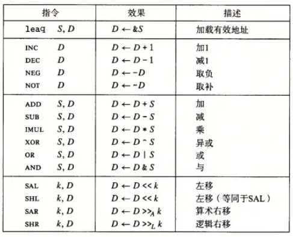

注：`leaq S D`是将S计算出的地址付给寄存器D。通常*会被用来执行加法和有限形式的乘法*

### 3.6 控制

#### 3.6.1 条件码

**条件码包括：**

- **ZF：**零标志，最近的操作得到的结果是否为0。

- **无符号数：**

    - **CF：**进位标志，最近的操作使得最高位产生进位。可用来检查无符号数是否存在溢出。

-  **补码：**

    - **SF：**符号标志，最近的操作得到的结果为负数。

    - **OF：**溢出标志，最近的操作导致补码溢出（可以通过符号位进一步判断是正溢出还是负溢出）。

#### 3.6.2 跳转指令

**条件传送指令`CMOV`**，*只有在满足条件时，才会将源数据传送到目的中*


### 3.7 函数

#### 3.7.1 运行时栈

#### 3.7.2 栈帧的组成部分

**被调用者保存寄存器，调用者保存寄存器**

#### 3.7.3 参数构造区

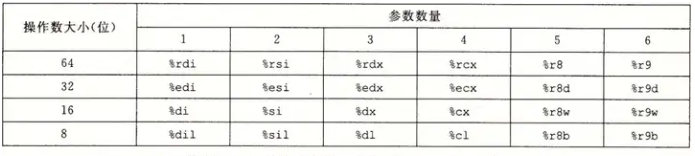

如果寄存器不够用，可以申请内存储

#### 3.7.4 返回地址


**综上所述：**

1. （被保存的寄存器）函数P将要使用的“被调用者保存寄存器”通过`push`保存在函数的栈帧中。

2. （局部变量）如果函数P使用了“调用者保存寄存器”，就需要将其保存在栈中，才能调用函数Q。并且函数P根据需要申请空间来保存其他局部变量。

3. （参数构造区）函数P将参数保存在寄存器中，如果超过6个参数，就申请空间保存到内存中。

4. （返回地址）函数P使用`call`指令调用函数Q，会将`call`的下一行指令的地址压入栈中，并将程序计数器指向函数Q的第一条指令的地址。

5. 当函数Q运行时会随着使用动态申请和释放局部变量，当函数Q运行完时，首先使用栈“被调用者保存寄存器”的值，然后使用`ret`指令返回将程序计数器设置为栈顶的返回地址，最后将栈顶的返回地址弹出。

### 3.8 数据

#### 3.8.1 数组

即C语言中的指针

#### 3.8.2 异质的数据结构

结构体

共用体


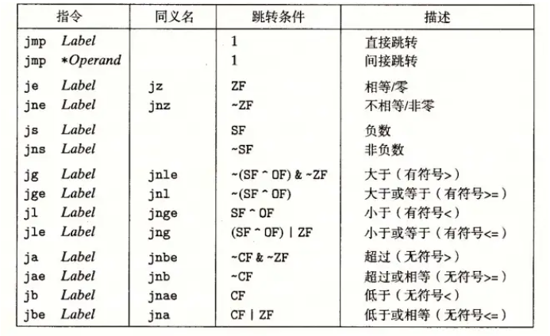


## 第4章 处理器体系结构

- 

### 4.1 硬件控制语言HCL

### 4.2 逻辑设计

两个重要元件：**寄存器与随机访问存储器（内存）**

其余见数电

### 4.3 Y86-64指令集体系结构

#### 4.3.1 状态单元

- **程序寄存器RF：**这里对x86-64的寄存器进行省略，降低复杂度。其中`%rsp`用于指示出栈、入栈、函数调用和返回地址。

- **条件码CC：**保存最近算数或逻辑指令造成的影响。

- **程序计数器PC：**保存当前正在执行的指令的地址。

- **内存DEME：**操作系统将物理内存抽象为一个单一的字节数组。

- **程序状态Stat：**表明当前程序运行的状态


#### 4.3.2 Y86-64指令及其编码

我们将指令的高8位称为**指令指示符**，可以用来确定指令类型，其中高4位为**代码部分**，低4位为**功能部分**


### 4.4 Y86-64的顺序实现

#### 4.4.1 处理指令的阶段

处理一条指令我们可以将其划分成若干个阶段：

1. **取指（Fetch）：**根据程序计数器PC从内存中读取指令字节。然后完成以下步骤

    2.  从指令中提取出指令指示符字节，并且确定出指令代码（`icode`）和指令功能（`ifun`）

    3. 如果存在寄存器指示符，则从指令中确定两个寄存器标识符`rA`和`rB`

    4. 如果存在常数字，则从指令中确定`ValC`

    5. 根据指令指令长度以及指令地址，可确定下一条指令的地址`valP`

6. **译码（Decode）：**如果存在`rA`和`rB`，则译码阶段会从寄存器文件中读取`rA`和`rB`的值`valA`和`valB`。对于`push`和`pop`指令，译码阶段还会从寄存器文件中读取`%rsp`的值。

7. **执行（Execute）：**算术逻辑单元（ALU）会根据`ifun`的值执行对应的计算，得到结果`valE`，包括

    8. 计算运算结果，会设置条件码的值，则条件传送和跳转指令会根据`ifun`来确定条件码组合，确定是否跳转或传送。

    9. 计算内存引用的有效地址

    10. 增加或减少栈指针

11. **访存（Memory）：**写入内存或从内存读取数据`valM`。

12. **写回（Write Back）：**将结果写入寄存器文件中。

13. **更新PC（PC Update）：**将PC更新为`valP`，使其指向下一条指令。


#### 4.4.2 SEQ硬件结构

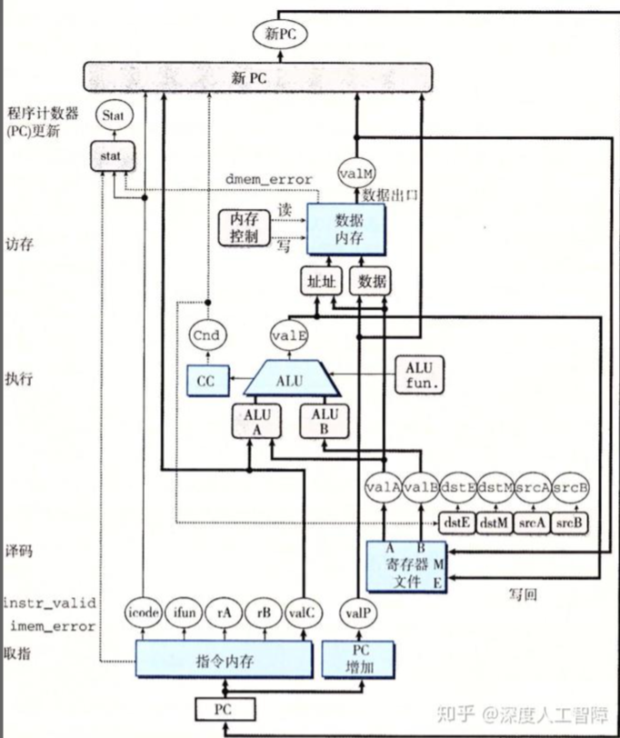

`valA`的源`srcA`、`valB`的源`srcB`、写入计算结果`valE`的寄存器`dstE`、写入内存值`valM`的寄存器`dstM`

### 4.5 流水线

#### 4.5.1 SEQ+和PIPE-

引入寄存器以提高吞吐量

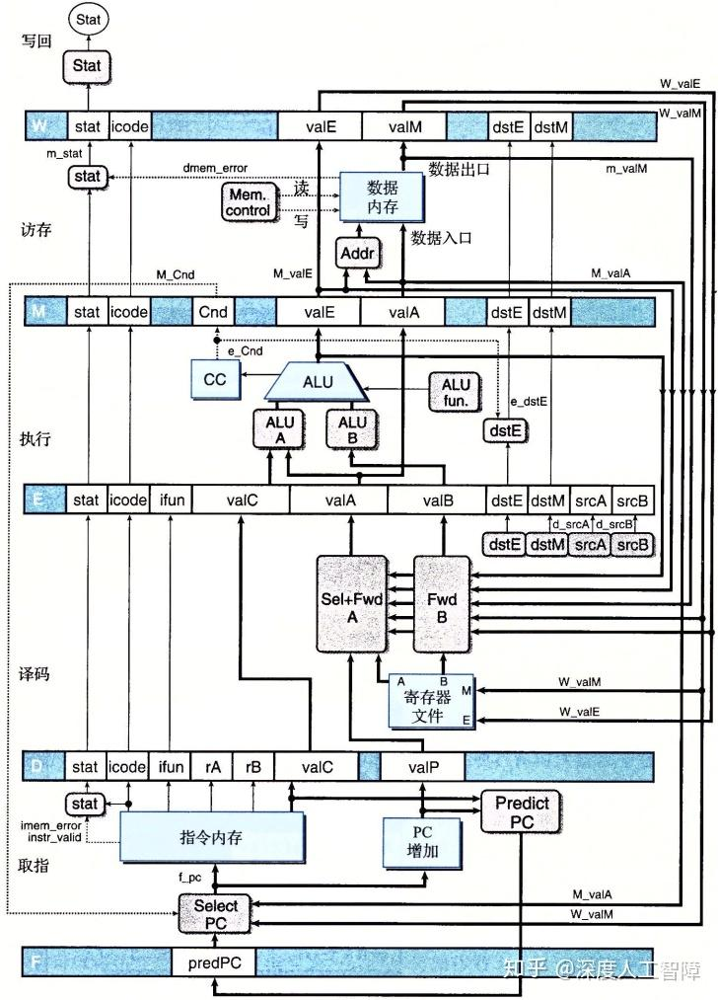

#### 4.5.2 处理控制相关


#### 4.5.3 流水线冒险

控制冒险与数据冒险

- 用暂停来避免数据冒险

- 用转发来避免数据冒险

    旁路

- 通过加载互锁来处理这种加载/使用数据冒险

    即插入气泡

- 避免控制冒险


### 4.6 性能分析

计算PIPE执行一条指令所需的平均时钟周期来衡量系统的性能，该指标为**CPI**


## 第5章 优化程序性能

- 


### 5.1 优化编译器的能力和局限性

编译器能够提供对程序的不同优化级别。

- **内存别名使用：**编译器会假设不同的指针可能会指向相同的位置

- **函数调用：**可以使用**内联函数替换**来优化函数调用

以上会限制性能

### 5.2 表示程序性能

CPE

### 5.3 程序示例

### 5.4 消除循环的低效率

用循环展开与代码移动来优化：识别要执行多次（比如在循环内）但是计算结果不会改变的计算，如len函数

### 5.5 减少过程调用

减少循环中的函数调用

### 5.6 消除不必要的内存引用

尽量减少访存操作，更多使用临时变量等储存在寄存器上的变量

### 5.7 理解现代处理器

流程与之前的五级流水线不同。将指令拆分，如拆分成加载，计算，写入等，指令执行的顺序不一定和机器代码的顺序相同，提高指令级并行。

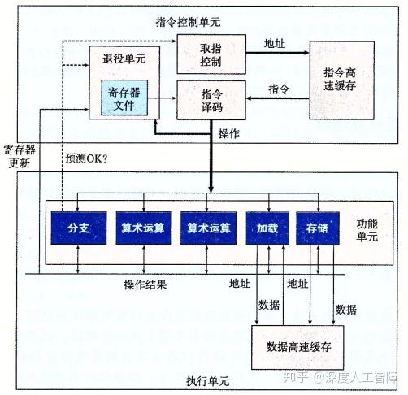

**退役单元：**

- 当指令完成，且引起这条指令的分支点预测正确，则这条指令会从队列中出队，然后*完成对寄存器文件的更新*。

- 如果引起该指令的分支点预测错误，就会将该指令出队，并丢弃计算结果，由此保证预测错误不会改变程序状态。

与算数运算性能相关的一些重要概念：

- **延迟（Latency）：**表示完成单独一个运算所需的时钟周期总数

- **发射时间（Issue Time）：**表示采用流水线时，两个连续的同类型运算之间需要的最小时钟周期数

- **容量（Capacity）：**表示能够执行该运算的功能单元数量

对于一个容量为`C`，发射时间为`I`的操作而言，其吞吐量为`C/I`

CPE值的两个基本界限

- 延迟界限

- 吞吐量界限

数据流图的画法：上方寄存器只有只读寄存器和循环寄存器，下方寄存器只有只写寄存器和循环寄存器，其余略


### 5.8 循环展开

**kx1循环展开**，将一个循环展开成了两部分，第一部分是每次循环处理k个元素，能够减少循环次数；第二部分处理剩下还没计算的元素，是逐个进行计算的。

### 5.9 提高并行性

通过引入多个变量来提高循环中的并行性。**kxk循环展开，**将一个循环展开成了两部分，第一部分是每次循环处理k个元素，能够减少循环次数，并且引入k个变量保存结果；第二部分处理剩下还没计算的元素，是逐个进行计算的。

如果k大于寄存器的数目，则中间结果就会保存到内存的堆栈中，使得计算中间结果要反复读写内存，造成性能损失。

改变结合顺序也可以提供并行性。

### 5.10 优化合并代码的结果小结

### 5.11 一些限制因素

### 5.12 理解内存性能

- 加载性能

- 存储性能

### 5.13 应用：性能提高技术

### 5.14 确认和消除性能瓶颈


## 第6章 存储器层次结构

- 

多个具有不同容量、成本和访问时间的存储设备构成了存储器层次结构，称为存储器系统。
执行指令时访问数据所需的周期数：
CPU寄存器：0个周期
L1~L3高速缓存：4~75个周期
主存：上百个周期
磁盘：几千万个周期

### 6.1 存储技术

几种基本的存储技术

随机访问存储器，分为两类：

- RAM，同时也是易失性存储器，也分为两类：

    - SRAM：静态随机访问存储器，速度快，价格高。多用来作为高速缓存存储器。

    - DRAM：动态随机访问存储器，速度慢，价格低。多用来作为主存（内存）和图形系统的帧缓冲器

- ROM，同时也是非易失性存储器。闪存属于 ROM，固态硬盘就是基于闪存开发而来。

    - 机械硬盘

    - 固态硬盘

#### 6.1.1 随机访问存储器

1、SRAM

SRAM 将每个位存储在一个**双稳态**的存储器单元内。每个单元由六个晶体管组成。

双稳态即该电路无限期地稳定保持在两个不同的电压状态。

对于 SRAM，只要有电，就永远地保持它的值。即使有干扰，当干扰消除，电路也会恢复到稳定值。

2、DRAM

DRAM 将每个位存储为对一个电容的充电。每个 DRAM 单元由一个电容和一个访问晶体管组成。

DRAM 对干扰非常敏感。当电容的电压被扰乱后，就永远不会恢复了。

3、SRAM 与 DRAM 比较

4、传统的 DRAM

DRAM 芯片被分为 d 个超单元，每个超单元包含 w 个 DRAM 单元，w 一般为 8。当从 DRAM 中读取数据时，一次可以读取一个超单元的数据（可以近似的将超单元理解为一个字节）。

内存控制器依次将行地址和列地址发送给 DRAM，DRAM 将对应的超单元的内容发回给内存控制器以实现读取数据。

从 DRAM 中读取超单元的步骤：

1. 内存控制器发来行地址 i，DRAM 将整个第 i 行复制到内部的行缓冲区。

2. 内存控制器发来列地址 i，DRAM 从行缓冲区中复制出超单元 (i,j) 并发送给内存控制器。

5、内存模块

许多 DRAM 芯片封装在内存模块中，插到主板的扩展槽上。

常用的是双列直插内存模块 (DIMM)，以 64 位为块与内存控制器交换数据。

比如一个内存模块包含 8 个 DRAM 芯片，每个 DRAM 包含 8M 个超单元，每个超单元存储一个字节。使用 8 个 DRAM 芯片上相同地址处的超单元来表示一个 64 位字，DRAM 0 存储第一个字节，DRAM 1 存储第 2 个字节，依此类推。

要取出内存地址 A 处的一个字，内存控制器先将 A 转换为一个超单元地址 (i,j)，然后内存模块将 i,j 广播到每个 DRAM。作为响应，每个 DRAM 输出它的 (i,j) 超单元的 8 位内容，合并成一个 64 位字，再返回给内存控制器。

主存由多个内存模块连接到内存控制器聚合成。

#### 6.1.2 磁盘存储

1、磁盘构造

磁盘由盘片组成，每个盘片有两个表面，表面上覆盖着磁性记录材料。一个磁盘包含一个或多个盘片。

盘片以固定速率旋转，通常为 5400~15000，单位是转每分钟 (RPM)。

每个表面由多个同心圆（称为磁道）组成，每个磁道被划分为一组扇区，每个扇区包含相同的数据位（一般为512字节）。

扇区之间由间隙分隔开，间隙中不存储数据位，而存储用来标识扇区的格式化位。

名词柱面用来表示距离主轴相等的磁道的集合。比如一个磁盘有 3 个盘片，那么每个柱面就有 6 个磁道。

2、磁盘容量

决定磁盘容量的因素：

记录密度：磁道一英寸的段中可以放入的位数。

磁道密度：从盘片中心出发半径上一英寸的段内可以有的磁道数。

面密度：记录密度与磁道密度的乘积。

磁盘容量公式：

DRAM 和 SRAM 相关的单位中 K = 2^10，磁盘、网络、速率、吞吐量相关的单位中 K=10^3。

注：磁盘格式化会填写间隙、标识出有故障的柱面、在每个区中预留出一组柱面作为备用。所以格式化容量要比最大容量小。

3、磁盘操作

磁盘用读写头来读写存储在磁性表面的位。每个表面都有一个读写头，任何时候所有的读写头都位于同一个柱面上。

磁盘读写数据时以扇区为单位，即一次读写一个扇区大小的块。

对扇区的访问时间包括三部分：

寻道时间：为了读取目标扇区的内容，传动臂首先要将读写头定位到包含目标扇区的磁道上。

现代驱动器的平均寻道时间为 3~9 ms，最大为 20 ms。

旋转时间：读写头定位到期望的磁道后，要等待目标扇区的第一个位旋转到读写头下。

旋转时间依赖于磁盘的旋转速度和读写头到达目标磁道时的位置。

最大旋转时间是旋转速度的倒数，平均旋转时间是最大旋转时间的一半。

传送时间：平均传送时间是读写头读写完整个扇区的时间。

传送时间依赖于磁盘的旋转速度和每条磁道的扇区数目。

旋转时间一般和寻道时间差不多，而传送时间相对可以忽略不计，因此从磁盘读取一个扇区的时间约为 10 ms。

4、逻辑磁盘块

现代磁盘呈现为一个逻辑块的序列，每个逻辑块大小为一个扇区，即 512 字节。

当操作系统读写磁盘时，发送一个逻辑块号到磁盘控制器，控制器上的固件将逻辑块号翻译为一个（盘面、磁道、扇区）的三元组。

5、连接 I/O 设备

系统总线与内存总线都是与 CPU 相关的，而 IO 总线与 CPU 无关。

Intel 的外部设备互连总线（PCI）就是一种 IO 总线。

IO 总线速度相比于系统总线和内存总线慢，但是可以容纳种类繁多的第三方 IO 设备。

连接到 IO 总线的三种设备：

通用串行总线（USB）：USB 总线是一个广泛使用的标准，连接各种 IO 设备，包括键盘、鼠标等。

显卡/显示适配器：负责代表 CPU 在显示器上画像素。

主机总线适配器：连接磁盘。常总的磁盘接口是 SCSI 和 SATA。其中 SCSI 比 SATA 更快也更贵。

6、访问磁盘

CPU 使用内存映射 IO 技术来向 IO 设备发射命令。在使用内存映射 IO 的系统中，地址空间中有一块地址是专为与 IO 设备通信保留的，每个这样的地址称为一个 IO 端口。当一个设备连接到总线时，它与一个或多个端口相关联。

假设磁盘控制器映射到端口 0xa0，读一个磁盘扇区的步骤如下：

CPU 依次发送命令字、逻辑块号、目的内存地址到 0xa0，发起一个磁盘读。因为磁盘读的时间很长，所以此后 CPU 会转去执行其他工作。

磁盘收到读命令后，将逻辑块号翻译成一个扇区地址，读取该扇区的内容，并将内容直接传送到主存，不需要经过 CPU (这称为直接内存访问(DMA))。

DMA 传送完成后，即磁盘扇区的内容安全地存储在主存中后，磁盘控制器给 CPU 发送一个中断信号来通知 CPU。

#### 6.1.3 固态硬盘

固态硬盘 (SSD) 是一种基于闪存的存储技术。

一个固态硬盘中封装了一个闪存翻译层和多个闪存芯片。闪存翻译层是一个硬件/固件设备，功能类似磁盘控制器，将对逻辑块的请求翻译成对底层物理设备的访问。

一个闪存由 B 个块的序列组成，每个块由 P 页组成，页的大小为 512byte~4kb。数据以页为单位进行读写。

对于 SSD 来说，读比写快。因为只有在一页所属的块整个被擦除后，才能写这一页。重复写十万次后，块就会磨损，因此固态硬盘寿命较低。

随机写 SSD 很慢的两个原因：

擦除块需要相对较长的时间。

如果写操作试图修改一个已经有数据的页，那么这个块中所有带有用数据的页都必须复制到一个新的块，然后才能向该页写数据。

SSD 相比于旋转磁盘的优点：由半导体存储器构成，没有移动部件，所以更结实，随机访问也更快，能耗更低。

缺点：更容易磨损，不过现在的 SSD 已经可以用很多年了。

#### 6.1.4 存储技术趋势

性能上：SRAM > DRAM > SSD > 旋转磁盘

发展速度上：增加密度(降低成本) > 降低访问时间

DRAM 和 磁盘的性能滞后于 CPU 的性能提升速度，两者之间的差距越来越大。

### 6.2 局部性


局部性有两种形式：时间局部性和空间局部性。

#### 6.2.1 对程序数据引用的局部性

这里对向量 v 中元素的访问是顺序访问的，称为步长为 1 的引用模式。在空间局部性上，步长为 1 的引用模式是最好的。

#### 6.2.2 取指令的局部性

程序指令存放在内存中，CPU 需要读这些指令，因此取指令也有局部性。比如 for 循环中的指令具有好的时间局部性和空间局部性。

#### 6.2.3 局部性小结

评价局部性的简单原则：

重复引用相同变量的程序有好的时间局部性。

对于步长为 k 的引用模式的程序，k 越小，空间局部性越好。

对于取指令来说，循环有好的时间和空间局部性。循环体越小，循环迭代次数越多，局部性越好。

### 6.3 存储器层次结构

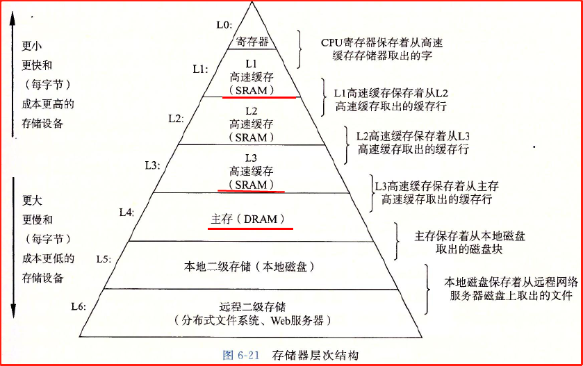

#### 6.3.1 存储器层次结构中的缓存

存储器层次结构的核心思想：第 k 层作为第 k+1 层存储设备的缓存。

缓存的具体实现：第 k+1 层的存储器被划分为连续的块，每个块有唯一的地址或名字。第 k 层的存储器被划分为较少的块的集合，每个块的大小与 k+1 层的块大小一样。数据以块为传输单元在不同层之间复制。

层次结构中更低的层，因为访问时间更长，为了补偿访问时间，使用的块更大。

1、缓存命中

当需要 k+1 层的某个数据对象 d 时，如果 d 恰好缓存在 k 层中，就称为缓存命中。

2、缓存不命中

缓存不命中时，第 k 层的缓存从 第 k+1 层缓存中取出包含 d 的块。

如果第 k 层缓存已经满了，需要根据替换策略选择一个块进行覆盖 (替换)，未满的话需要根据放置策略来选择一个块放置。

3、缓存不命中的种类

冷不命中：一个空的缓存称为冷缓存，冷缓存必然不命中，称为冷不命中。

冲突不命中：常用的放置策略是将 k+1 层的某个块限制放置在 k 层块的一个小的子集中。比如 k+1 层的块 1,5,9,13 映射到 k 层的块 0。这会带来冲突不命中。

容量不命中：当访问的工作集的大小超过缓存的大小时，会发生容量不命中。即缓存太小了，不能缓存整个工作集。

4、缓存管理

寄存器文件的缓存由编译器管理，L1,L2,L3 的缓存由内置在缓存中的硬件逻辑管理，DRAM 主存作为缓存由操作系统和 CPU 上的地址翻译硬件共同管理。

### 6.4 高速缓存存储器

L1 高速缓存的访问速度约为 4 个时钟周期，L2 约 10 个周期，L3 约 50 个周期。

当 CPU 执行一条读内存字 w 的指令，它首先向 L1 高速缓存请求这个字，如果 L1 没有就向 L2，依此而下。

#### 6.4.1 通用的高速缓存存储器组织结构

假设一个计算机系统中的存储器地址有 m 位，形成 M =2^m 个不同的地址。m 个地址为划分为 t 个标记位，s 个组索引位，b 个块偏移位。

高速缓存被组织成 S=2^s 个高速缓存组，每个组包含 E 个高速缓存行，每个行为一个数据块，包含一个有效位，t=m-(b+s) 个标记位，和 B=2^b 字节的数据块。高速缓存的容量 = S * E * B。

高速缓存可以通过简单地检查地址位来找到所请求的字。

当 CPU 要从地址 A(由m个地址位组成) 处读一个字时：

A 中的 s 个组索引位告诉我们在哪个组中

A 中的 t 个标记位告诉我们在这个组中的哪一行：当且仅当这一行设置了有效位并且标记位与 A 中的标记位匹配时，才说明这一行包含这个字。

A 中的 b 个块偏移位告诉我们在 B 个字节的数据块中的字偏移。

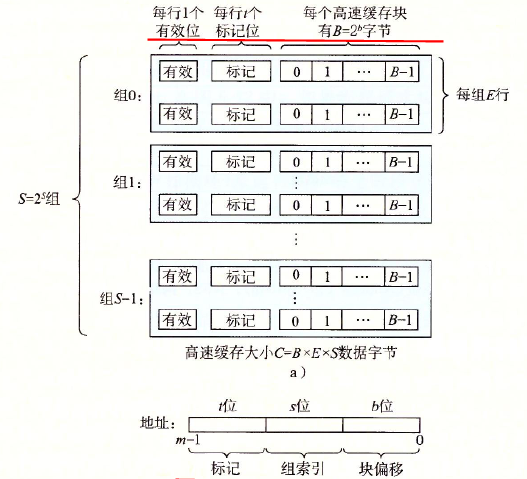

理解

使用高位做标记位，可以避免连续的块被映射到同一高速缓存组中。

通过高速缓存从内存读字

假设一个系统中只有 CPU、L1 高速缓存和主存。

当 CPU 执行一条从内存读字 w 的指令，如果 L1 有 w 的副本，就得到 L1 高速缓存命中；如果 L1 没有，就是缓存不命中。

当缓存不命中，L1 会向主存请求包含 w 的块(L1 中的块就是它的高速缓存行)的一个副本。当块从内存到达 L1，L1 将这个块存在它的一个高速缓存行里，然后从中抽取出字 w，并返回给 CPU。

高速缓存确定一个请求是否命中，然后抽取出被请求的字的过程分为三步：

1. 组选择

2. 行匹配

3. 字抽取

高速缓存有以下几类：

直接映射高速缓存：每个组只有一行，即 E=1。

组相联高速缓存：每个组有多行，1<E<C/B。

全相联高速缓存：只有一个组，E=C/B。

#### 6.4.2 直接映射高速缓存

1、直接映射高速缓存中的组选择

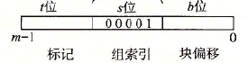

从 w 的 m 位地址中抽取出 s 个组索引位，并据此选择相应的高速缓存组。

2、直接映射高速缓存中的行匹配

因为直接映射高速缓存每个组只有一行，只要这一行设置了有效位且标记位相匹配，就说明想要的字的副本确实存储在这一行中。

3、直接映射高速缓存中的字抽取

从 w 的地址中抽取出 b 个块偏移位，块偏移位提供了所需的字的第一个字节的偏移。

4、直接映射高速缓存不命中时的行替换

缓存不命中时需要从下一层取出被请求的块，然后将其存储在组索引位指示的组中的高速缓存行中。

因为直接映射高速缓存每个组只有一行，所以替换策略很简单：用新取出的行替换当前行。

5、运行中的直接映射高速缓存

标记位和索引位连接起来标识了整个内存中的所有块，而高速缓存中的高速缓存组（块）是少于内存中的块数的。因此位于不同标记位，相同组索引位的块会映射到高速缓存中的同一个高速缓存组。

在一个高速缓存组中存储了哪个块，可以由标记位唯一地标识。

理解：对于主存中的整个地址空间，根据标记位不同将其分为了若干个部分，每个部分可以单独且完整地映射到高速缓存中，且刚好占满整个直接映射高速缓存。

6、直接映射高速缓存中的冲突不命中

冲突不命中在直接映射高速缓存中很常见。因为每个组只有一行，不同标记位的块会映射到同一行，发生冲突不命中。

#### 6.4.3 组相联高速缓存

1、组相联高速缓存中的组选择

与直接映射高速缓存一样，组索引位标识组。

2、组相联高速缓存中的行匹配

组相联高速缓存中的行匹配更复杂，因为要检查多个行的标记位和有效位，以确定其中是否有所请求的字。

注意：组中的任意一行都可能包含映射到这个组的内存块，因此必须搜索组中的每一行，寻找一个有效且标记位相匹配的行。

3、组相联高速缓存中的字抽取

与直接映射高速缓存一样，块偏移位标识所请求的字的第一个字节。

4、组相联高速缓存中不命中时的行替换

几种替换策略

随机替换策略：随机选择要替换的行

最不常使用策略：替换在过去某个时间窗口内引用次数最少的一行。

最近最少使用策略：替换最后一次访问时间最久远的那一行。

因为存储器层次结构中越靠下，不命中开销越大，好的替换策略越重要。

#### 6.4.4 全相联高速缓存

全相联高速缓存由一个包含所有高速缓存行 (E=C/B) 的组组成。

因为高速缓存电路必须并行地搜索不同组已找到相匹配的标记，所以全相联高速缓存只适合做小的高速缓存。

DRAM 主存采用了全相联高速缓存，但是因为它采用了虚拟内存系统，所以在进行类似行匹配的页查找时不需要对一个个页进行遍历。

1、全相联高速缓存中的组选择

全相联高速缓存中只有一个组，所以地址中没有组索引位，只有标记位和块偏移位。

2、全相联高速缓存中的行匹配和字抽取

与组相联高速缓存一样。与组相联高速缓存的区别在于规模大小

#### 6.4.5 有关写的问题

写相比读要复杂一些。

- 写命中（写一个已经缓存了的字 w）的情况下，高速缓存更新了本层的 w 的副本后，如何处理低一层的副本有两种方法：

    - 直写：立即将 w 的高速缓存块写回到低一层中。

        - 优点：简单

        - 缺点：每次写都会占据总线流量

    - 写回：尽可能地推迟更新，只有当替换算法要驱逐这个更新过的块时，才把它写到低一层中。

        - 优点：利用了局部性，可以显著地减少总线流量。

        - 缺点：增加了复杂性。必须为每个高速缓存行维护一个额外的修改位，表明此行是否被修改过。

- 写不命中情况下的两种方法：

    - 写分配：加载相应的低一层的块到本层中，然后更新这个高速缓存块。

        - 优点：利用写的空间局部性

        - 缺点：每次不命中都会导致一个块从低一层传送到高速缓存

    - 非写分配：避开高速缓存，直接把这个字写到低一层中

直写一般与非写分配搭配，两者都更适用于存储器层次结构中的较高层。

写回一般与写分配搭配，两者都更适用于存储器层次结构中的较低层，因为较低层的传送时间太长。

因为硬件上复杂电路的实现越来越容易，所以现在使用写回和写分配越来越多。

#### 6.4.6 一个真实的高速缓存层次结构的解剖

三种高速缓存：

i-cache：只保存指令的高速缓存。i-cache 通常是只读的，因此比较简单。

d-cache：只保存程序数据的高速缓存。

统一的高速缓存：既保存指令又保存程序数据。

现代处理器一般包括独立的 i-cache 和 d-cache，其中两个原因如下：

使用两个独立的高速缓存，CPU 可以同时读一个指令字和一个数据字。

可以确保数据访问不会与指令访问形成冲突不命中（不过可能会使容量不命中增加）。

Core i7 的高速缓存层次结构及其特性

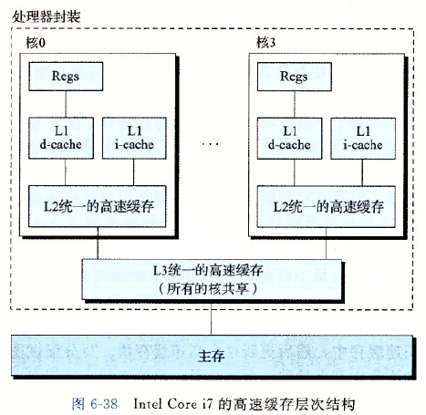

可以看到 Core i7 中的高速缓存采用的都是组相联高速缓存。

#### 6.4.7 高速缓存参数的性能影响

高速缓存的性能指标

命中率：命中的内存引用比率。

命中时间：从高速缓存传送一个字到 CPU 的时间，包括组选择、行确认和字抽取的实践。

不命中处罚：不命中产生的额外时间消耗。

几个影响因素

高速缓存大小：较大的高速缓存可以提高命中率，但是会运行得更慢，即增加命中时间。

块大小：较大的块更能利用空间局部性以提高命中率。但是对于给定的总容量，块越大高速缓存行就越少，不利用利用时间局部性。较大的块因为传送时间更长，所以也会增加不命中处罚。现代处理系统的高速缓存块一般为 64 字节。

相联度：

### 6.5 编写高速缓存友好的代码

### 6.6 综合:高速缓存对程序性能的影响

#### 6.6.1 存储器山

#### 6.6.2 重新排列循环以提高空间局部性

#### 6.6.3 在程序中利用局部性

### 6.7 小结


## 第7章 链接

- 

链接在以下三个阶段都可以执行：

编译时，即在源代码被翻译成机器代码时

加载时，即程序被加载器加载到内存并执行时

运行时，即由应用程序来执行

现代系统中，链接是由链接器自动执行的。

### 7.1 编译器驱动程序

编译器驱动程序可以使用户根据需要调用语言预处理器、编译器、汇编器和链接器。

通过静态链接，链接器将多个可重定位目标文件组合形成一个可执行目标文件。

### 7.2 静态链接

静态链接器以一组可重定位目标文件和命令行参数作为输入，生成一个完全链接的、可以加载和运行的可执行目标文件作为输出。

在构造可执行文件的过程中，链接器主要完成两个任务：

- 符号解析

    - 什么是符号：目标文件定义和引用符号，每个符号对应着一个函数、全局变量或静态变量

    - 符号解析的目的：将每个符号引用和一个符号定义关联起来

- 重定位

    - 由编译器和汇编器生成的可重定位目标文件中的代码和数据节是从 0 开始的。可重定位目标文件中还包含重定位条目。

    - 如何实现重定位：链接器通过把每个符号定义和一个内存位置（运行时地址）关联起来以实现重定位。然后修改所有对这些符号的引用，使它们指向这个内存位置。

### 7.3 目标文件

一个目标文件又称目标模块。目标文件纯粹是**字节块的集合**。目标文件本身是一个字节序列。

这些字节块中有些包含程序代码或程序数据，其他的则包含引导链接器和加载器的数据结构。

链接器把这些块连接起来，确定被连接块的运行时位置，并修改代码和数据块中的各种位置。

目标文件有三种形式：

- 可重定位目标文件：包含二进制的代码和数据。可以与其他可重定位目标文件合并成可执行目标文件。又称 obj 文件，gcc 经过预处理、编译、汇编后生成的 `.o` 文件即为可重定位目标文件。

- 可执行目标文件：包含二进制的代码和数据。可以被直接复制到内存并执行。简称可执行文件，gcc 经过链接后生成的 `.out` 文件以及无后缀名文件都是可执行文件。

    - 在 linux 中，.out 文件和无后缀名文件基本意义一样，只是命名习惯的不一致而已，即 main.out 和 main 两个文件是一样的。

- 共享目标文件：特殊类型的可重定位目标文件，即动态链接库。可以在加载或者运行时被动态地加载进内存并链接。

静态链接库属于哪种呢？

编译器和汇编器生成可重定位目标文件和共享目标文件，链接器生成可执行目标文件。

目标文件是按照特定的目标文件格式来组织的，各个系统的目标文件格式都不相同。Windows 使用 PE 格式，Linux 使用 ELF 格式。

### 7.4 可重定位目标文件

本书以 Linux 中的 **ELF** 可重定位目标文件为例。

可重定位目标文件由多个不同的节组成，每一节都是一个连续的字节序列。指令、初始化了的全局变量、未初始化的的变量分别位于不同的节。

一个 ELF 可重定位文件中包含以下节（按位置顺序排列）：

- ELF 头：特殊的节，包含文件的一些基本属性信息，用来解释目标文件和帮助链接器进行语法分析。

包含内容：生成该文件的系统的字的大小和字节顺序，ELF 头的大小，目标文件的类型，机器类型(如 x86-64)，节头部表的文件偏移，节头部表中条目的大小和数量。

- .text：包含已编译程序的机器代码。即存放的是指令代码。

- .rodata：包含一些特殊的只读数据。

- .data：包含已初始化的全局和静态变量。

- .bbs：包含未初始化的全局和静态变量，以及所有被初始化为 0 的全局或静态变量。

    - 注意：.bss 节在目标文件中仅是一个占位符，**不占据实际空间**。这两类变量都是运行时在内存中为其分配变量，并初始化为 0

- .symtab：包含一个符号表。存放了在程序中定义和引用的符号 (即函数和全局变量) 的信息。

    - 注意：与可编译器中的符号表不同，.symtab 中的符号表不包含局部变量的条目。

- .rel.text：包含一个 .text 节中位置的列表，当链接器把此目标文件与其他文件组合时，需要修改这些位置。

    - 一般任何调用外部函数或引用全局变量的指令都需要修改，而调用本地函数的指令则不需要修改。为什么不需要修改呢？

    - 注意：可执行目标文件不需要重定位，一般不包含 .rel.text 和 .rel.data 节。

    - 理解：.rel.text 中包含的实际上是代码的重定位条目。

- .rel.data：包含被模块引用或定义的所有全局变量的重定位信息。

    - 如果一个已初始化的全局变量其初始值是一个全局变量地址或外部定义函数的地址，就需要被修改。

    - 理解：.rel.data 中包含的实际上是已初始化的数据的重定位条目。

- .debug：一个调试符号表，内部包含的条目是程序中定义的局部变量和类型定义，程序中定义和引用的全局变量，还有原始的 C 源文件。

    - 注意：.debug 节并不总是存在，只有用 -g 选项来调用编译器驱动程序时，才会有这一节。

- .line：包含原始 C 源程序中的行号和 .text 节中机器指令之间的映射。

    - 注意：.line 节和 .debug 节一样，并不总是存在，只有用 -g 选项来调用编译器驱动程序时，才会有这一节。

- .strtab：包含一个字符串表，其中包括 .symtab 和 .debug 节中的符号表，以及节头部中的节名字。

    - 字符串表实际上就是一个以 null 结尾的字符串的序列。

- 节头部表：特殊的节，是一个用来描述目标文件的节。

    - 内容：含有与目标文件中每个节相对应的一个条目，描述了对应节的位置和大小等信息。

注意**局部变量在运行时保存在栈中**，既不出现在 .data 节中，也不出现在 .bss 节中。


伪节

有三个特殊的伪节，它们在节头部表中是没有条目的：

- ABS：代表不该被重定位的符号

- UNDEF：代表未定义的符号，即在本目标模块中引用，但在其他地方定义的符号

- COMMON：表示还未被分配位置的未初始化的数据目标。

这些伪节只有可重定位文件中才有，可执行文件中没有。

COMMON 和 .bss 的区别很细微：

- COMMON：未初始化的全局变量

- .bss：未初始化的静态变量，初始化为 0 的全局或静态变量

原因：未初始化的全局变量是全局符号中的**弱符号**，编译器将其分配为 COMMON 以表明是弱符号。

### 7.5 符号和符号表

重定位的核心就是对符号表进行符号解析

每个可重定位目标模块 m 都有一个符号表（即 .symtab 节），包含着 m 定义和引用的符号的信息。

有三种不同的符号：

- 由模块 m 定义并能被其他模块引用的**全局符号**。包括非静态的函数和全局变量

- 由其他模块定义并被 m 引用的全局符号，称之为**外部符号**。对应其他模块中定义的非静态函数和全局变量。

- 由模块 m 定义且只能被 m 引用的**局部符号**。包括带 static 属性的函数和全局变量。（所以**使用static可以让该变量不能被外部访问**）

对照 C++ 的语法来理解什么是全局符号和局部符号（static 对全局变量和函数的隐藏效果是一样的）：

C++ 中，static 变量只能在本文件中使用，即使外其他文件中用 extern 中声明也不行。属于这里的局部符号

C++ 中，非 static 的全局变量在其他文件中也能使用，只需在该文件中用 extern 声明即可。属于这里的全局符号

编译器在 .data 或 .bss 中为每个全局变量和 static 变量的定义分配空间，并在符号表中创建一个有唯一名字的符号。


符号表中的条目

符号表实际上是一个条目的数组，每个条目描述一个符号的信息。

```Objective-C++
typedef struct{
    int name;//name 是一个字符串表(.strtab节)中的字节偏移，指向符号的名字(用一个以 null 结尾的字符串表示)
    char type:4;//表明符号的类型：数据或函数（4 bits）
            binding:4;//表明符号是本地的还是全局的（4 bits）//这里的意思似乎是 type 和 binding 分别是一个 char 类型的高四位和低四位
    char reserved;//
    short section;//表明符号位于文件的哪个节中，section 是一个到节头部表的索引。
    long value;//对于可重定位文件而言，value 是距定义目标的节的起始位置的偏移；对于可执行文件而言，value 是一个绝对运行时地址
    long size;//对象的大小，以字节为单位
}
```

符号表中的条目除了符号外，还可以包含各个节的条目，对应原始源文件的路径名的条目。

### 7.6 符号解析

链接器解析符号引用的方法：将每个引用和它输入的可重定位文件的符号表中的一个确定的符号定义关联起来。

符号解析可以分为对局部符号的解析和对全局符号的解析：

- 局部符号：简单明了

    - 备注：在每个模块中，编译器只允许每个局部符号有一个定义。并且会确保每个静态变量有唯一的名字。

- 全局符号：更复杂一些

    - 方式：编译器遇到一个不是在当前模块定义的符号时，会假设该符号是在其他某个模块中定义的，在可重定位目标文件中生成一个符号表条目，并把它交给链接器处理。

    - 特殊情况：多个目标文件中定义了相同名字的的全局符号。

重整

链接器通过对重载函数的不同版本进行重整，将每个唯一的方法和参数列表的组合编码成一个对链接器来说唯一的名字。

#### 7.6.1 链接器如何解析多重定义的全局符号

编译器和汇编器会把每个全局符号区分为强或弱，并将之隐含地编码在可重定位文件地符号表里。

- 强符号：函数和已初始化的全局变量

- 弱符号：未初始化的全局变量

Linux 链接器使用以下规则来处理多重定义的全局符号：

- 规则1：不允许有多个同名的强符号

- 规则2：如果一个全符号和多个弱符号同名，那么选择强符号

- 规则3：如果有多个弱符号同名，任意选择其中一个


#### 7.6.2 与静态库链接

可以将多个相关的目标模块打包成一个单独的文件，称为静态库。

通过静态库，相关的函数可以被编译为独立的目标模块，然后封装成一个单独的静态库文件。

静态库可以用作链接器的输入。链接器在构造可执行文件时，从静态库中复制被应用程序引用的目标模块，其他未用到的模块则不会复制。


在 linux 中，静态链接库是 `.a` 文件，动态链接库是 `.so` 文件。在windows 中，静态链接库是 `.lib` 文件，动态链接库是 `.dll` 文件。

静态库的应用实例

通过如下命令创建静态库：

```Shell
linux> gcc -c addvec.c multvec.c   //将 addvec.c 和 multvec 两个文件编译成两个可重定位目标文件

linux> ar rcs libvector.a addvec.o multvec.o  //采用 ar 工具将上一步生成的两个可重定位目标文件 addvec.o 和 multvec.o 封装到静态库 libvector.o 中。


```

### 7.6.3 链接器如何解析引用

符号解析的过程

在符号解析阶段，链接器从左到右按照它们在编译器驱动程序命令行上出现的顺序来扫描可重定位目标文件和存档文件。

在扫描中，链接器会维护一个可重定位目标文件的集合 E，一个未解析的符号 (即引用了但尚未定义的符号) 集合 U，已定义的符号集合 D。初始时 E, U, D 都为空。

1. 对于命令行上的每个输入文件 f，链接器会判断 f 是一个目标文件还是一个存档文件。

    - 如果 f 是一个目标文件，链接器会把 f 添加到 E，修改 U 和 D 来反映 f 中的符号定义和引用，并继续下一个输入文件。

    - 如果 f 是一个存档文件，链接器会尝试匹配 U 中未解析的符号和存档文件成员定义的符号。

    - 如果 f 中的某个成员 m 定义了一个符号来解析 U 中的一个引用，就把 m 加到 E 中，并修改 U 和 D 来反映 m 中的符号定义和引用。

1. 对存档文件中所有的成员目标文件都依次进行这个过程。之后任何不包含在 E 中的成员目标文件都简单地被丢弃。

2. 处理完 f，链接器会继续处理下一个输入文件。

3. 当链接器扫描完所有输入文件后，如果 U 是非空的，链接器会输出一个错误并终止。

库在命令行中放在什么位置

在命令行中，如果定义一个符号的库出现在引用这个符号的目标文件前，引用就不能被解析，链接会失败。因为初始时 U 是空的。

一般把库放在命令行的结尾。如果库之间相互依赖，则依赖者在前，被依赖者在后。如果双向引用，可以在命令行上重复库。

### 7.7 重定位

符号解析完成后，每个符号引用就和一个符号定义（即一个输入目标模块中的一个符号表条目）关联起来了。到底是怎么关联起来的？此时链接器已经知道它的输入模块中的代码节和数据节的确切大小（存储在节头部表中），接下来就是重定位步骤了。

重定位将合并输入模块并为每个符号分配运行时地址。

重定位分为两步：

重定位节和符号定义。分为两步：

链接器将所有相同类型的节合并为同一类型的新的聚合节。

链接器将运行时内存地址赋给新的聚合节，赋给输入模块定义的每个节，以及赋给输入模块定义的每个符号。

上面两步完成后，程序中的每条指令和全局变量都有唯一的运行时内存地址了。

重定位节中的符号引用。

链接器修改代码节和数据节中对每个符号的引用，是他们指向正确的运行时地址。链接器依赖于可重定位目标模块中的重定位条目。

#### 7.7.1 重定位条目

重定位条目用来解决符号引用和符号定义的运行时地址的关联问题。

当汇编器遇到对最终位置的目标引用时，就会生成一个重定位条目，告诉链接器在合并目标文件为可执行文件时如何修改这个引用。

代码的重定位条目放在 .rel.text 中，已初始化数据的重定位条目放在 .rel.data 中。

每个重定位条目都代表了一个必须被重定位的引用。

ELF 重定位条目的格式

```Objective-C
typedef struct{
long offset;    //需要被修改的引用的节偏移（即该符号引用距离所在节的初始位置的偏移）。
long type:32,   //重定位类型，不同的重定位类型会用不同的方式来修改引用
symbol:32; //symbol table index,指向被修改引用应该指向的符号
long addend;    //一个有符号常数，一些类型的重定位要使用它对被修改引用的值做偏移调整
}
```

ELF 定义了 30 种不同的重定位类型。以下是其中最基本的两种：

- R_X86_64_PC32：重定位一个使用 32 位 PC 相对地址的引用。

    - 什么是 PC 相对地址：一个 PC 相对地址就是距程序计数器的值的偏移量。当 CPU 执行到一条使用 PC 相对寻址的指令时，就将在指令中编码的 32 位偏移量值加上 PC 的当前运行时值，得到有效地址，PC 值通常是下一条指令在内存中的地址。

- R_X86_64_32：重定位一个使用 32 位绝对地址的引用。通过绝对寻址，CPU 直接使用在指令中编码的 32 位值作为有效地址。

这两种类型都使用了 x86-64 小型代码模型，该模型假设可执行目标文件中的代码和数据的总体大小小于 2GB，因此可以通过 32 位地址来访问。GCC 默认使用小型代码模型。此外还有中型代码模型和大型代码模型。

#### 7.7.2 重定位符号引用

1、重定位 PC 相对引用

PC 相对引用的机制：在引用中存放着与 PC 的值偏移量。这实际上是符号定义的地址与符号引用的地址差。在实际运行时，当执行到了符号引用的指令时，PC 中的值就是符号引用的地址，加上 与 PC 的偏移量（即符号定义与符号引用的地址差）就得到了符号定义的地址。

备注：这里是相对粗糙的解释，详细的细节还要考虑到 attend 的值，具体的要看书上 481 页。

2、重定位绝对引用

绝对引用的机制：引用中存放的就是符号定义的绝对地址

### 7.8 可执行目标文件

可执行目标文件是一个二进制文件，包含加载程序到内存并运行它所需的所有信息。

可执行目标文件的格式与可重定位目标文件的格式类似。

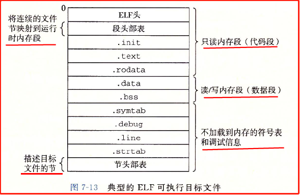

其中 ELF头 描述了文件的总体格式，还包括程序的入口点，即程序运行时要执行的第一条指令的地址。

段头部表和节头部表描述了可执行文件中的**片到内存映像中的段的映射关系**。它描述了各节在可执行文件中的偏移、长度、在内存映射中的偏移等。

.text, .rodata, .data 节与可重定位目标文件中的节相似，但已经重定位到它们最终的运行时内存地址。

_init 节定义了一个小函数 _init，程序的初始化代码会调用它。

可执行文件是完全链接的，因此比可重定位目标文件少了 .rel 节。

### 7.9 加载可执行目标文件

加载过程：

`./prog`，因为 prog 不是一个内置的 shell 命令，所以 shell 会认为 prog 是一个可执行目标文件，通过调用**加载器**（是操作系统中的一个程序）来运行它。
**加载**：加载器将可执行目标文件的代码和数据从磁盘复制到内存，然后跳转到程序的第一条指令或入口点来运行程序。

    任何 Linux 程序都可以通过 `execve` 函数来调用加载器。
每个 Linux 程序都有一个运行时内存映像。代码段总是从 0x400000 处开始，后面是数据段，然后是运行时堆段，通过调用 malloc 库往上增长。堆后面的区域是为共享模块保留的。用户栈总是从最大的用户地址 2^48-1 开始，向较小内存地址增长。从地址 2^48 开始是留给内核的。
在分配栈、共享库、堆的运行时地址的时候，链接器还会使用**地址空间布局随机化**，所以每次程序运行时这些区域的地址都会改变（为了安全）。


加载器的工作过程
加载器运行时，创建一个**内存映像**（虚拟地址空间），在程序头部表的引导下，将可执行文件的片复制到代码段和数据段（内存映射）。然后加载器跳转到程序的入口点，即 _start 函数的地址（函数在系统目标文件 ctrl.o 中定义），_start 函数调用系统启动函数 __libc_start_main（定义在 libc.o 中），__libc_start_main 初始化执行环境，调用用户层的 main 函数，处理 main 函数的返回值，并在需要时把控制返回给内核。

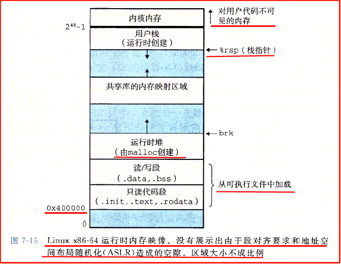

### 7.10 动态链接共享库

静态库解决了如何让大量相关函数对应用程序可用的问题。

静态库的缺点：

    静态库需要定期维护和更新。如果想要使用一个更新后的静态库，必须显式地将程序与更新了的静态库重新链接。

    调用的静态库中的函数在运行时会被复制到每个运行进程的文本段中。

    

共享库是为了解决静态库缺陷的产物。也就是说共享库的主要目的就是

    共享库与可执行文件相独立，只要输出接口不变（即名称、参数、返回值类型和调用约定不变），共享库更新不会对可执行文件造成任何影响。

    允许多个正在运行的进程共享内存中相同的库代码，从而节约宝贵的内存资源。

    共享库是一个目标模块，在运行或加载时，可以加载到任意的内存地址，并和内存中的程序链接起来。

动态链接：在程序运行或加载时，动态链接器将共享库加载到内存中并和程序链接起来。


共享库共享的方式：

    一个共享库只有一个 .so 文件，所有引用该库的可执行目标文件共享这个 .so 文件中的代码和数据，而不是像静态库那样复制和嵌入到引用它们的文件中。

    在内存中，一个共享库 .text 节的一个副本可以被不同的正在运行的进程共享。

    链接器复制了一些共享库中的重定位和符号表信息，以便运行时可以解析对共享库中代码和数据的引用。

共享库实例

生成共享库的方式：

```Shell
linux> gcc -shared -fpic -o libvector.so addvec.c multvec.c  
// 将 addvec.c 和 multvec.c 封装到动态库 libvector.so 中
// -fpic 选项指示编译器生成与位置无关的代码。
// -shared 选项指示链接器创建一个共享的目标文件。


```

下图是动态链接的过程，其中的 libc.so 是包含所有标准 C 函数的动态库。

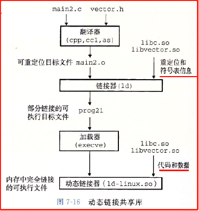

加载器执行程序时会发现一个.interp段

，内容为动态链接器所在的位置，这个时候加载器会启动动态链接器。

动态链接器完成链接的操作：

1. 重定位 libc.so 的文本和数据到某个内存段。（理解：这里的意思是将 libc.so 的内容加载到内存中？）

2. 重定位 libvector.so 的文本和数据到另一个内存段。

3. 重定位 prog21 中所有对由 libc.so 和 libvector.so 定义的符号的引用。

上述操作完成后，共享库的位置就固定了，且程序执行的过程中都不会改变。

### 7.11 从应用程序中加载和链接共享库

动态链接的应用：

- 分发软件。软件开发者常利用共享库来分发软件更新，它们生成共享库的新版本，用户只需要下载共享库并替代当前版本，下一次运行应用程序时，应用将自动链接和加载新的共享库。

- 构建高性能 Web 服务器：许多 Web 服务器使用基于动态链接的方法来生成动态内容。将每个生成动态内容的函数打包在共享库中，当一个浏览器请求达到时，服务器就动态加载并链接相应函数，然后直接调用它，而非创建新的进程来运行函数。


Java 就是通过 dlopen 接口加载共享库来调用 C 和 C++ 函数的。

### 7.12 位置无关代码


多个进程如何共享动态库的同一个副本，两种方法：

给每个共享库分配一个事先预备的专用的地址空间片，然后要求加载器总是在这个地方加载共享库。这种方法问题很多。

使用位置无关代码。这种方法才是实际采用的方法，列出上面那个就是为了用来衬托这个方法的。

位置无关代码（PIC）可以**加载而无需重定位**。

用户可以对 GCC 使用 -fpic 选项来生成 PIC 代码。共享库的编译必须总是使用此选项。

### 7.13 库打桩机制

### 7.14 处理目标文件的工具

Linux 系统种可以帮助处理目标文件的工具：

AR：创建静态库，插入、删除、列出和提取成员。

LDD：列出一个可执行文件在运行时所需要的共享库。

其他工具省略，详见原书 496 页。

### 7.15 小结

链接可以在编译时由静态编译器完成（静态库的链接），也可以在加载和运行时由动态链接器完成（动态库的链接）。

链接器处理的文件是目标文件，目标文件是一种二进制文件，有 3 种不同形式：

可重定位目标文件：

可执行目标文件：静态链接器将多个可重定位目标文件合并成一个可执行目标文件，它可以加载到内存中并执行。.exe 文件就是可执行目标文件。

共享目标文件（共享库）：运行时由动态链接器链接和加载。

链接器的两个主要任务：

符号解析：将目标文件中的每个全局符号都绑定到一个唯一的定义。

重定位：确定每个符号的最终内存地址，并修改对那些目标的引用。

静态链接器是由 GCC 这样的编译驱动程序调用的。它们将多个可重定位目标文件合并成一个单独的可执行目标文件。多个目标文件可以定义相同的符号，链接器可以按照一定规则来解析这些相同的符号。

多个目标文件可以被连接到一个单独的静态库中。链接器用库来解析其他目标模块中的符号引用。许多链接器都是通过从左到右的顺序扫描库来解析符号引用。

加载器将可执行文件的内容映射到内存，并运行这个程序。链接器还可能生成部分链接的可执行目标文件，这样的文件中有对定义在共享库中的例程和数据的为解析的引用。在加载时，加载器将部分链接的可执行文件映射到内存，然后调用动态链接器，动态链接器通过加载共享库和重定位程序中的引用来完成链接任务。

被编译为位置无关代码的共享库可以加载到任何地方，也可以在运行时被多个进程共享。为了加载、链接和访问共享库的函数和数据，应用程序也可以在运行时使用动态链接器。


## 第8章 异常控制流

- 

从给处理器加电开始，到断电为止，程序计数器假设一个值的序列：a0, a1, a2, ..., an。其中每个 a(k) 都是某个相应的指令 I(k) 的地址。

每次从 a(k) 到 a(k+1) 的过渡称为控制转移。这样的控制转移序列叫做处理器的**控制流**（control flow）。

最简单的控制流是一个平滑的序列，其中每个 I(k) 和 I(k+1) 都是相邻的。而诸如跳转、调用、返回等指令则会造成平滑流的突变，这些突变是由程序内部变量带来的。

还有一种突变是由程序外部的原因造成的，比如磁盘返回数据，鼠标关闭程序等，这种突变就叫做**异常控制流**（Exceptional Control Flow, ECF）。

异常控制流 ECF 发生在计算机系统的各个层次：

- 硬件层，硬件中断

- 操作系统层，内核通过上下文切换将控制从一个进程转移到另一个进程

- 应用层，一个进程给另一个进程发送信号，信号接收者将控制转移到信号处理程序。

ECF 的应用：

- 操作系统内部。ECF 是操作系统用来实现 I/O、进程和虚拟内存的基本机制。

- 与操作系统交互。应用程序通过使用一个叫做系统调用（system call）的 ECF 形式，向操作系统请求服务。

- 编写应用程序。操作系统为应用程序提供了 ECF 机制，用来创建新进程、等待进程终止、通知其他进程系统中的异常事件、检测和响应这些事件。

- 并发。ECF 是计算机系统中实现并发的基本机制。并发的例子有：异常处理程序或信号处理程序中断应用程序的执行，时间上重叠执行的进程和线程。

- 软件异常处理。C++ 和 Java 通过 try、catch、throw 等语句来提供异常处理功能。异常处理允许程序进行非本地跳转（即违反通常的调用/返回栈规则的跳转）来响应错误情况。非本地跳转是一种应用层 ECF，在 C 中由 setjmp和 longjmp 函数提供。

理解：首先要知道，异常控制流是从程序计数器的控制流层面来描述的。异常控制流就是程序计数器的控制流产生了程序外部原因带来的突变。

### 8.1 异常

异常（exception）是异常控制流的一种形式，一部分由硬件实现（也因此它的具体细节会随系统的不同而有所不同），一部分由操作系统实现。异常位于硬件和操作系统交界的部分。

注意：这里的异常和 C++ 或 Java 中的应用级异常是不同的。

异常就是控制流中的突变，用来响应处理器状态中的某些变化。在处理器中，状态被编码为不同的位和信号，状态变化称为事件（event）。

任何情况下，当处理器检测到有事件发生时，就会通过一张叫做异常表的跳转表，进行一个间接过程调用（异常），到异常处理程序（操作系统中一个专门用来处理这类事件的子程序）中。

事件的例子：发生虚拟内存缺页、算术溢出、一条指令试图除以 0、一个系统定时器产生的信号等。

当异常处理程序完成处理后，根据引起异常的事件的类型，会发生以下三种情况中的一种：

- 处理程序将控制返回给当前指令 I(curr)，即事件发生时正在执行的指令。

- 处理程序将控制返回给下一条指令 I(next)，即如果没有发生异常将会执行的下一条指令。

- 处理程序终止被中断的程序。

#### 8.1.1 异常处理                                                                                                                                                                                                                                                                                                                             

系统为每种可能的异常都分配了一个唯一的非负整数的异常号：

一部分异常号是处理器设计者分配的（对应硬件部分）。比如被零除、缺页、内存访问违例、断点、算术溢出。

另一部分是由操作系统内核的设计者分配的（对应软件部分）。比如系统调用、来自外部 I/O 设备的信号。

在系统启动时，操作系统分配和初始化一张异常表，使得表目 k 包含异常 k 的处理程序的地址。

系统在执行某个程序时，处理器检测到发生了一个事件，并确定了对应的异常号 k，就会触发异常。

触发异常：执行间接过程调用，通过异常表的表目 k，转到相应的处理程序。异常号是到异常表中的索引，异常表的起始地址放在一个特殊 CPU 寄存器——**异常表基地址寄存器**中。

异常类似过程调用，但有一些不同：

1. 过程调用时，在跳转到处理程序前，处理器将返回地址压入栈中。而在异常中，返回地址是当前指令（事件发生时正在执行的指令）或下一条指令。

2. 处理器也会把一些额外的处理器状态压入栈中，在处理程序返回时，重新开始执行被中断的程序会需要这些状态。

3. 如果控制从用户程序转移到内核，所有这些项目都被压倒内核栈中，而不是用户栈中。

4. 异常处理程序运行在内核模式下，因此它们对所有的系统资源都有完全的访问权限。

一旦硬件触发了异常，剩下的工作就是由异常处理程序在软件中执行。

异常处理结束后，会执行一条特殊的“从中断返回”指令，可选地返回到被中断的程序，该指令将适当的状态弹回到处理器的控制和数据寄存器中，然后将控制返回给别终端的程序。

#### 8.1.2 异常的类别

异常可以分为 4 类：

- 中断：来自 I/O 设备的信号；异步

- 陷阱：有意的异常；同步

- 故障：潜在的可恢复的错误；同步

- 终止：不可恢复的错误；同步

中断是异步异常，异步异常是由处理器外部的 I/O 设备中的事件产生的。

陷阱、故障和终止都是同步异常，它们是执行一条指令（称为**故障指令**）的直接产物。因为指令是按时钟周期执行的，所以由指令造成的异常必然是同步的。

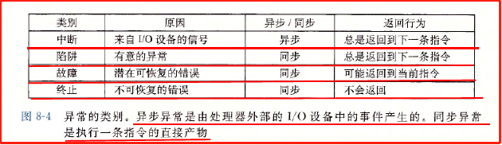

中断

    中断是异步异常，是由处理器外部的 I/O 设备中的事件产生的。硬件中断不是由指令造成的，因此它是异步的。硬件中断的异常处理程序常常叫做中断处理程序。

    I/O 设备向处理器芯片上的一个引脚发信号，并将异常号放到系统总线上来触发中断。异常号标识了引起中断的设备。

    在当前指令完成执行后，处理器注意到中断引脚的电压变高了，就从系统总线读取异常号，调用对应的中断处理程序。

陷阱和系统调用

    陷阱是有意的异常，是执行一条指令的结果。

    陷阱最重要的用途是在应用程序和内核之间提供一个接口，叫做系统调用。

    系统提供了一条特殊的 ”syscall n“ 指令，当用户程序想要向内核请求服务 n 时，就执行这条指令。执行 syscall 指令会导致一个到异常处理程序的陷阱（异常），这个处理程序解析参数，并调用适当的内核程序。

    用户程序经常需要向内核请求服务，比如读文件（read）、创建进程（fork）、加载程序（execve）、终止进程（exit）等。

    从程序员角度看，系统调用和普通的函数调用是一样的。但是实现上大不相同。

故障

    故障由错误情况引起。故障发生时，处理器将控制转移给故障处理程序，如果处理程序能够修正错误，就把控制返回到引起故障的指令，否则返回给内核中的 abort 例程，abort 会终止当前的应用程序。

    缺页异常

    缺页异常是一种经典的故障（页面是虚拟内存中一个连续的块，典型值是 4KB）。当指令引用一个虚拟地址，而与该地址对应的物理页面不在内存中，必须要从磁盘取出时，就会发生缺页异常。

    然后缺页处理程序会从磁盘加载适当的页面，然后将控制返回给引起故障的指令。当指令再次执行时，相应的物理页面就在内存中了。

    理解：从存储器层次结构的角度看，缺页异常似乎可以看作是内存不命中的惩罚。

终止

    终止是不可恢复的致命错误造成的结果，通常是一些硬件错误。终止处理程序将控制返回给一个 abort 例程，该例程会终止这个应用程序。

    理解：运行程序时遇到了 abort 表明发生了故障或终止异常。

#### 8.1.3  Linux/x86-64系统中的异常


x86-64 系统中有 256 种不同的异常类型，其中 0~31 号是 Intel 架构师定义的异常，剩下的是操作系统定义的中断和陷阱。
理解：0-31 号是故障或终止，32~255 号都是操作系统定义的中断或系统调用。

Linux/x86-64 故障和终止

- 除法错误。当应用试图除以零时，或者当一个除法指令的结果对目标操作数来说太大了，就会发生除法错误。

    当发生除法错误，Unix 会直接终止程序，Linux shell 通常把除法错误报告为“浮点异常(Floating Exception)”。

- 一般保护故障。有许多原因，通常是因为一个程序引用了一个未定义的虚拟内存区域，或试图写一个只读的文本段。

    此类故障也不会恢复，Linux shell 通常会把一般保护故障报告为“**段故障(Segmentation fault)**”。

- 缺页异常。此类故障会尝试恢复并重新执行产生故障的指令。

- 机器检查。在告知故障的指令执行中检测到致命的硬件错误时发生。

    此类故障从不返回控制给应用程序。

Linux/x86-64 系统调用

Linux 提供几百种系统调用，供应用程序请求内核服务时使用。（其中有一部分在 unistd.h 文件中）

系统中有一个跳转表（类似异常表）。每个系统调用都有一个唯一的整数号，对应一个到内核中跳转表的偏移量。

C 程序使用 syscall 函数可以直接调用任何系统调用。但是没必要这么做，C 标准库为大多数系统调用提供了包装函数。这些包装函数也是系统级函数。

所有 Linux 系统调用的参数都是通用寄存器而不是栈传递的。一般寄存器 %rax 包含系统调用号。

系统调用是通过陷阱指令 **syscall** 进行的（这里的 syscall 指令是汇编级别的指令）。

```C++
'系统级函数写 helloworld'

int main()

{

    write(1, "hello, world\n", 13);

    _exit(0);

}

'汇编语言版本（省略了绝大部分代码）'

main:

    movq $1, %rax

    syscall

```

### 8.2 进程

异常是允许操作系统内核提供进程概念的基本构造块。

进程的经典定义就是**一个执行中程序的实例**。系统中的每个程序都运行在某个进程的**上下文**（context）中。

上下文是由程序正确运行所需的状态组成的。这个状态包括存放在内存中的程序的代码和数据，它的栈、通用目的寄存器的内容、程序计数器、环境变量、打开文件描述符的集合。

当用户向 shell 输入一个可执行目标文件的名字，运行程序时，shell 就会创建一个新的进程，然后在这个新进程的上下文中运行该可执行文件。

进程提供给应用程序的关键抽象：

一个独立的逻辑控制流。好像程序独占地使用处理器。

一个私有的地址空间。好像程序独占地使用内存。

#### 8.2.1 逻辑控制流

使用调试器单步执行程序时会看到一系列的程序计数器（PC）值，这个 PC 的值的序列叫做**逻辑控制流**，简称逻辑流。

PC 的值唯一地对应于包含在程序的可执行目标文件中的指令，或包含在运行时动态链接到程序的共享对象中的指令。

逻辑流有许多不同的形式，异常处理程序、进程、信号处理程序、线程等都是逻辑流的例子。

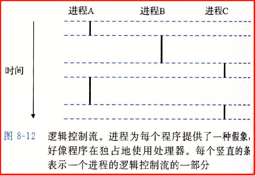

**进程是轮流使用处理器的**。

#### 8.2.2 并发流

当一个逻辑流的执行在时间上与另一个流重叠，就称为并发流，这两个流称为并发地运行。

并行流是并发流的真子集，如果两个流并发地运行在**不同的处理器核**或不同的计算机上时，就称为并行流。

一个进程和其他进程轮流运行的概念叫做多任务。

一个进程执行它的控制流的一部分的每一时间段叫做时间片。如 8.2.1 的图中的进程 A 包含两个时间片。

#### 8.2.3 私有地址空间

进程为每个程序提供它自己的私有地址空间。一般而言，和这个私有地址空间中某个地址相关联的那个内存字节是不能被其他进程读或写的。

不同进程的私有地址空间关联的内存的内容一般不同，但是每个这样的空间都有相同的通用结构。

x86-64 Linux 进程的地址空间的组织结构

地址空间的顶部保留给内核（操作系统常驻内存的部分），包含内核在代表进程执行指令时（比如当执行了系统调用时）使用的代码、数据、堆和栈。

地址空间的底部留给用户程序，包括代码段、数据段、运行时堆、用户栈、共享库等。代码段总是从地址 0x400000 开始。

理解：可以看出，**内核栈和用户栈是分开的**。

#### 8.2.4 用户模式和内核模式

处理器使用某个控制寄存器中的一个**模式位**（mode bit）来区分用户模式与内核模式。进程初始时运行在用户模式，当设置了模式位时，进程就运行在内核模式。
运行在内核模式的进程可以执行指令集中的任何指令，并可以访问系统中的任何内存位置。
运行在用户模式的进程不允许执行特权指令，比如停止处理器、改变模式位、发起 I/O 操作等，也不能直接引用地址空间内核区中的代码和数据，用户程序只能通过系统调用接口间接地访问内核代码和数据。
进程从用户模式变为内核模式的方法是通过中断、故障、陷阱（系统调用就是陷阱）这样的异常。异常发生时，控制传递给异常处理程序，处理器将模式从用户模式转变为内核模式。

    
/proc 文件系统
Linux 提供了一种叫做 /proc 文件系统的机制来允许用户模式进程访问内核数据结构的内容。
/proc 文件系统将许多内核数据结构的内容输出为一个用户程序可以读的文本文件的层次结构。
可以通过 /proc 文件系统找出一般的系统属性（如 CPU 类型：/proc/cpuinfo）或者某个特殊的进程使用的内存段（/proc/<process-id>/maps）。

    2.6 版本的 Linux 内核引入了 /sys 文件系统，它输出关于系统总线和设备的额外的低层信息。

#### 8.2.5 上下文切换

上下文切换是一种较高层形式的异常控制流，它是建立在中断、故障等较低层异常机制之上的。

系统通过上下文切换来实现多任务。

内核为每个进程维持一个上下文，上下文是内核重新启动一个被挂起的进程所需的状态。

上下文由一些对象的值（是这些对象的值而非对象本身）组成，这些对象包括：通用目的寄存器、浮点寄存器、状态寄存器、程序计数器、用户栈、内核栈和各种内核数据结构（如描述地址空间的页表、包含有关当前进程信息的进程表、包含进程已打开文件的信息的文件表）。

内核挂起当前进程，并重新开始一个之前被挂起的进程的决策叫做调度，是由内核中的**调度器**完成的。

内核使用上下文切换来调度进程：

1. 保存当前进程的上下文

2. 恢复某个先前被抢占的进程被保存的上下文

3. 将控制传递给这个新恢复的进程

当内核代表用户执行系统调用时，可能发生上下文切换。如果系统调用因为等待某个事件而阻塞（比如 sleep 系统调用显式地请求让调用进程休眠，或者一个 read 系统调用要从磁盘读数据），内核就可以让当前进程休眠，切换到另一个进程。即使系统调用没有阻塞，内核也可以进行上下文切换，而不是将控制返回给调用进程。

中断也可能引发上下文切换。如所有的系统都有一种定时器中断机制，即产生周期性定时器中断，通常为 1ms 或 10ms。当发生定时器中断，内核就判定当前进程已经运行了足够长时间，该切换到新的进程了。

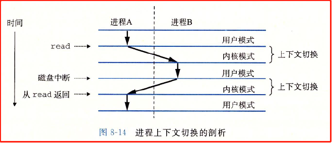

### 8.3 系统调用错误处理

当 Unix 系统级函数遇到错误时，它们通常会返回 -1，并设置全局整数变量 errno 来表示什么出错了。
程序员应该总是检查错误
strerror 函数返回一个文本串，描述了和某个 errno 值相关联的错误。使用 strerror 来查看错误

```C++
'调用 Unix fork 时检查错误'
if((pid = fork()) < 0) //如果发生错误，此时 errno 已经被设置为对应值了
{
fprintf(stderr, "fork error: %s\n", strerror(errno));//strerror(errno) 返回描述当前 errno 值的文本串
exit(0);
}
```


错误处理包装函数
许多人因为错误检查会使代码臃肿、难读而放弃检查错误。可以通过定义错误报告函数及对原函数进行包装来简化代码。
对于一个给定的基本函数，定义一个首字母大写的包装函数来检查错误。

```C++
'错误报告函数'
void unix_error(char *msg)
{
fprintf(stderr, "%s: %s\n", msg, strerror(errno));
exit(0);
}
'fork 函数的错误处理包装函数 Fork'
pid_t Fork(void)
{
pid_t pid;
if ((pid = fork()) < 0)
unix_error("Fork error"); //调用上面定义的包装函数
return pid;
}
```

### 8.4 进程控制

#### 8.4.1 获取进程ID

每个进程都有一个唯一的非零正整数表示的进程 ID，叫做 PID。有两个获取进程 ID 的函数：

getpid 函数：返回调用进程的 PID（类型为 pid_t，在 type.h 中定义了 pid_t 为 int）。

getppid 函数：返回它的父进程的 PID。

#### 8.4.2 创建和终止进程

进程总是处于以下三种状态之一：

- 运行。进程要么在 CPU 上执行，要么在等待被执行且最终被内核调度。

- 停止。进程的执行被挂起且不会被调度。当收到 SIGSTOP, SIGTSTP, SIGTTIN, SIGTTOU 信号时，进程就会停止，直到收到一个 SIGCONT 信号时再次开始运行。

- 终止。进程永远地停止了。进程有三种原因终止：收到一个信号，该信号的默认行为是终止进程；从主进程返回；调用 exit 函数。

信号是一种软件中断的形式。

终止进程

`void exit(int status);` 

创建进程

父进程通过调用 `fork` 函数创建一个新的运行的子进程。

fork 函数**只被调用一次，但是会返回两次**：一次返回是在父进程中，一次是在新创建的子进程中（可以理解成返回到父进程和子进程，然后执行代码）。父进程中返回子进程的 PID，子进程中返回 0。

因为 fork 创建的子进程的 PID 总是非零的，所以可以根据返回值是否为 0 来分辨是当前是在父进程还是在子进程。

`pid_t fork(void); //子进程返回 0，父进程返回子进程的 PID，如果出错，返回 -1`

子进程与父进程几乎完全相同：

子进程得到与父进程用户级虚拟地址空间相同但独立的一份副本，包括代码段、数据段、堆、共享库、用户栈。

子进程获得与父进程所有文件描述符相同的副本。这意味着子进程可以读写父进程打开的任何文件。

子进程和父进程之间的最大区别在于 PID 不同。


- 调用一次，返回两次。fork 函数被父进程调用一次，但是返回两次：一次是返回到父进程，一次是返回到子进程。（fork 调用前只有父进程，调用后多了子进程，因此在两个进程里都要返回）

- 不论子进程还是父进程，它的返回点都是调用 fork 函数的地方，因此在 fork 函数调用之前的部分只会在父进程中执行，而不会在子进程中执行。

- 并发执行。父进程和子进程是并发执行的独立进程，内核会交替执行它们的逻辑控制流中的指令。

- 相同但是独立的地址空间。两个进程的地址空间的内容是完全相同的，但是是互相独立的。

- 共享文件。

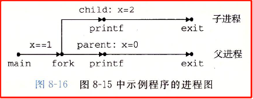


#### 8.4.3 回收子进程

当一个进程终止时，内核并不会立即把它删除。相反，进程被保持在一种已终止的状态中，直到被它的父进程回收。

当父进程回收已终止的子进程时，内核将子进程的退出状态传递给父进程，然后清除子进程。

- 僵死进程：一个终止了但还未被回收的进程。

- init 进程

    系统启动时内核会创建一个 init 进程，它的 PID 为 1，不会终止，是**所有进程的祖先**。

    如果一个父进程终止了，init 进程会成为它的**孤儿进程**的养父。init 进程会负责回收没有父进程的僵死子进程。

    长时间没有运行的程序，总是应该回收僵死子进程。即使僵死子进程没有运行，也在消耗系统的内存资源。

waitpid 函数

一个进程可以通过调用 waitpid 函数来等待它的子进程终止或停止。

`pid_t waitpid(pid_t pid, int *statusp, int options);  //如果成功，返回对应的已终止的子进程的 PID；如果其他错误，返回 -1`

waitpit 函数比较复杂。默认情况下 options = 0，此时 waitpid 会挂起调用进程的执行，直到它的等待集合中的一个子进程终止。如果等待集合中的一个进程在刚调用时就已经终止了，那么 waitpid 就立即返回。waitpid 的返回值是对应的已终止的子进程的 PID，此时该子进程会被回收，内核从系统中删除掉它的所有痕迹。

1 判定等待集合的成员

    等待集合的成员是由参数 pid 确定的：

    如果 pid>0，等待集合就是进程 ID=pid 的那一个特定的子进程。

    如果 pid=-1，等待集合就是由父进程的所有子进程共同构成的。

    还有其他等待集合，不再讨论。

2 修改默认行为

    默认情况下 options=0，可以将 options 设置为常量 WNOHANG, WUNTRACED, WCONTINUED 的各种组合来修改默认行为：

    options=0，挂起调用进程的执行，直到它的等待集合中的一个子进程终止。如果等待集合中的一个进程在刚调用时就已经终止了，那么 waitpid 就立即返回。

    options=WNOHANG，如果等待集合中的一个子进程终止了，返回该子进程 ID，如果没有子进程终止，也立即返回，返回值为 0。WNOHANG 的特点是立即返回，不会挂起调用进程。

    options=WUNTRACED，挂起调用进程的执行，直到等待集合中的一个进程变成已终止或被停止，返回值是该子进程 ID。WUNTRACED 的特点是还可以检查被停止的子进程。

    options=WCONTINUED，挂起调用进程的执行，直到等待集合中一个正在运行的进程终止或等待集合中一个被停止的进程收到 SIGCONT 信号重新开始执行。

    options=WNOHANG|WUNTRACED，立即返回，如果等待集合中的子进程都没有被停止或终止，则返回 0，否则返回该子进程的 PID。

3 检查已回收子进程的退出状态

    如果 statusp 参数是非空的，那么 waitpid 就会在 status 中放上关于导致 waitpid 返回的子进程的状态信息，status 是 statusp 指向的值。

    wait.h 头文件定义了解释 status 参数的几个宏：

    WIFEXITED(status)：如果子进程通过调用 exit 或者一个返回（return）正常终止，就返回真。

    WEXITSTATUS(status)：返回一个正常终止的子进程的退出状态。只有在 WIFEXITED() 返回为真时，才会定义这个状态。

    WIFSIGNALED(status)：如果子进程是因为一个未被捕获的信号终止的，那么就返回真。

    WTERMSIG(status)：返回导致子进程终止的信号的编号。只有在 WIFSIGNALED() 返回为真时，才定义这个状态。

    WIFSTOPPED(status)：如果引起返回的子进程当前是停止的，就返回真。

    WSTOPSIG(status)：返回引起子进程停止的是信号的编号。只有在 WIFSTOPPED() 返回为真时，才定义这个状态。

    WIFCONTINUED(status)：如果子进程收到 SIGCONT 信号重新启动，则返回真。

4 错误条件

    如果调用进程没有子进程，那么 waitpid 返回 -1，并设置 errno 为 ECHILD。如果 waitpid 函数被一个信号中断，那么它返回 -1，并设置 errno 为 EINTR。

5 wait函数

    wait 函数是 waitpid 函数的简单版本。

    `pid_t wait(int *statusp);  //如果成功，返回子进程的 PID，如果出错，返回 -1`

#### 8.4.4 让进程休眠

sleep函数

    sleep 函数将一个进程挂起一段指定的时间。注意：sleep 不是 C 标准库里的函数，是 unistd 中的控制进程的函数。

    `unsigned int sleep(unsigned int secs); //返回还要休眠的秒数`

    如果请求的休眠时间量到了，sleep 返回 0，否则返回还剩下的要休眠的秒数（当 sleep 函数被一个信号中断而过早地返回，会发生这种情况）。

pause函数

    pause 函数让调用函数休眠，直到该进程收到一个信号。

    `int pause(void);`

#### 8.4.5 加载并运行程序

execve函数

execve 函数在当前进程的上下文中加载并运行一个新程序（是程序不是进程）。


`int execve(const char *filename, const char *argv[], const char *envp[]); //如果成功，则不返回，如果错误，返回 -1。`

execve 函数功能：加载并运行可执行目标文件 filename，并带一个参数列表 argv 和一个环境变量列表 envp。

execve **调用一次并从不返回**（区别于 fork 调用一次返回两次）。

参数列表和变量列表：

- 参数列表：argv 指向一个以 null 结尾的指针数组，其中每个指针指向一个字符串。

- 环境变量列表：envp 指向一个以 null 结尾的指针数组，其中每个指针指向一个环境变量字符串，每个串都是形如 “name=value” 的名字-值对。

execve函数的执行过程

execve 函数调用加载器加载了 filename 后，设置用户栈，并将控制传递给新程序的主函数（即 main 函数）。


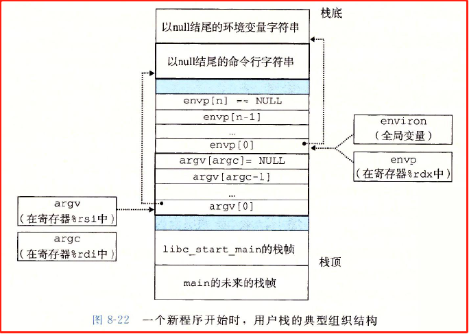

区分程序与进程

    程序：程序是一堆代码和数据，程序可以作为目标文件存在于磁盘上，或作为段存在于虚拟地址空间中。

    进程：进程是执行中程序的一个具体的实例。

    程序总是运行在某个进程的上下文中。

区分 fork 和 execve

    fork 函数是在新的子进程中运行相同的程序，新的子进程是父进程的一个复制品。

    execve 函数是在当前进程的上下文中加载并运行一个新的程序，它会覆盖当前进程的地址空间，但没有创建一个新的进程。

#### 8.4.6 利用fork和execve运行程序

像 Unix shell 和 Web 服务器这样程序大量使用了 fork 和 execve 函数

一个简单的 shell 的实现方式

shell 会打印一个命令行提示符，等待用户在 stdin 上输入命令行，然后对这个命令行求值。

### 8.5 信号

信号是一种更高层次的软件形式的异常，它允许进程和内核中断其他进程。

一个信号就是一条消息，它通知进程系统中发生了某件事情。

每种信号类型都对应于某种系统事件。信号可以简单分为两类：

一类信号对应低层的硬件异常，此类异常由内核异常处理程序处理，对用户进程不可见。但是当发生异常，会通过信号通知用户进程发生了异常。

例子：一个进程试图除以 0，内核会发送给他一个 SIGFPE 信号。

一类信号对应于内核或其他用户进程中叫高层的软件事件。

例子：用户按下 Ctrl+C，内核会发送一个 SIGINT 信号给这个前台进程组中的每个进程。一个进程可以通过向另一个进程发送 SIGKILL 信号强制终止它。

上面列出的这些信号是一些宏，类型是 int，值就是它们的编号。

#### 8.5.1 信号术语

//传送一个信号到目的进程包含两个步骤：

1. 发送信号。内核通过更新目的进程上下文中的某个状态，发送一个信号给目的进程。

2. 接收信号。当目的进程被内核强迫以某种方式对信号的发送做出反应时，就接受了信号。进程可以忽略、终止或通过执行一个叫做信号处理程序的用户层函数捕获这个信号。

发送信号有两种原因：

    内核检测到一个系统事件，比如除零错误或子进程终止。

    一个进程调用了 kill 函数，显式地要求内核发送一个信号给目的进程。一个进程可以发送信号给自己。

待处理信号

待处理信号是指发出但没有被接收的信号。

一种类型最多只会有一个待处理信号。如果一个进程已经有一个类型为 k 的待处理信号，接下来发给他的类型为 k 的信号都会直接丢弃。

进程可以有选择地阻塞接收某种信号。当一种信号被阻塞，它仍可以发送，但是产生的待处理信号不会被接收。

一个待处理信号最多只能被接收一次。内核为每个进程在 pending 位向量中维护着待处理信号的集合，在 blocked 位向量中维护着被阻塞的信号集合。

只要传送了一个类型为 k 的信号，内核就会设置 pending 中的第 k 位，只要接收了一个类型为 k 的信号，内核就会清除 blocked 中的第 k 位。

#### 8.5.2 发送信号

    Unix 系统提供了大量向进程发送信号的机制。这些机制都是基于进程组（process group）的概念。
进程组
每个进程都只属于一个进程组，进程组由一个正整数进程组 ID 来标识。
可以使用 getpgrp 函数获取当前进程的进程组 iD，可以使用 setpgid 函数改变自己或其他进程的进程组。
默认情况下，子进程和它的父进程同属于一个进程组。

`pid_t getpgrp(void);   // 返回调用进程的进程组 ID`
`int setpgid(pid_t pid, pid_t pgid);     // 将进程 pid 的进程组改为 pgid。若成功返回 0，错误返回 -1。`
`// 如果 pid=0，就表示使用当前进程的 pid，如果 pgid=0，就表示要将使用第一个参数 pid 作为进程组 ID。`
用/bin/kill程序发送信号
可以用 Linux 中的 kill 程序向另外的进程发送任意的信号。
正的 PID 表示发送到对应进程，**负的 PID 表示发送到对应进程组中的每个进程**。

`linux> /bin/kill -9 15213      # 发送信号9（SIGKILL）给进程 15213。
linux> /bin/kill -9 -15213     # 发送信号9（SIGKILL）给进程组 15213 中的每个进程。`
上面使用了完整路径，因为有些 Unix shell 有自己内置的 kill 命令。
从键盘发送信号
Unix shell 使用**作业**这个抽象概念来表示为对一条命令行求值而创建的进程。在任何时刻，至多只有**一个前台作业**，后台作业可能有多个。
`linux> ls | sort  # 这会创建两个进程组成的前台作业，这两个进程通过 Unix 管道连接起来：一个进程运行 ls 程序，另一个运行 sort 程序`
**shell 为每个作业创建一个独立的进程组，进程组 ID 通常取作业中父进程中的一个。**

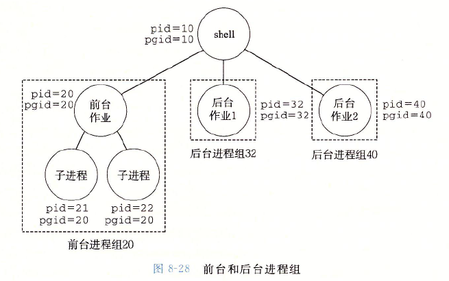

上图是一个包含一个前台作业与两个后台作业的 shell。

在键盘上输入 Ctrl+C 会导致内核发送一个 SIGINT 信号到前台进程组中的每个进程，默认情况下会终止前台作业。

输入 Ctrl+Z 会发送一个 SIGTSTP 信号到前台进程组中的每个进程，默认情况下会停止（挂起）前台作业。

用kill函数发送信号

    进程可以通过调用 kill 函数发送信号给其他进程（包括自己）。

    `int kill(pid_t pid, int sig);  //若成功则返回 0，若错误则返回 -1`

    pid 取值有三种情况：

    pid>0：kill 函数发送信号号码 sig 给进程 pid。

    pid=0：kill 函数发送信号 sig 给调用进程所在进程组中的每个进程，

    pid<0：kill 函数发送信号 sig 给进程组 | pid | (pid 的绝对值)中的每个进程。

用alarm函数发送信号

    进程可以通过调用 alarm 函数向他自己发送 SIGALRM 信号。

    `unsigned int alarm(unsigned int secs);  //返回前一次闹钟剩余的描述，如果以前没有设定闹钟，就返回 0。`

    alarm 函数安排内核在 secs 秒后发送一个 SIGALRM 信号给调用进程。如果 secs=0，则不会调度安排新的闹钟。

    在任何情况下，对 alarm 的调用都将取消任何待处理的闹钟，并返回任何待处理的闹钟在被发送前还剩下的秒数。如果没有待处理的闹钟，就返回 0。

发送信号的方法总结

- 内核给进程/进程组发送信号。

- 使用 /bin/kill 程序给进程/进程组发送任意信号。

- 调用 kill 函数给进程/进程组发送任意信号。

- 进程调用 alarm 函数给自己发送 SIGALRM 信号。

- 键盘按键来发送信号。

#### 8.5.3 接收信号

当内核把进程 p 从内核模式切换到用户模式时（比如从系统调用返回），他会检查进程 p 的未被阻塞的待处理信号的集合。如果集合为空，内核就将控制传递到 p 的逻辑控制流中的下一条指令；如果集合非空，内核就选择集合中的某个信号（通常是最小的 k），并强制 p 接收信号 k。
进程 p 收到信号会触发 p 采取某种行为，等进程完成了这个行为，控制就传递回 p 的逻辑控制流中的下一条指令。
每个信号类型都有一个预定义的默认行为，是下面中的一种：

- 进程终止

- 进程终止并转储内存

- 进程停止（被挂起）直到被 SIGCONT 信号重启

- 进程忽略该信号

进程可以通过 signal 函数修改和信号相关联的默认行为，其中 SIGSTOP 和 SIGKILL 的默认行为不能修改。
`sighandler_t signal(int signum, sighandler_t handler); //若成功返回指向前次处理程序的指针，若出错则返回 SIG_ERR（不设置 errno）。`
signal 函数接受两个参数：信号值和函数指针，可以通过下列三种方法之一来改变和信号 signum 相关联的行为：
如果 handler 是 SIG_IGN，那么忽略类型为 signum 的信号。SIG_IGN 是 signal.h 中定义的一个宏。
如果 handler 是 SIG_DFL，那么类型为 signum 的信号行为恢复为默认行为。SIG_DEF 是 signal.h 中定义的一个宏。
如果 hanlder 是用户定义的函数的地址，这个函数就被称为信号处理程序。只要进程接收到一个类型为 signum 的信号，就会调用这个程序。通过把处理程序的地址传递到 signal 函数来改变默认行为，这叫做设置信号处理程序。调用信号处理程序被称作捕获信号。执行信号处理程序被称作处理信号。
当处理程序执行它的 return 语句时，控制传递回控制流中进程被信号接收中断位置处的指令。
信号处理程序可以被其他信号处理程序中断。


#### 8.5.4 阻塞和解除阻塞信号

Linux 提供两种阻塞信号的机制：

- 隐式阻塞机制。内核默认阻塞任何当前处理程序正在处理信号类型的待处理的信号。

- 显式阻塞机制。应用程序可以使用 sigprocmask 函数和它的辅助函数，明确地阻塞和解除阻塞选定的信号。

#### 8.5.5 编写信号处理程序

信号处理是 Linux 系统编程最棘手的问题。

处理程序的几个复杂属性：

    处理程序与主程序和其他信号处理程序并发运行，共享同样的全局变量，可能和主程序与其他处理程序互相干扰。

    如何接收信号及何时接收信号的规则常常有违人的直觉。

    不同的系统有不同的信号处理语义。

安全的信号处理

信号处理程序与主程序和其他信号处理程序并发地运行，如果它们并发地访问同样的全局数据结果，那结果可能不可预知。

一些保守的编写处理程序使其安全地并发运行的原则：

    处理程序要尽可能简单。越简单越不容易出错。

    在处理程序中只调用异步信号安全的函数。异步信号安全的函数能够被信号处理程序安全地调用，因为它们要么是可重入地，要么不能被信号处理程序中断。

    保存和恢复 errno。许多 Linux 异步信号安全的函数会在出错返回时设置 errno，在处理程序中调用时可能会干扰主程序中其他依赖于 errno 的部分。因此要在进入处理程序时将 errno 保存在局部变量中，返回前恢复它。

    阻塞所有的信号，保护对共享全局数据结构的访问。在访问处理程序和主程序共享的全局数据时，暂时阻塞信号。以保证信号处理程序不会中断那些用于访问数据的指令序列。

    用 volatile 声明全局变量。用 volatile 告诉编译器不要缓存这个变量，每次引用该变量都要从内存中读取。避免因为编译器的缓存优化机制导致处理程序和主程序获取的变量值不一样。

    用 sig_atomic_t 声明标志。详细介绍略，可以看书。

上面这些规则是保守的，不总是严格必须，但建议采用保守的方法。

下面是 Linux 保证异步信号安全的系统级函数，许多常见函数如 printf, malloc, exit 都不在其中，其中产生输出的唯一安全的函数是 write 函数。

因为产生输出的唯一安全的函数是 write 函数，本书作者开发了一些安全的函数，称为 SIO 包，用来在信号处理程序中打印简单的消息。

`ssize_t sio_putl(long v);    //向标准输出打印一个 long 类型数字，如果成功返回传送的字节数，出错返回 -1`

`ssize_t sio_puts(char s[]);  //向标准输出打印一个字符串，如果成功返回传送的字节数，出错返回 -1`

`void sio_error(char s[]);    //打印一条错误消息并终止。`

正确的信号处理

    要注意：如果存在一个未处理的信号 k，那表明至少有一个 k 信号到达了，实际上可能不止一个。

可移植的信号处理

Unix 信号处理的另一个缺陷：不同的系统有不同的信号处理语义。如：

signal 函数的语义各有不同。有些老的 Unix 系统在信号 k 被处理程序捕获后就把对信号 k 的反应恢复到默认值。

系统调用可以被终端。像 read, write, accept 等系统调用潜在地会阻塞进程一段较长的时间，称为慢速系统调用。一些较早的 Unix 系统中，慢速系统调用被信号中断后不会继续执行，而是直接返回错误。

Posix 标准定义了 sigaction 函数，允许用户在设置信号处理时，明确指定想要的信号处理语义。

Signal 包装函数设置了一个信号处理程序，它的信号处理语义如下：

只有这个处理程序当前正在处理的那种类型的信号被阻塞。

信号不会排队等待。

只要可能，被中断的系统调用会自动重启。

一旦设置了信号处理程序，它就会一直保持，直到 handler 参数为 SIG_IGN 或 SIG_DFL 的 Signal 函数被调用。

#### 8.5.6 同步流以避免讨厌的并发错误

如何编写读写相同存储位置的并发流程序是一个难题。

基本的解决方式是：以某种方式同步并发流，从而得到最大的可行的交错集合，每个可行的交错都能得到正确的结果。

#### 8.5.7 显式地等待信号

有时候主程序需要显式地等待某个信号处理程序运行。如当 Linux shell 创建一个前台作业时，在接收下一条用户命令之前，它必须等待作业终止，被 SIGCHLD 处理程序回收。

### 8.6 非本地跳转

C 语言提供了一种用户级异常控制流形式，称为非本地跳转，它将控制直接从一个函数转移到另一个当前正在执行的函数，而不需要经过正常的调用-返回序列（即 C 标准库 setjmp.h 的内容）。(即try和catch的功能)

非本地跳转通过 setjmp 和 longjmp 函数来完成

sigjmp函数

`int setjmp(jmp_buf env);  //返回 0，setjmp 的返回值不能被赋值给变量，但可以用在条件语句的测试中`

`int sigsetjmp(sigjmp_buf env, int savesigs);`

setjmp 函数在 env 缓冲区中保存当前调用环境，以供后面的 longjmp 使用。

调用环境包括程序计数器、栈指针和通用目的寄存器。

longjmp函数

`void longjmp(jmp_buf env, int retval);`

`void siglongjmp(sigjmp_buf env, int retval);`

longjmp 函数从 env 缓冲区中恢复调用环境，然后触发一个从最近一次初始化 env 的 setjmp 调用的返回。然后 setjmp 返回，并带有非零的返回值 retval。

setjmp 和 longjmp 之间的关系比较复杂：setjmp 函数只被调用一次，但返回多次：一次是第一次调用 setjmp 将调用环境保存在 env 中时，一次是为每个相应的 longjmp 调用。而 longjmp 函数被调用一次，但从不返回。

非本地跳转的一个重要应用：允许从一个深层嵌套的函数调用中立即返回，而不需要解开整个栈的基本框架，通常是由检测到某个错误情况引起的。

C++ 和 Java 提供的 try 语句块异常处理机制是较高层次的，是 C 语言的 setjmp 和 longjmp 函数的更加结构化的版本。可以把 throw 语句看作 longjmp 函数，catch 子句看作 setjmp 函数。

### 8.7 操作进程的工具

Linux 系统提供了大量的监控和操作进程的工具：

- STRACE：打印一个正在运行的程序和它的子进程调用的每个系统调用的轨迹。

- PS：列出当前系统中的进程（包括僵死进程）。

- TOP：打印关于当前进程资源使用的信息。

- PMAP：显示进程的内存映射。

- /proc：一个虚拟文件系统，以 ASCII 文本格式输出大量内核数据结构的内容，用户程序可以读取这些内容。

Shell实验总结

书上 shell 程序内容总结：首先解析命令行参数，获得一个参数列表，然后检查第一个参数是否为内置文件名，是则直接执行内置的文件，否则通过 execve 函数调用相应可执行文件。注意调用后最后要回收子进程。

shell 程序的构成

一个极简的 shell 程序包括以下几个函数：main 函数、eval 函数、parseline 函数、buildin 函数，它们的各自的主要职责如下：

- main：shell 程序的入口点，职责：循环从标准输入读取命令行字符串并调用 eval 函数解析并执行命令行字符串。

- eval：解析并执行命令行字符串。职责：首先调用 parseline 函数解析命令行字符串，然后使用 buildin 函数检查是否为内置命令，不是的话要生成一个进程（作业）来完成此命令，还要根据情况回收相应进程。

- parseline 函数：解析命令行字符串。职责：根据空格拆分命令行字符串，构造 argv 向量。

- buildin 函数：检查命令是否为内置命令，如果是的话直接调用相应函数，不是的话返回交给 eval 函数负责。


## 第9章 虚拟内存

- 

虚拟内存为每个进程提供了一个大的、一致的和私有的地址空间。

虚拟内存提供了三个重要能力：

1. 将主存看成一个存储在磁盘上的地址空间的高速缓存，在主存中只保存活动区域，并根据需要在磁盘和主存中传送数据。

2. 为每个进程提供了**一致的地址空间**，简化了内存管理。进而简化了链接、进程间共享数据、进程的内存分配、程序加载。

3. 保护了每个进程的地址空间不被其他进程破坏。

虚拟内存的几个特点：

1. 虚拟内存遍及计算机系统的所有层面，在硬件异常、汇编器、链接器、加载器、共享对象、文件和进程的设计中都扮演着重要角色。

2. 虚拟内存给予应用程序强大的能力，可以创建和销毁内存片（chunk），将内存片映射到磁盘文件的某个部分，以及与其他进程共享内存。

3. 虚拟内存很危险。每次应用程序引用一个变量、间接引用一个指针或调用一个如 malloc 的动态分配程序时，都会和虚拟内存交互，如果使用不当就会发生错误。

### 9.1 物理和虚拟寻址

主存被组织成一个由 M 个连续的字节大小的单元组成的数组。每字节都有一个唯一的物理地址。CPU 访问内存最自然的方式就是使用物理地址，称为物理寻址。

现代 CPU 使用的是虚拟寻址：CPU 通过生成一个虚拟地址（VA）来访问主存，这个虚拟地址首先通过地址翻译转换为物理地址。

地址翻译需要 CPU 硬件和操作系统之间的紧密合作。CPU 芯片上名为内存管理单元（**MMU**）的专用硬件利用存放在主存中的查询表来动态翻译虚拟地址。

### 9.2 地址空间

地址空间是一个非负整数地址的有序集合：{0, 1, 2, ...}

如果地址空间中的整数是连续的，就称为线性地址空间。

在计算机系统中，CPU 从一个有 N=2^n 个地址的地址空间中生成虚拟地址空间。

一个地址空间的大小是由表示地址的位数来描述的，例如现代的 64 位计算机一般支持 64 位虚拟地址空间。

主存中的每个字节都有一个虚拟地址和一个物理地址。

### 9.3 虚拟内存作为缓存的工具

虚拟内存作为磁盘的高速缓存，和存储器层次结构中的其他缓存一样，磁盘（较低层）中的数据被分割成块，作为磁盘和主存（较高层）之间的传输单元。

VM（虚拟内存）系统通过将虚拟内存分割为**虚拟页**（Virtual Page，VP）来处理此问题。每个虚拟页的大小为 P=2^p。

类似的，物理内存被分割为**物理页**（PP），大小也是 P 字节。物理页也被称为页帧。

任何时刻，所有的虚拟页都被分为了三个不相交的子集：

1. 未分配的：VM 系统还未分配（未创建）的页。未分配的块没有任何数据与它们相关联，因此不占用任何磁盘空间。

2. 已缓存的：当前已缓存在物理内存中的已分配页。

3. 未缓存的：未缓存在物理内存中的已分配页。


#### 9.3.1 DRAM缓存的组织结构

主存一般采用 DRAM，DRAM 与磁盘之间的速度差要比 SRAM 与 DRAM 之间的速度差大很多，并且从磁盘的一个扇区读取第一个字节的时间开销比读这个扇区中的连续字节要慢很多。因此 DRAM 缓存的组织结构与高速缓存有很大不同。

因为严重的不命中处罚和访问第一个字节的开销，虚拟页一般很大，通常在 4KB~2MB，且 DRAM 缓存是全相联的，即任何虚拟页都可以放在任何的物理页中。不命中时的替换策略也很重要。

因为访问磁盘很慢，所以 DRAM 都采用写回（即延时写），而非直写。

#### 9.3.2 页表

VM 系统需要判定一个虚拟页是否缓存在 DRAM 中的某个地方，如果是，那么需要确定虚拟页存放在哪个物理页中；如果不是，那么需要判断虚拟页存放在磁盘的哪个位置，并且在 DRAM 中选择一个牺牲页并把虚拟页从磁盘复制到 DRAM 中替换这个牺牲页。

这些功能由操作系统软件、MMU 中的地址翻译硬件、页表共同完成：

1. 页表是一个存放在 DRAM 中的数据结构，它将虚拟页映射到物理页。

2. 每次地址翻译硬件将一个虚拟地址转换为硬件地址时都会读取页表。

3. 操作系统负责维护页表的内容，以及在磁盘和 DRAM 间传送页。

页表是一个页表条目（PTE）构成的数组，虚拟地址空间中的每个页在页表中的一个固定偏移量处都有一个 PTE。可以认为 PTE 由一个有效位和一个 n 位地址字段组成。有效位表明该虚拟页是否被缓存在 DRAM 中。

对于三种不同的页，其页表条目的内容不同：

1. 已缓存的页：有效位=1，n 位地址字段表示该页在 DRAM 中相应的物理页的起始地址。

2. 未缓存的页：有效位=0，n 位地址字段表示该虚拟页在磁盘上的起始地址。

3. 未分配的页：有效位=0，地址字段为空。


虚拟内存下面的“磁盘”通常指的是交换空间（Swap Space）或页面文件（Page File）。这是操作系统在物理内存不足时，用来临时存储不常用的内存页的磁盘区域。

#### 9.3.3 页命中

例如当 CPU 要读取上图中的 VP2 就会发生页命中。

地址翻译硬件使用虚拟地址作为索引从页表中查找相应的页表条目，然后读取条目中的内容来获取该虚拟页在 DRAM 中的物理地址。

#### 9.3.4 缺页

DRAM 缓存不命中称为缺页。如 CPU 要读取上图中的 VP3 时，会从页表条目的有效位发现该页没有被缓存。

当发生缺页会触发一个缺页异常。缺页异常会调用内核中的缺页异常处理程序，该程序会从已缓存的页中选择一个牺牲页。如果该牺牲页之前已经被修改，内核会先将它复制回磁盘（即写回），然后内核会占用它的物理页并修改它的页表条目为未缓存的。

缺页异常处理完成后，会重新启动导致缺页的指令，该指令重新进行对该虚拟地址的操作。

#### 9.3.5 分配页面

初始的虚拟地址空间中的虚拟页基本都是未分配的，当调用了 malloc 就会分配一个或一些新的虚拟页，这些页指向磁盘上的对应页面。

理解：或许是因为 malloc 只负责分配内存，不负责创建对象，所以 malloc 分配得到的页是**未缓存**的。


#### 9.3.6 又是局部性救了我们

虚拟内存利用了局部性。

通过将活动页面集合（称为工作集）缓存到 DRAM 中来减少出现缺页的情况。

如果工作集的大小超出了 DRAM 的大小，程序将会发生抖动，页面会不断地换进换出。

根据本节内容可以区分主存缓存与各高速缓存的组织结构的不同之处：

1. 高速缓存将地址位划分为有效位、标记位、组索引位、块偏移位，通过组选择、行匹配、字抽取来完成对数据的操作。

2. 主存采用了 VM 系统，使用页表来实现对数据的查找。

### 9.4 虚拟内存作为内存管理的工具

实际上每个进程都会有一个独立的虚拟地址空间，也都有一个**独立的页表**。不同进程的虚拟页面可能映射到同一个物理页面上。

通过按需页面调度与独立的虚拟地址空间，VM 在内存管理时实现了以下功能：

1. 简化链接。独立的地址空间允许为每个进程的内存映像使用相同的基本格式，如代码段都是从 0x400000 开始，数据段都在代码段后，栈从用户进程地址空间最高的地方向下生长等。因为采用了虚拟地址，所以这些可执行文件是独立于物理内存中代码和数据的最终位置的。

2. 简化加载。当要向内存中加载可执行文件和共享对象文件时，Linux 加载器为代码段和数据段分配虚拟页并将其标记为无效的（即未缓存的），将页表条目指向目标文件中适当的位置即可。

    a. 将一组连续的虚拟页映射到任意一个文件中的任意一个位置叫做内存映射。

3.  简化共享。独立地址空间为操作系统提供了一个管理用户进程与操作系统自身之间共享的一致机制。操作系统通过将不同进程中适当的虚拟页面映射到相同的物理页面，从而安排多个进程共享这部分代码的一个副本，而不是在每个进程中创建单独的副本。

1. 简化内存分配。当一个进程要求分配堆空间时，操作系统分配 k 个的连续的虚拟内存页面，并将它们映射到物理内存中任意位置的 k 个任意的物理页面。由于页表工作的方式，物理页面不需要是连续的。

### 9.5 虚拟内存作为内存保护的工具

每次 CPU 生成一个虚拟地址时，地址翻译硬件都会读一个 PTE，可以通过在 PTE 上添加一些额外的许可位来控制对一个虚拟页面内容的访问。


上图中每个 PTE 都添加了三个许可位：

1. SUP 表示进程是否必须运行在内核模式下才能访问该页。

2. READ 控制读的权限。

3. WRITE 控制写的权限。

### 9.6 地址翻译

地址翻译是通过硬件实现的。


地址翻译是一个 N 元素的虚拟地址空间（VAS）和一个 M 元素的物理地址空间（PAS）之间的映射。


CPU 中有一个页表基址寄存器指向当前页表。

n 位的虚拟地址包含 p 位的虚拟页面偏移和 n-p 位的虚拟页号。


MMU（内存管理单元） 利用虚拟页号来选择适当的 PTE，然后将 PTE 中的物理页号和虚拟地址中的虚拟页偏移量串联起来就得到了对应的物理地址。

页面命中时 CPU 硬件执行的步骤：

1. 处理器生成一个虚拟地址，并把它传送给 MMU。

2. MMU 根据虚拟地址生成 PTE 地址，并从主存请求得到它。

3. 主存向 MMU 返回 PTE。

4. MMU 构造物理地址，并把它传送给主存。

5. 主存返回所请求的数据字给处理器。

上述步骤可以概括为：MMU 收到处理器传来的虚拟地址后，根据虚拟地址中的虚拟页号和页表基址寄存器的内容从主存的页表中获取对应 PTE 项，根据 PTE 项中的物理页号构造出物理地址并从主存中取回数据。

页面不命中时需要通过内核的缺页异常处理程序替换页，然后重新进行一遍上述步骤。

#### 9.6.1 结合高速缓存和虚拟内存

大多数系统采用物理寻址来访问 SRAM 高速缓存，即先完成了地址翻译，再根据得到的物理地址到 SRAM 高速缓存中查找。

因为访问权限的检查已经在地址翻译时完成，所以高速缓存无需处理保护问题。

问题：地址翻译要访问主存获取页表条目，相比访问高速缓存岂不是慢很多？不会的，因为页表条目也可以缓存在 SRAM 中。

#### 9.6.2 利用TLB加速地址翻译

每次 CPU 产生一个虚拟地址，MMU 都要查阅一个 PTE，这带来了额外的开销。

许多系统在 MMU 中包括了一个关于 PTE 的小的缓存——翻译后备缓冲器（TLB）。这样所有的地址翻译步骤在 MMU 中就可以执行完成。

TLB 采用了具有较高相联度的组相联方式，用于组选择和行匹配的索引和标记字段从虚拟地址的虚拟页号中提取出来。

当 TLB 不命中时，MMU 需要从 L1 高速缓存中取出相应的 PTE 替换 TLB 中的某个已存在的条目。

#### 9.6.3 多级页表

如果只用一个页表来进行地址翻译，该页表就会很大，比如一个 32 位的地址空间、4KB 的页面、4 字节的 PTE，就需要一个大小为 4MB 的页表。64 位的系统就更大了。

常用多级页表来压缩页表。

一个两级页表的例子

一个 32 位的地址空间中页面的大小为 4KB，则共有 1MB 个页面，可以将地址空间划分为 1024 个片，每个片包括 1024 个连续的页。

一级页表的每个 PTE 负责映射虚拟地址空间中的一个片，二级页表的每个 PTE 映射一个页。

如果某个片的 1024 个页面都没有被分配，那一级页表中这个片的 PTE 就是空的，只有该片中的页面被分配了，一级页表的 PTE 才会指向该片对应的二级页表的基址。

多级页表从两个方面降低了内存需求：

1. 如果一级页表的 PTE 是空的，那相应的二级页表根本就不存在。

2. 只有一级页表和最常用的二级页表才总是在主存中，VM 系统可以在需要时才创建、页面调入或调出二级页表。

多级页表

下图中虚拟地址被划分为了 k 个 VPN 和一个 VPO。每个 VPN i 都是一个到第 i 级页表的索引。

第 k 级页表中的每个 PTE 包含某个物理页面的 PPN（物理页号）或一个磁盘页的地址。其他页表中的 PTE 则包含对应的下一级页表的基址。

对于多级页表，要确定虚拟地址的物理页号，需要访问 k 个页表的 PTE。通过 TLB 将不同层次上页表的 PTE 缓存起来，但多级页表的地址翻译不比单级页表慢很多。


#### 9.6.4 综合:端到端的地址翻译

对于一个有 TLB 和 L1 d-cache 的小系统，其：

1. 虚拟地址是 14 位。

2. 物理地址是 12 位。

3. 页面大小是 64 字节。因此对应的 VPO 和 PPO 都是 6 位，进而确定 VPN 是 8 位，PPN 是 6 位。

4. TLB 是四路组相联。因此在根据 VPN 从 TLB 中查询是否缓存了对应 PTE 时，TLB 索引字段为 2 位，标记字段为 6 位。

5. L1 d-cache 是物理寻址、直接相联的，行大小为 4 字节，总共 16 个组。因此在根据物理地址从 L1 中查找是否缓存了对应块时，组索引为 4 位。


以 CPU 要读地址 0x03d4 处的字节为例，端到端的地址翻译的过程如下：

1. MMU 从地址中抽取出 VPN（0x0F），并检查 TLB 是否有 PTE 0x0F 的副本。TLB 从 VPN 中抽取出 TLB 索引（0x03）和 TLB 标记（0x03），与 TLB 的 0x3 组中的第二个条目匹配成功，然后将缓存的 PPN（0x0D）返回给 MMU。（如果 TLB 不命中，MMU 就需要从主存取出相应的 PTE，如果发生缺页，还需要先调入合适的页面）。

2. MMU 将 PPN 和来自虚拟地址的 VPO 连接起来，形成了物理地址（0x354），然后 MMU 将物理地址发送给 L1 缓存。

3. L1 缓存从物理地址中抽取出缓存偏移 CO（0x0）、缓存组索引 CI（0x5）和缓存标记（0x0D），然后与 L1 缓存中的行进行组选择、行匹配、字抽取，这里匹配成功并读取到字节 0x36（如果匹配不成功，还需要到下级缓存继续查找）。

4. L1 缓存将字节返回给 MMU，然后 MMU将字节传递给 CPU。

从虚拟页号中抽取出 TLB 索引和标记字段


从物理地址中抽取出标记段、组索引段、字偏移段


### 9.7 案例研究: Intel Core i7/Linux内存系统

现在的 Core i7 CPU 的实现支持 48 位（256TB）的虚拟地址空间和 52 位（4PB）的物理地址空间。还有一个兼容模式支持 32（4GB）的虚拟和物理地址空间。

一个典型的Corei7内存系统

CPU 中封装了 4 个核、一个所有核共享的 L3 高速缓存，一个 DDR3 内存控制器。

每个核除了包含 L1、L2 高速缓存外，还包含具有两层结构的 TLB 缓存、一组基于 QuickPath 技术的快速的点到点链路。

点到点链路是为了让一个核与其他核、外部 I/O 桥直接通信。


实验室电脑的 CPU 硬件情况（鲁大师检测）

- 处理器：英特尔 Core i7-6700K @ 4.00GHz 四核

- 速度：4.01 GHz (100 MHz x 40.0)

- 处理器数量：核心数: 4 / 线程数: 8

- 核心代号：Skylake

- 生产工艺 ：14 纳米

- 插槽/插座：Socket LGA1151

- 一级数据缓存：4 x 32 KB, 8-Way, 64 byte lines

- 一级代码缓存：4 x 32 KB, 8-Way, 64 byte lines

- 二级缓存：4 x 256 KB, 4-Way, 64 byte lines

- 三级缓存：8 MB, 16-Way, 64 byte lines

- 特征：MMX, SSE, SSE2, SSE3, SSSE3, SSE4.1, SSE4.2, HTT, EM64T, EIST, Turbo Boost

主存：ChannelA-DIMM0 三星 DDR4 2400MHz 8GB

#### 9.7.1 Core i7地址翻译

Core i7 采用了四级页表结构，每个进程有它自己私有的页表层次结构。

当一个 Linux 进程运行时，与已分配的页相关联的页表都是驻留在内存中的。

CR3 控制寄存器指向第一级页表的起始位置。CR3 的值是每个进程上下文的一部分，每次上下文切换时，CR3 的值都会被恢复。

完整的Core i7地址翻译过程

Core i7 中页的大小为 4KB，因此 VPO 与 PPO 都是 12 位，VPN 是 36 位，PPN 是 40 位。

四级页表中的每个页表都是 4KB 对齐的：页表条目的大小为 2^3 字节，每个页表包含 2^9 个页表条目，页表大小为 4KB。


一、二、三级页表的条目格式

因为页表都是 4KB 对齐的，所以页表物理地址 52 位中的低 12 位不需要保存，PTE 中只保存了下级页表物理基地址的高 40 位。


四级页表的条目格式


PTE 有三个权限位，控制对页的访问。R/W 控制是只读还是读写；U/S 控制用户模式是否可以访问；XD 用来禁止从某些页读指令。

每次访问一个页，MMU 都会设置 A 位，称为引用位。内核可以利用这个引用位实现它的页替换算法。

每次写了一个页后，MMU 都会设置 D 位，称为修改位。修改位告诉内核在替换该页前是否必须写回牺牲页。

内核可以通过调用一条特殊的内核模式指令来清除引用位或修改位。

四级页表将虚拟地址翻译为物理地址的过程

36 位 VPN 划分为 4 个 9 位的片，每个片用作某一级页表查询时的偏移量。


#### 9.7.2 Linux虚拟内存系统

内核虚拟内存包含内核中的代码和数据结构，内核虚拟内存的某些区域被映射到所有进程共享的物理页面，例如内核代码和全局数据结构。

内核虚拟内存的其他区域包含每个进程都不相同的数据，比如页表、内核在进程的上下文执行代码时使用的栈等。


Linux虚拟内存区域

Linux 将虚拟内存组织成一些区域（也叫做段）的集合。一个区域就是已分配的虚拟内存的连续片，例如代码段、数据段、堆、共享库段、用户栈等多是不同的区域。

每个已分配的虚拟页面都保存在某个区域中。不同区域间可以有间隙。

下图是一个进程中虚拟内存区域的内核数据结构。内核为每个进程维护一个单独的任务结构（task_struct），包含了内核运行该进程所需的所有信息。

task_struct 中有一个条目指向 mm_struct，它描述了虚拟内存的当前状态。

mm_struct 中的 pgd 字段指向第一级页表的基址，当内核运行这个进程时，就把 pgd 放到 CR3 控制寄存器中。

mm_struct 中的 mmap 指向一个 vm_area_struct（区域结构）的链表，每个区域结构都描述了当前虚拟地址空间的一个区域。

一个区域结构包含以下字段：

1. vm_start：指向区域起始处；

2. vm_end：指向区域结束处；

3. vm_prot：描述区域内包含的所有页的读写许可权限；

4. vm_flags：描述区域内的页面是私有的，还是与其他进程共享的；

5. vm_next：指向链表中下一个区域结构。


Linux缺页异常处理程序

当触发缺页后，缺页处理程序会执行以下步骤：

1. 判断虚拟地址 A 是否合法：将 A 和每个区域结构中的 vm_start 和 vm_end 相比较。如果不合法会触发一个段错误。

2. 判断试图进行的内存访问是否合法：检查进程是否有读、写、执行此区域内页面的权限。如果不合法会触发一个保护异常。

3. 选择牺牲页面并进行替换，如果牺牲页面被修改过需要先写回。

### 9.8 内存映射

内存映射：Linux 通过将一个虚拟内存区域与一个磁盘上的对象关联起来，来初始化这个虚拟内存区域的内容。

虚拟内存区域可以映射到两种类型的对象：

1. Linux 文件系统中的普通文件：一个区域可以映射到一个普通磁盘文件的连续部分，如一个可执行目标文件。如果区域比文件区要大，就用 0 填充剩下的部分。

2. 匿名文件：一个区域可以映射到一个匿名文件，匿名文件由内核创建，包含的全是二进制零。

无论哪种情况，一旦一个虚拟页面被初始化了，它就在一个由内核维护的专门的交换文件（也叫交换空间）之间换来换去。

交换空间的大小限制着当前运行着的进程能够分配的虚拟页面的综述。

9.8.1 再看共享对象

9.8.2 再看fork函数目

9.8.3 再看execve函数

9.8.4 使用mmap函数的用户级内存映射

9.9 动态内存分配

9.9.1 malloc和free函数

9.0.2 为什么要使用动态内存分配

9.9.3 分配器的要求和目标

9.9.4 碎片

9.9.5 实现问题

9.9.6 隐式空闲链表

9.9.7 放置已分配的块

9.9.8 分割空闲块

9.9.9 获取额外的内存

9.9.10 合并空闲块

9.9.11 带边界标记的合并

9.9.12 综合:实现一个简单的分配器

9.9.13 显式空闲链表

9.9.14 分离的空闲链表

9.10 垃圾收集

9.10.1 垃圾收集器的基本知识

9.10.2 Marke.Swee垃圾收集器

9.10.3 c程序的保守Mark&Sweep

### 9.11 C程序中常见的与内存有关的错误

与内存有关的错误经常在时间上和空间上距离错误源一段距离后才表现出来。

注意：以下错误都是 C 程序中的常见错误，不完全适用于 C++ 程序。

#### 9.11.1 间接引用坏指针

虚拟地址空间中有一些大洞（即区域之间的部分），当试图间接引用一个指向这些洞的指针就会触发段异常。

试图写一些只读的区域会触发保护异常。

经典的scanf错误

`scanf("%d", val); //经典的 scanf 错误：试图将一个字写到 val 的值表示的地址处。`

如果 val 的值对应一个空洞或不能写的位置，将触发异常。如果 val 的值对应一个合法的读写位置，将会修改该处的值，通常会产生灾难性后果。

#### 9.11.2 读未初始化的内存

bss 段（如未初始化的全局变量）总是被加载器初始化为 0，但是堆内存并非如此。

常见错误：假设堆内存初始化为 0。

#### 9.11.3 允许栈缓冲区溢出

如果不检查输入串的大小就写到栈中的目标缓冲区就可能导致缓冲区溢出错误。

`gets(buf); //可能发生缓冲区溢出错误 fgets(buf); //fgets 限制了输入串的大小，避免了上述错误`

#### 9.11.4 其他错误

还有其他错误如下：

1. 假设指针和它们指向的对象是相同大小的。如混淆 sizeof(int *) 和 sizeof(int)。

2. 造成错位错误。访问数组元素时越界：A[n]。

3. 引用指针,而不是它所指向的对象。如混用 *size-- 和 *(size--)。

4. 误解指针计算。如忘记指针加一的单位是指针指向的对象的大小，而不是一个字节。

5. 引用不存在的变量。如函数返回一个函数中的局部变量的地址。

6. 引用空闲堆块中的数据。如引用已经被释放了的堆中的数据。

7. 引起内存泄露。内存泄漏是缓慢、隐性的杀手，当忘记释放分配的块时会引发内存泄漏。


## **第10章 系统级I/O**

- 

输入/输出是**在主存和外部设备之间复制数据**的过程：

1. 输入从 IO 设备复制数据到主存

2. 输出从主存复制数据到 IO 设备

在 Linux 系统中，C/C++ 等高级语言的 I/O 函数都是通过内核提供的系统及 **Unix I/O** 实现的。

学习 Unix I/O 的意义：

1. I/O 是系统操作不可或缺的一部分。如 I/O 在进程的创建和执行中扮演者关键的角色。

2. 有时只能使用 Unix I/O，比如读取文件的元数据（如文件大小、文件创建时间等）。

### **10.1 Unix I/O**

一个 Linux 文件就是一个字节序列，**所有的 I/O 设备都被模型化为文件**，如网络、磁盘等，所有的输入和输出都被当做对相应文件的读和写来执行。

Linux 使用 **Unix I/O 来作为处理文件的接口**，它以一种统一且一致的方式来执行所有的输入和输出：

1. **打开文件**：应用程序通过要求内核**打开相应的文件来访问一个 I/O 设备**，内核返回一个用**非负整数表示的描述符**来标识这个文件。内核会记录有关这个打开文件的所有信息，应用程序只需记住描述符。

2. Linux shell 创建的**每个进程开始时都有三个打开的文件：标准输入（描述符为 0）**，**标准输出（描述符为 1），标准错误（描述符为 2）**

3. **关闭文件**：内核关闭文件时，释放打开文件时创建的数据结构，并将描述符恢复到可用的描述符池中。当一个进程终止，内核就会关闭所有打开的文件并释放它们的内存资源。

4. **读文件**：一个读操作就是从文件复制数据到内存。当读取到文件末尾会触发一个 EOF(end of file) 条件。

5. **写文件**。

6. **改变当前的文件位置：对于每个打开的文件，内核保持着一个文件位置 k**，它是从文件开头起始的字节偏移量，初始为 0。**可以通过 seek 函数来显式设置当前位置 k。**

### **10.2 文件**

Linux 文件有不同的类型：

1. **普通文件**：包含任意数据。应用程序常会将普通文件进一步分为文本文件（只包含 ASCII 或 Unicode 字符的文件）和二进制文件（其他所有文件）。对内核而言，两者没有区别。

2. **目录：**包含一组链接的文件，其中每一个链接都是一个文件名。**每个目录至少含有两个条目：“.” 表示到该目录自身的链接，“..” 表示到目录层次结构中父目录的链接。**

3. **套接字**：用来与另一个进程进行网络通信的文件。

Linux 将所有的文件组织成一个目录层次结构，由**根目录 (/)** 确定

每个进程都有一个**当前工作目录**。

目录层次结构中的位置用路径名来指定，路径名有两种形式：

1. **绝对路径名：**以一个斜杠开始，表示从根节点开始的路径

2. **相对路径名**：以文件名（包括目录）开始，表示从当前工作目录开始的路径。如 ./hello.c （斜杠前的点表示当前目录）

### **10.3 打开和关闭文件**

进程通过调用 **open 函数**打开一个已存在的文件或创建一个新文件。

`int open(char *filename, int flags, mode_t mode); //若成功则返回文件描述符，若出错返回 -1`

**open 函数返回一个文件描述符**，返回的描述符总是在进程中当前没有打开的最小描述符。

flag 参数指明进程如何访问这个文件：

1. O_RDONLY：只读

2. O_WRONLY：只写

3. O_RDWR：可读可写

4. O_CREAT：如果文件不存在，就创建它的一个截断的（空）文件

5. O_TRUNC：如果文件已存在，就截断它

6. O_APPEND：在写操作前，设置文件位置到文件的结尾处。

fd = open("foo.txt", O_WRONLY|O_APPEND, 0);

mode 参数指定新文件的访问权限位。

每个进程都有一个 **umask**，它是通过调用 umask 函数创建的，当进程通过带有 mode 参数的 open 函数来创建一个新文件时，文件的访问权限位被设置为 mode & ~umask。

`umask(S_IRGRP, S_IROTH);`

`fd = open("foo.txt", O_WRONLY, S_IRUSER|S_IRGRP|SIROTH); //只有文件的拥有者能够读这个文件，其他用户都不能。`

进程通过 **close 函数**关闭一个打开的文件，关闭一个已关闭的描述符会出错。

`int close(int fd); // fd 是一个文件描述符`

### **10.4 读和写文件**

应用程序通过调用 read 和 write 函数来执行输入和输出。

`ssize_t read(int fd, void *buf, size_t n); //若成功则返回读的字节数，若 EOF 则返回 0，若出错返回 -1`

`ssize_t write(int fd, const void *buf, size_t n); //若成功返回写的字节数，若出错返回 -1`

read 函数从描述符为 fd 的当前文件位置复制最多 n 个字节到内存位置 buf。

write 函数从内存位置 buf 复制最多 n 个字节到描述符 fd 的当前文件位置。

ssize_t 和 size_t 的区别：

1. size_t 是 unsigned long

2. ssize_t 是 long

read 和 write 传送的字节少于 n （称为**不足值**）的情况：

1. 读时遇到 EOF

2. 从终端（键盘、显示器等）读文本行时，每个 read 函数一次传送一个文本行

3. 读和写网络套接字。

### **10.5 用RIO包健壮地读写**

**RIO（Robust I/O）** 包即健壮的 I/O 包，它会自动处理上下文的不足值。（这是本书的作者编写的一个包）

RIO 提供了两类不同的函数：

1. **无缓冲的输入输出函数**用于直接在内存和文件之间传送数据，没有应用级缓冲。

2. **带缓冲的输入函数**：可以高效地从文件读取文本行和二进制数据，文件的内容缓存在应用级缓冲区内。带缓冲的 RIO 输入函数是线程安全的。

#### **10.5.1 RIO 的无缓冲的输入输出函数**

`ssize_t rio_readn(int fd, void *usrbuf, size_t n); //若成功则返回字节数，若 EOF 则返回 0，若出错返回 -1。` 

`ssize_t rio_writen(int fd, void *usrbuf, size_t n); //若成功则返回字节数，若出错返回 -1。`

它们的参数、返回值与 Unix I/O 中的 read 和 write 的参数、返回值含义相同

对同一个描述符，可以任意交错地调用 rio_readn 和 rio_writen。

如果 rio_readn 和 rio_written 函数被一个从应用信号处理程序的返回中断，那么每个函数都会手动地重启 read 或 write。

理解：从 rio_readn 和 rio_writen 的实现看，它们似乎只是增加了一个处理中断的能力？

**10.5.2 RIO 的带缓冲的输入函数**

**缓冲的作用**

比如要从文件读取一行数据，一种方法是用 read 函数来一次读取一个字节并检查是否是换行符，直到遇到换行符位置。这样效率不高，每读取一个字节都要陷入内核。

使用缓冲区是更好的方法。带缓冲的输入函数在函数内调用 read 来填满缓冲区，然后从缓冲区复制文本。当缓冲区变空就自动调用 read 重新填满缓冲区。

`void rio_readinitb(rio_t *rp, int fd); //无返回值` 

`ssize_t rio_readlineb(rio_t *rp, void *usrbuf, size_t maxlen); //若成功则返回字节数，若 EOF 则返回 0，若出错返回 -1。` 

`ssize_t rio_readnb(rio_t *rp, void *usrbuf, size_t n); //若成功则返回字节数，若 EOF 则返回 0，若出错返回 -1。`

**rio_t 类型**

RIO 中定义了一个类型 rio_t 来表示一个内部缓冲区（internal buf）

```Objective-C
#defint RIO_BUFSIZE 8192        //定义一个宏表示缓冲区的大小
typedef struct{
    int rio_fd;                 //缓冲区描述符
    int rio_cnt;                //缓冲区未读字节数
    char *rio_bufptr;           //缓冲区中下一个未读的字节
    char rio_buf[RIO_BUFSIZE];  //缓冲区本身
} rio_t;
```

**rio_readinitb 函数**

每打开一个描述符，都会调用一次 rio_readinitb 函数，它将描述符 fd 和地址 rp 处的一个类型为 rio_t 的读缓冲区联系起来。

```Objective-C
void rio_readinitb(rio_t *rp, int fd)
{
    rp->rio_fd = fd;        //缓冲区描述符即绑定的文件的描述符
    rp->rio_cnt = 0;
    rp->rio_bufptr = rp->rio_buf;  //初始化时 rio_bufptr 指向缓冲区的第一个字节。
}
```

**rio_read 函数**

这是 RIO 中定义的一个工具函数，是 RIO 读程序的核心，rio_readlineb 和 rio_readnb 的实现调用了此函数。

函数的功能：从缓冲区读取 n 个字节到位置 usrbuf 处（读取前会首先检查缓冲区是否已空，如果已经空了，就先调用 read 填满缓冲区）。

```Objective-C
static ssize_t rio_read(rio_t *rp, char *usrbuf, size_t n)
{
    int cnt;
    
    while (rp->rio_cnt <= 0) //如果缓冲区已经空了（即未读字节数<=0）
    {
        rp->rio_cnt = read(rp->rio_fd, rp->rio_buf, sizeof(rp->rio_buf));//填满缓冲区
        if (rp->rio_cnt < 0)
            if (errno != EINTR) return -1;
        else if (rp->rio_cnt == 0)
            return 0;
        else 
            rp->rio_bufptr = rp->rio_buf;
    }
    
    cnt = n;
    if (rp->rio_cnt < n)
        cnt = rp->rio_cnt;
    memcpy(usrbuf, rp->rio_bufptr, cnt);
    rp->rio_bufptr += cnt;
    rp->rio_cnt -= cnt;
    return cnt;    
}  
```


**rio_readlineb 函数**

rio_readlineb 函数从文件 rp 读出下一个文本行（包括行尾的换行符），将它复制到内存位置 usrbuf，并用 NULL(\0) 字符来结束这个文本行。

rio_readlineb 函数最多读 maxlen-1 个字节，余下的一个字符留给 NULL 字符。文本行中超过 maxlen-1 字节的部分被截断，并用一个 NULL 结束。

```Objective-C
ssize_t rio_readlineb(rio_t *rp, void *usrbuf, size_t maxlen)
{
    int n, rc;
    char c, *bufp = usrbuf;

    for (n = 1; n < maxlen; n++)
    {
        rc = rio_read(rp, &c, 1); //从缓冲区一个一个读取字符
        if (rc == 1)       //如果顺利读取了一个字符
        {
            *bufp++ = c;
            if (c == '\n') { n++; break; }
        }
        else if (rc == 0) // 如果遇到 EOF
        {
            if (n == 1) return 0;
            else break;
        }
    }
    *bufp = 0; //以空字符结尾
    return n - 1;
}
```

**rio_readnb 函数**

rio_readnb 函数从文件 rp 最多读 n 个字节到内存位置 usrbuf。

对同一描述符，对 rio_readlineb 和 rio_readnb 的调用可以任意交叉进行。但是对带缓冲的函数的调用不应该和无缓冲的 rio_readn 函数交叉使用。

```Objective-C
ssize_t rio_readnb(rio_t *rp, void *usrbuf, size_t n)
{
    size_t nleft = n;
    ssize_t nread;
    char *bufp = usrbuf;

    while (nleft > 0)
    {
        nread = rio_read(rp, bufp, nleft);
        if (nread < 0) return -1;
        else if (nread == 0) break;
        nleft -= nread;
        bufp += nread;
    }
    return (n - nleft);
}
```

### **10.6 读取文件元数据**

通过 stat 和 fstat 函数可以读取文件的元数据

`int stat(const char *filename, struct stat *buf);` 

`int fstat(int fd, struct stat *buf);`

stat 函数以文件名为输入，填写 stat 结构体中的各个成员。fstat 函数与 stat 相似，但是以文件描述符为输入。

stat 数据结构中，st_mode 成员编码了文件访问许可位和文件类型，st_size 成员包含了文件的字节数大小。

Linux 在 sys/stat.h 中定义了宏谓词（谓词函数）来确定 st_mode 成员的数据类型：

1. S_ISREG(mode_t m)。是否是一个普通文件

2. S_ISGIR(mode_t m)。是否是一个目录文件

3. S_ISSOCK(mode_t m)。是否是一个网络套接字

### **10.7 读取目录和内容**

可以使用 readdir 系列函数读取目录的内容。

**opendir 函数**

`DIR *opendir(const char *name); //若成功，返回指向目录流的指针；若出错，返回 NULL`

流是对有序列表的抽象。

函数 opendir 以路径名为参数，返回指向目录流（即目录项的列表）的指针。

**readdir 函数**

`struct dirent *readdir(DIR *dirp);//若成功，返回指向下一个目录项的指针；若没有更多的目录项或出错，返回 NULL`

函数 readdir 返回指向流 dirp 中下一个目录项的指针。若没有更多的目录项或出错，返回 NULL。其中如果出错 readdir 还会设置 errno。

可以通过检查 errno 是否被修改过来区分是出错还是没有更多的目录项

每个目录项都是一个结构

struct dirent{ ino_t d_ino;//文件位置 char d_name[256];//文件名 }

**closedir 函数**

`int closedir(DIR *dirp);`

函数 closedir 关闭流并释放所有的资源。

### **10.8 共享文件**

可以使用多种方式来共享 Linux 文件。

**内核表示打开的文件的方式**

内核使用**三个相关的数据结构**来表示打开的文件：

1. **描述符表。每个进程**都有自己独立的描述符表，表项是由进程**打开的文件描述符**索引的。每个打开的描述符表项**指向文件表中的一个表项**。

2. **文件表。**文件表中包含打开文件的集合，**所有的进程共享一个文件表**。文件表中的每个表项包括：**当前的文件位置(在文件中的读取位置，而不是文件所在位置)、引用计数（当前指向该文件的描述符表项数）**，一个指向 v-node 表中对应表项的指针。

    3. 引用计数：关闭一个描述符会减少相应的文件表表项中的引用计数，当引用计数减到 0，内核就删除该表项。

4. **v-node 表。所有的进程共享一个 v-node 表。**每个表项包含 **stat 结构（文件的元数据）中的大多数信息**，包括 st_mode 和 st_size 成员。


**文件的共享**

**文件表中的不同表项可能表示同一文件。**

**多个描述符可以通过不同的文件表表项来引用同一个文件，每个描述符有各自的"当前文件位置"。如果以同一 filename 调用 open 函数两次，就会发生如此情况。**

**多个描述符也可以指向同一个文件表项来引用同一个文件，这时多个描述符具有相同的“当前文件位置”。比如调用 fork 生成的子进程有一个父进程描述符表的副本。父子进程中的描述符都指向相同的文件表项。**

**理解：多个描述符具有相同的文件位置意味着它们读取文件的进度会互相影响。**

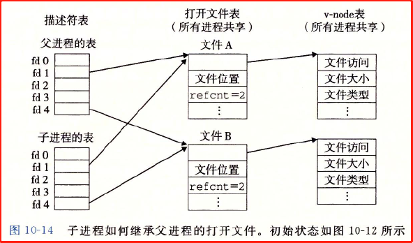


### **10.9 I/O重定向**

**Linux shell** 提供了 **I/O 重定向操作符**，允许用户将磁盘文件和标准输入联系起来。

`linux> ls > foo.txt // shell 将加载和执行 ls 程序并将标准输出重定向到磁盘文件 foo.txt`

当一个 Web 服务器代表客户端运行 CGI 程序时也会执行一种相似的重定向。

**dup2函数**

I/O 的重定向的工作方式是使用 **dup2 函数**

`int dup2(int oldfd, int newfd); //若成功返回描述符，若失败返回 -1。`

**dup2 函数赋值描述符表的表项 oldfd 到另一个表项 newfd，覆盖 newfd 之前的内容**。如果 newfd 已经打开了，它会在复制 oldfd 之前**关闭 newfd**。

例子：标准输入在该进程的描述符表中对应了一个描述符 fd1，该描述符原本指向了表示文件 A 的文件表项，重定向后指向了描述符 fd4 所指向的表示文件 B 的文件表项。

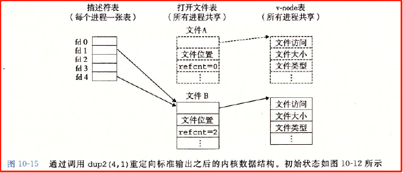

### **10.10 标准I/O**

C 语言定义了一个**标准 I/O 库**，为程序员提供了 Unix I/O 的较高级别的替代，它包括（但不止以下这些）：

1. **fopen 和 fclose：**打开和关闭文件

2. **fread 和 fwrite：**读字节和写字节

3. **fgets 和 fputs：**读字符串和写字符串

4. **scanf 和 printf：**复杂的格式化的 I/O 函数

标准 I/O 库将一个打开的文件模型化为一个**流**，一个流就是一个指向 FILE 类型的结构的指针。每个 ANSI C 程序开始时都有三个打开的流：stdin, stdout, stderr

`extern FILE *stdin; //标准输入（描述符为0）`

`extern FILE *stdout; //标准输出（描述符为1）` 

`extern FILE *stderr; //标准错误（描述符为2）`

**类型为 FILE 的流**是对**文件描述符和流缓冲区**的抽象。

**流缓冲区**的目的和 RIO 读缓冲区的目的一样：**使开销较高的 Linux I/O 系统调用的数量尽可能小。**

**一个示例**

比如有个程序要反复调用标准 I/O 的 getc 函数，每次读取一个字符。当第一次调用 getc 时，库通过调用一次 read 函数来**填充缓冲区**，然后将缓冲区中的第一个字节返回给应用程序。只要缓冲区还有未读字节，接下来 getc 都直接从流缓冲区得到服务。

### **10.11 综合:我该使用哪些I/O函数**

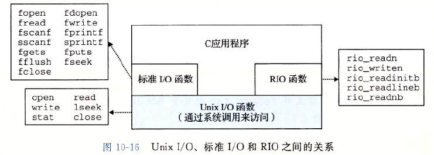

Unix I/O 是在操作系统内核里实现的。RIO 函数是本书作者编写的 read 和 write 的健壮的包装函数。

在程序中使用哪种函数遵循以下指导原则：

1. **只要有可能就使用标准 I/O。**

2. 不要使用 scanf 和 readlineb 来读**二进制文件**。二进制文件中 0xa 字节并不表示换行符。

3. 对网络套接字的 I/O 使用 RIO 函数。

**套接字**

Linux 对网络的抽象是**一种叫做套接字的文件类型。套接字由文件描述符来引用，称为套接字描述符。进程通过读写套接字描述符**来与其他计算机上进程通信。

**标准 I/O 流的限制**

**标准 I/O 流有两个限制：**

1. 输入函数不能紧跟在输出函数之间，除非中间插入对 fflush, fseek, fsetpos 或 rewind 的调用。fflush 清空缓冲区，后三个函数调用 Unix I/O 中的 lseek 来重置当前的文件位置。

2. 输出函数也不能紧跟在输入函数后。除非中间插入对 fseek, fsetpos 或 rewind 的调用，或输入函数遇到了文件结束符。

对套接字不能使用 lseek 函数，所以标准 I/O 流难以用来处理套接字。


## 第11章 网络编程

- 

### 11.1 客户端-服务器编程模型

网络应用都是基于客户端-服务器模型的。采用此模型，一个应用是由一个服务器进程和一个或多个客户端进程组成的。

服务器管理某种资源，并通过操作这种资源来为它的客户端提供服务。

客户端-服务器模型中的基本操作是事务。一个客户端-服务器事务包括以下四步：

1. 客户端需要服务时，向服务器发送一个请求，发起一个事务。比如客户端请求下载某个文件。

2. 服务器收到请求后，解释它并以适当方式操作自己的资源。比如服务器从磁盘读客户端所请求的文件。

3. 服务器给客户端发送一个响应，并等待下一个请求。比如将客户端请求的文件发送给客户端。

4. 客户端收到响应并处理它。比如客户端下载收到的文件。

注意客户端和服务器都是进程，两者可以在一台主机上也可以在不同的主机上。

### 11.2 网络

对主机而言，网络是一种 I/O 设备，是数据源和数据接收方。

一个插到 I/O 总线扩展槽的网络适配器提供了到网络的物理接口。从网络接收到的数据从适配器经过 I/O 和内存总线复制到内存，通常是 **DMA 传送**。

网络的最底层是 LAN（局域网），以太网是最流行的局域网技术。

在一个以太网中，多台主机通过电缆连接到一个集线器上。

多个以太网可以通过网桥连接起来构成一个桥接以太网。


网络的重要特性：它能由采用完全不同和不兼容技术的各种局域网和广域网组成。

网络协议要具备的两个基本能力：

1. 命名机制：提供一种一致的主机地址格式来表示主机地址。

2. 传送机制：定义了统一格式的协议数据单元来传送数据。

从客户端 A 发送数据到服务器端 B 的基本步骤

1. 主机 A 上的客户端进行一个**系统调用**，从客户端的虚拟地址空间复制数据到内核缓冲区中。

2. 主机 A 上的协议软件通过在数据前附加互联网络包头和 LAN1 帧头，创建了一个 LAN1 的帧，然后传送此帧到适配器。其中 LAN1 帧头寻址到路由器（理解：这应该是指链路层分组的首部），互联网络包头寻址到主机 B（理解：这应该指网络层 IP 数据报的首部）。

3. LAN1 适配器把该帧复制到网络上。

4. 此帧到达路由器时，路由器的 LAN1 适配器从电缆上读取它，并把它传送到协议软件。

5. 路由器从互联网络包头中提取出目的互联网络地址，并用它作为路由表的索引，确定向哪里转发这个包（本例中为 LAN2），路由器剥落掉旧的 LAN1 帧头，加上寻址到主机 B 的 LAN2 帧头，并把得到的帧传送到适配器。

6. 路由器的 LAN2 适配器复制该帧到网络上。

7. 此帧到达主机 B 时，它的适配器从电缆上读到此帧，并将它传送到协议软件。

8. 主机 B 上的协议软件剥落掉包头和帧头。当服务器进行一个读取这些数据的系统调用时，协议软件最终将得到的数据复制到服务器的虚拟地址空间。


总结：以上 8 个步骤可以分为两部分：数据在主机上通过系统调用在进程的虚拟地址空间与内核间传送，数据在网络间传送。

### 11.3 全球IP因特网

全球 IP 因特网即互联网。

互联网中的每台主机都有实现 TCP/IP 协议的软件。

互联网中的客户端和服务器混合使用套接字接口函数和 Unix I/O 函数来进行通信。通常将套接字函数实现为系统调用，这些系统调用会陷入内核，并调用各种内核模式的 TCP/IP 函数。


#### 11.3.1 IP地址

一个 IP 地址就是一个 32 位无符号整数。网络程序将 IP 地址存放在下面的 IP 地址结构中。

```Objective-C
struct in_addr {
    uint32_t s_addr;
} // 以网络字节顺序（大端法）存储，即使主机字节顺序是小端法。
```

TCP/IP 定义的统一的网络字节顺序为大端字节顺序。Unix 提供了几个函数来在网络和主机字节顺序间实现转换

现在的 intel 系统主要都是小端序。

```Objective-C
#include <arpa/inet.h>

uint32_t htonl(uint32_t hostlong);   //返回网络字节顺序
uint16_t htons(uint16_t hostshort);  //返回网络字节顺序

uint32_t ntohl(uint32_t netlong);   //返回按照主机字节顺序的值
uint16_t ntohs(uint16_t netshort);  //返回按照主机字节顺序的值
```

二进制IP地址与点分十进制串之间的转换

```Objective-C
#include <arpa/inet.h>
int inet_pton(AF_INET, const char *src, void *dst); //将点分十进制转换为二进制的网络字节顺序的 IP 地址。成功则返回 1，如果 src 为非法地址则返回 0，出错返回 -1。
const char *inet_ntop(AF_INET, const void*src, char *dst, socklen_t size); //将二进制网络字节顺序的 IP 地址转换为点分十进制，并把得到的字符串最多 size 个字节复制到 dst。
        //如果成功返回点分十进制串的指针，若出错返回 NULL。
```

#### 11.3.2 因特网域名

域名到 IP 地址之间的映射通过分布在世界各地的数据库来维护。

DNS 数据库包含上百万条主机条目结构，每一条定义了一组域名和一组 IP 地址之间的映射。

每台主机都有本地定义的域名 localhost，这个域名总是映射为回送地址 127.0.0.1。

多个域名可以映射到同一个 IP 地址，最常见的情况是多个域名映射到同一组的多个 IP 地址。

#### 11.3.3 因特网连接

客户端和服务器通过在连接上接收和发送字节流来通信。连接是点对点的与全双工的。

连接的端点是套接字，套接字地址由一个 IP 地址和一个 16 位的端口号组成。用 “地址：端口” 来表示。

客户端套接字地址中的端口是由内核自动分配的临时端口，服务器套接字地址中的端口通常是某个熟知端口。

Web 服务器常用端口 80，熟知名字为 http；邮件服务器使用端口 80，熟知名字为 smtp。

文件 /etc/services 中包含一张主机提供的熟知端口与熟知名字之间的映射。

一个连接由两端的套接字地址唯一确定。


### 11.4 套接字接口

套接字接口是一组函数，和 Unix I/O 函数结合起来创建网络应用。


#### 11.4.1 套接字地址结构

从内核角度看，套接字是通信的端点；从程序的角度看，**套接字是一个有相应描述符的打开文件**。

套接字地址存放在 sockaddr_in 结构中。

```Objective-C
'互联网套接字地址结构'
struct sockaddr_in {
    uint16_t        sin_family;  // 协议族
    uint16_t        sin_port;    // 网络字节顺序的端口号
    struct in_addr  sin_addr;    // 网络字节顺序的 IP 地址
    unsigned char   sin_zero[8];
}
'通用套接字地址结构'
struct sockaddr {
    uint16_t  sa_family;    // 协议族
    char      sa_data[14];  // 地址
}
```

connect, bind, accept 函数都接受一个指向通用 sockaddr 结构的指针，然后要求应用程序将于协议特定结构相关的指针强制转换成这个通用结构。

#### 11.4.2 socket函数

客户端和服务器都使用 socket 函数来创建一个套接字描述符。

`int socket(int domain, int type, int protocol); // 如果成功返回描述符，出错返回 -1`

socket 函数的使用

可以通过如下方式使套接字成为连接的一个端点。但最好使用`getaddrinfo` 函数来自动生成这些参数，这样可以让代码与协议无关。

`clientfd = socket(AF_INET, SOCK_STREAM, 0); // AF_INET 表示使用 32 位 IP 地址， SOCK_STREAM 表示这个套接字是连接的一个端点。`

socket 返回的 clientfd 描述符仅是部分打开的，还不能用于读写。如何完成打开套接字的工作，取决于是客户端还是服务器。

#### 11.4.3 connect函数

客户端通过调用 connect 函数来建立和服务器的连接。

`int connect(int clientfd, const struct sockaddr* addr, socklen_t addrlen); // 若成功返回 0，若出错返回 -1。`

connect 函数会阻塞，一直到连接成功建立或发生错误。

#### 11.4.4 bind函数

bind, listen 和 accept 函数都是服务器端用的函数。

bind 函数用来将套接字描述符和套接字地址关联起来。

`int bind(int sockfd, const struct sockaddr* addr, socklen_t addrlen); // 若成功返回 0，若出错返回 -1。`

#### 11.4.5 listen函数

listen 函数将套接字转换为监听状态。

`int listen(int sockfd, int backlog) // 若成功返回 0，若出错返回 -1。`

参数 backlog 通常会设置为一个较大的值，如 1024。

#### 11.4.6 accept函数

accept 函数用来接受来自客户端的连接请求。

`int accept(int listenfd, struct sockaddr* addr, int* addrlen); // 若成功返回已连接描述符，若出错返回 -1。`

11.4.7 主机和服务的转换

11.4.8 套接字接口的辅助函数

11.4.9 echo客户端和服务器的示例

11.5 Web服务器

11.5.1 Web基础

11.5.2 Web内容

11.5.3 HTTP事务

11.5.4 服务动态内容

11.6 综合: TINY Web服务器


## 第12章 并发编程

- 

（更多内容可以参考高性能计算）

如果逻辑控制流在时间上重叠，那么就称它们是并发的。注意：核心是在时间上重叠。

操作系统内核运行多个应用程序采用了并发机制，但并发不止用于内核，也用于应用程序中。应用级并发的一些应用场合：

1. 访问慢速 I/O 设备。当一个用户等待来自慢速 I/O 设备（比如磁盘）的数据到达时，内核会运行其他进程。

2. 与人交互。每次用户请求某种操作时（比如通过点击鼠标），一个独立的并发逻辑流被创建来执行这个操作。

3. 通过推迟工作以降低延迟。

4. 服务多个网络客户端。一个并发服务器为每个客户端创建一个单独的逻辑流。

5. 在多核机器上进行并行计算。被划分称并发流的应用程序通常在多个机器上比单处理器机器上快很多，因为这些流会并行执行，而不是交错执行。

使用应用级并发的应用程序称为并发程序。OS 提供了三种基本的构造并发程序的方法：

1. 进程。在这种形式下，每个逻辑控制流都是一个进程，由内核来调度和维护。因为进程有独立的虚拟地址空间，想要和其他流通信，控制流必须使用显式的进程间通信（IPC）机制。

2. I/O 多路复用。在这种形式下，应用程序在一个进程的上下文中显式地调用它们自己的逻辑流。逻辑流被模型化为状态机，数据到达文件描述符后，主程序显式地从一个状态转换到另一个状态。因为程序是一个单独的进程，所以所有的流都共享同一个地址空间。

3. 线程。线程是运行在一个单一进程上下文中的逻辑流，由内核进行调度。线程像进程流一样由内核进行调度，像 I/O 多路复用一样共享同一个虚拟地址空间。

### 12.1 基于进程的并发编程

构造并发程序最简单的方法就是用进程，使用 fork, exec, waitpid 等函数。

一个构造并发服务器的自然方法就是在父进程中接受客户端连接请求，然后创建一个新的子进程来为每个客户端提供服务。


上图中，服务器正在监听一个监听描述符（listenfd3）上的连接请求。然后服务器接受了客户端 1 的连接请求，返回给客户端 1 一个已连接描述符（connfd4）。这之后服务器要进行如下操作：

1. 派生一个子进程，这个子进程获得服务器描述符表的完整副本。

2. 子进程关闭它的副本中的监听描述符 listenfd3。（因为子进程不需要监听）

3. 父进程关闭它的已连接描述符 connfd4 的副本。（因为父进程不需要处理具体的连接任务，子进程处理即可）

因为父、子进程中的已连接描述符 connfd4 指向同一个文件表表项，所以父进程必须关闭它的 connfd 的副本，否则将永远不会释放 connfd4 的文件表条目，导致内存泄漏，进而耗光内存，系统崩溃。

#### 12.1.1 基于进程的并发服务器

```Objective-C
'一个基于进程的并发 echo 服务器'
#include "csapp.h"
void echo(int connfd);

void sigchld_handler(int sig)
{
    while(waitpid(-1, 0, WNOHANG) > 0) ;
    return;
}
```

12.1.2 进程的优劣

12.2 基于I/O多路复用的并发编程

12.2.1 基于I/O多路复用的并发事件驱动服务器

12.2.2 I/O多路复用技术的优劣

12.3 基于线程的并发编程

12.3.1 线程执行模型

12.3.2 Posix程

12.3.3 创建线程

12.3.4 终止线程

12.3.5 回收已终止线程的资源

12.3.6 分离线程

12.3.7 初始化线程

12.4 多线程程序中的共享变量

12.4.1 线程内存模型

12.4.2 将变量映射到内存

12.4.3 共享变量

12.5 用信号量同步线程

12.5.1 进度

12.5.2 信号量

12.5.3 使用信号量来实现互斥

12.5.4 利用信号量来调度共享资源

12.5.5 综合:基于预线程化的并发服务器

12.6 使用线程提高并行性

12.7 其他并发问题

12.7.1 线程安全

12.7.2 可重入性

12.7.3 在线程化的程序中使用已存在的库函数

12.7.4 竞争

12.7.5 死锁

