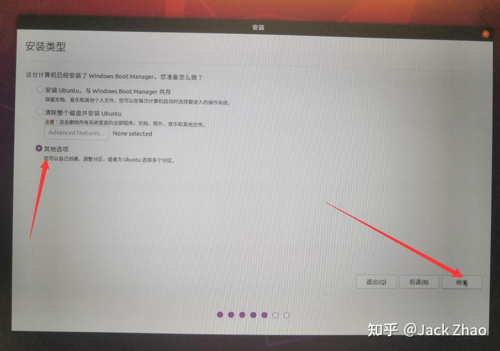

## 1. 使用启动盘重装

只需要按照安装的流程安装即可，在这个界面建议选择第一个界面（后面再扩容），比较方便



## 2.扩容

需要你预先准备好一定未分配的空间

先在新装好的系统中安装gparted

`sudo apt install gparted`

若无法下载可以先进行换源

之后插入启动盘并重启电脑，之后进入安装页面后选择try Ubuntu

进入之后在终端输入`sudo gparted`进行分区容量大小调整

具体可见：

[Ubuntu20.04根目录/home目录扩容（双系统，亲测有效） - SymPny - 博客园](https://www.cnblogs.com/SymPny/p/17605082.html#:~:text=用U盘启动)


## 3.算法组环境配置

[算法组环境配置指南](https://flowus.cn/84aeaf5f-7f57-4832-97aa-63d5d545d019)


## 4.python环境

[手把手教你如何在Ubuntu下安装Miniconda](https://zhuanlan.zhihu.com/p/368095197)

[conda使用指南](https://flowus.cn/81da72fc-187f-4b67-a016-dd986644e924)


## 5.ubuntu 其他配置

1.bash设置

```PowerShell
gedit ~/.bashrc
#添加以下内容
source /opt/ros/humble/setup.bash
alias cb='colcon build'
alias ss='source install/setup.bash'


```


2.中文输入法

[Ubuntu22.04安装Fcitx5中文输入法（详细）](https://zhuanlan.zhihu.com/p/508797663)


3.脚本写法

[初识脚本   理解 PATH 及  ~/.bashrc](https://zhuanlan.zhihu.com/p/46074591)

你可以在每个项目的根目录下创建一个名为 `.bash_aliases` 的文件，然后在这个文件中定义你的别名。然后，每次你在终端中进入这个项目的目录时，你可以通过以下命令来加载这些别名：

`source .bash_aliases`

## 6.相关软件

1.qq

[QQ Linux版-新不止步·乐不设限](https://im.qq.com/linuxqq/index.shtml)


2.微信

[微信](https://www.ubuntukylin.com/applications/106-cn.html)


3.microsoft edge

[了解 Microsoft Edge](https://www.microsoft.com/zh-cn/edge?form=MA13FJ)


4.vscode

更新软件包索引并安装依赖软件
`sudo apt update
sudo apt install software-properties-common apt-transport-https wget`
使用命令插入Microsoft GPG key
`wget -q [https://packages.microsoft.com/keys/microsoft.asc](https://packages.microsoft.com/keys/microsoft.asc) -O- | sudo apt-key add -`
启动vscode源仓库，输入
`sudo add-apt-repository "deb [arch=amd64] [https://packages.microsoft.com/repos/vscode](https://packages.microsoft.com/repos/vscode) stable main"`
apt软件源被启动，安装vscode软件包，需要一会儿时间
`sudo apt install code`
当新版本发布时更新升级安装包
`sudo apt update
sudo apt upgrade`


5.clash

[Releases · clash-verge-rev/clash-verge-rev](https://github.com/Clash-Verge-rev/clash-verge-rev/releases)

6.flutter

相信自己，跟随官方教程出一堆bug非常正常

找到flutter路径位置

`find /-name "*msedge" -type f 2> /dev/null`

使用microsoft的chrome内核

`find /-name "*msedge" -type f 2> /dev/null`

7.docker+gitlab

[Docker 搭建 Gitlab 服务器 (完整详细版)_docker gitlab_Touch&的博客-CSDN博客](https://blog.csdn.net/BThinker/article/details/124097795)

注意ip地址必须是本机的ip地址

可以通过`ifconfig | grep inet`查询

找到其中的ipv4地址（即不是127.0.0.1的那个ip地址）

你也可以直接用127.0.0.1作为ip地址，不过这种情况下别人无法访问你的服务器

8.zsh


9.nodejs与npm

`sudo apt install nodejs npm`

`npm config set registry https://registry.npmmirror.com`


10.Maven

[Linux环境安装Maven（详细图文）_linux安装maven-CSDN博客](https://blog.csdn.net/m0_52985087/article/details/136155283#:~:text=本文详细描述了如,安装成功的步骤。)


11.java

[Ubuntu 22.04.1配置java环境_ubuntu22.04java环境配置-CSDN博客](https://blog.csdn.net/qq_58259748/article/details/127201463)


