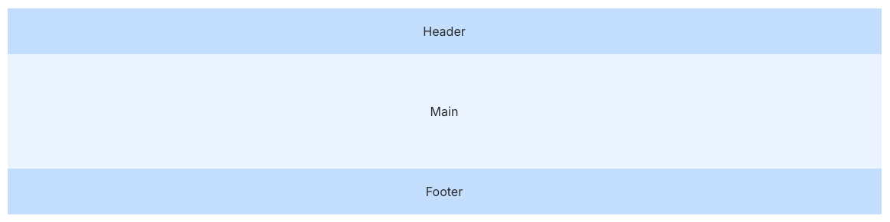
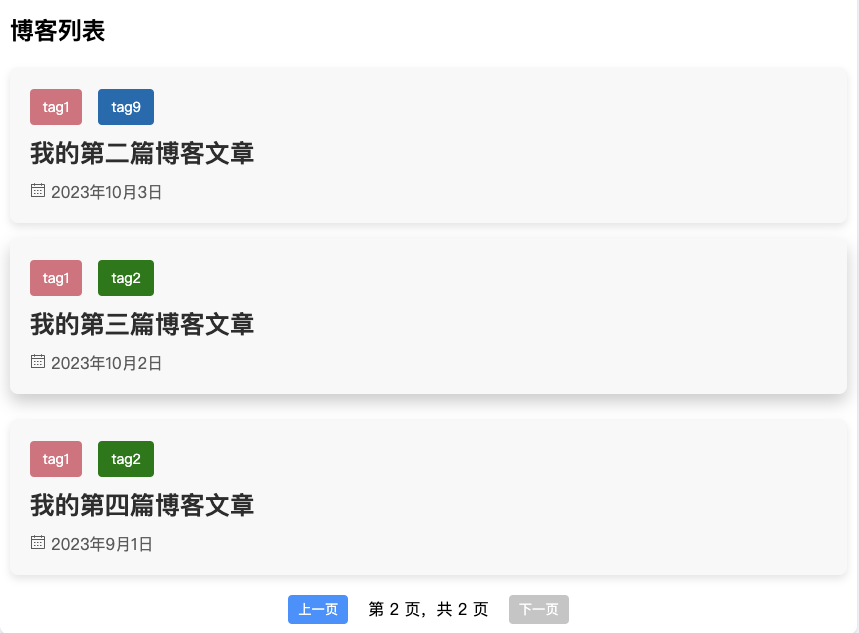

这是一切的开始

# 前言

博客前端基于Vue+Elementplus+ts搭建。肯定会有人会问，为什么要用Vue做博客这种静态网站，原因有如下几点：现在成熟的搭建博客的框架，如Hexo等虽然功能比较多，但是可扩展性还是不如Vue这种成熟的专门开发前端项目的框架，本人想后续开发更多Hexo不支持的功能，也为了之后可以接入后端让博客有更多功能；同时，我之前还没有开发完整前后端项目的经验，想拿这个项目练手。

UI库使用了和Vue较贴合的库Elementplus，~~饿了么出品必属精品~~，而且采用了ts代替js，至于为什么，可能只是因为我觉得更贴近现代的开发方式吧。

# 实施方案

## 基本架构

不同路由分别使用不同的视图组件，这些组件统一使用`Layout.vue`作为components。

## 布局

采用如下作为基本布局：



aside位于Main的左右两列，显示内容由不同视图组件动态调整。

## 博客列表

遍历目标文件夹中的每一个markdown文件，并用卡片的形式展示每一篇markdown的信息，使用`computed`对象中的属性实现翻页功能。



## 博客内容

这一步比较麻烦，要渲染markdown文件和提取markdown目录，并且让markdown目录可以交互。

### 正文内容

使用`markdown-it`以及一些扩展插件来处理markdown，再用katex渲染公式，最后将markdown根据自己设计的css转化为html代码。同时，使用`gray-matter`提取markdown的头部信息，包括：

- date

- slug

- title

- tags

### 目录

- 使用`markdown-it-table-of-contents`提取目录

```TypeScript
const tocMd = new MarkdownIt().use(markdownItToc, {
      includeLevel: [1, 2, 3],
      format: (heading: string) => heading,
      containerClass: 'toc',
      listType: 'ol'
    })
 const tocHtml = tocMd.render('[[toc]]\n' + markdownContent)
```

但是，这里提取出的内容包括markdown原文，只有第一个`div`里的才是目录，后续还要处理，提取出第一个div。

- 使用`markdown-it-anchor`处理交互，点击目录中的小标题可以跳转

```TypeScript
nextTick(() => {
  document.querySelectorAll('.post-toc a').forEach(anchor => {
    anchor.addEventListener('click', (e) => {
      e.preventDefault()
      const href = anchor.getAttribute('href')
      if (href) {
        const targetId = href.substring(1)
        const targetElement = document.getElementById(targetId)
        if (targetElement) {
          window.scrollTo({
            top: targetElement.offsetTop+80,
            behavior: 'smooth'
          })
        }
      }
    })
  })
})
```

`nextTick`可以实现一直监听动作。

- 目录显示当前阅读的位置

```TypeScript
   window.addEventListener('scroll', () => {
      const headings = document.querySelectorAll('h1, h2, h3')
      let lastVisibleHeading = ''
      headings.forEach(heading => {
        const rect = heading.getBoundingClientRect()
        if (rect.top <= 80) {
          lastVisibleHeading = heading.id
        }
      })
      activeHeading.value = lastVisibleHeading

      // 移除所有目录项的 active 类
      document.querySelectorAll('.post-toc a').forEach(anchor => {
        anchor.classList.remove('active')
        const li = anchor.closest('li')
        if (li) {
          li.classList.remove('active_li')
        }
      })

      // 为当前可见的标题对应的目录项添加 active 类
      for (const anchor of Array.from(document.querySelectorAll('.post-toc a'))) {
        const href = anchor.getAttribute('href') 
        if (href && href.substring(1) === activeHeading.value) {
          anchor.classList.add('active')
          const li = anchor.closest('li')
          if (li) {
            li.classList.add('active_li')
          }
          break
        }
      }

      document.querySelectorAll('.markdown-body a').forEach(anchor => {
          anchor.setAttribute('target', '_blank')
        })

    })
```

逻辑就是`lastVisibleHeading`和目录中的哪个标题最接近。

- 目录项过多时启用滚动条

采用`el-scrollbar`并设置max-height。

- 目录项过少时不显示目录

采用`v-if`即可。

## 标签

展示所有标签tag。并在点击对应标签时显示所有拥有这个标签的文章。

## 关于

原理同blogpost，显示一个markdown即可。

## 搜索

这个也比较麻烦，主要是细节多，实现了以下功能：

- 动态显示搜索结果

这个使用`el-input`解决也很简单，搜索功能如下，直接字符串判断是否包含内容即可。

```TypeScript
const searchPosts = () => {
      if (searchQuery.value) {
        const queries = searchQuery.value.toLowerCase().split(' ').filter(q => q)
        const postMatches = posts.value.map(post => {
          const matchCount = queries.reduce((count, query) => {
            return count + (post.title.toLowerCase().includes(query) || post.content.toLowerCase().includes(query) ? 1 : 0)
          }, 0)
          return { ...post, matchCount }
        })
        filteredPosts.value = postMatches
          .filter(post => post.matchCount > 0)
          .sort((a, b) => b.matchCount - a.matchCount)
        localStorage.setItem('filteredPosts', JSON.stringify(filteredPosts.value))
      } else {
        filteredPosts.value = []
        localStorage.removeItem('filteredPosts')
      }
      localStorage.setItem('searchQuery', searchQuery.value)
    }
```

- 匹配内容高亮与匹配内容的片段显示

高亮使用正则表达式去匹配就可以了。匹配内容的片段显示需要将各个匹配到的内容的附近截出一部分内容再连接就行，这里有个细节是如果两个匹配的字段很接近，就不能分成两段内容，这两个字段应该在同一个片段内。

- 多关键词搜索

用空格分隔输入内容，提取出各个关键词分别匹配

上两部分的关键代码如下：

```TypeScript
const highlight = (text: string) => {
      if (!searchQuery.value) return text
      let queries1 = searchQuery.value.split(' ').filter(q => q)
      for(let i = 0; i < queries1.length; i++) {
        if('[…]'.includes(queries1[i])) {
          queries1[i] = ''
        }
      }

  const queriesString = queries1.join(' ').replace(/[-\/\\^$*+?.()|[\]{}]/g, '\\$&');
  const queries = queriesString.split(' ').filter(q => q);
  const matches: { start: number, end: number }[]  = []

  queries.forEach(query => {
    const regex = new RegExp(`(${query})`, 'gi')
    let match
    while ((match = regex.exec(text)) !== null) {
      matches.push({ start: match.index, end: regex.lastIndex })
    }
  })

  matches.sort((a, b) => a.start - b.start)

  let highlightedText = ''
  let lastIndex = 0

  matches.forEach(match => {
    highlightedText += text.substring(lastIndex, match.start)
    highlightedText += `<span class="highlight">${text.substring(match.start, match.end)}</span>`
    lastIndex = match.end
  })

  highlightedText += text.substring(lastIndex)

  return highlightedText
}

const highlightSnippet = (text: string) => {

  const queries = searchQuery.value.toLowerCase().split(' ').filter(q => q)
  const indices: number[] = []

  queries.forEach(query => {
    let index = text.toLowerCase().indexOf(query)
    while (index !== -1) {
      indices.push(index)
      index = text.toLowerCase().indexOf(query, index + query.length)
    }
  })

  indices.sort((a, b) => a - b)

  const snippetParts: string[] = []

  let prevStart = 0
  let prevEnd = 30

  indices.forEach((index) => {
    const partStart = Math.max(0, index - 30)
    const partEnd = Math.min(text.length, index + queries[0].length + 30)
    if (partStart > prevEnd) {
      snippetParts.push(text.substring(prevStart, prevEnd) + '[…]')
      prevStart = partStart
    }
    prevEnd = partEnd
  })

  snippetParts.push(text.substring(prevStart,prevEnd) + '[…]')

  const highlightedSnippet = snippetParts.join('')

  return highlight(highlightedSnippet)
}
```

- 去除诸如`'[', '  ', '...'`之类无意义的搜索内容

## 黑夜模式

elementplus自带黑夜模式的css文件，除此之外的组件自己设计了dark-mode时的css，暂时不知道有没有更优雅的方式

## 响应式设计

几乎全是用ts代码判断屏幕宽度，并动态调整一些内容的显示与否，空列的宽度等，比较乱，没有做同意管理，扩展性不好。

## 主页

主要是css和页面的设计，选了个好看的图片，看着还行。

# 一些神奇的bug

1. css无法生效

原因：`<style scoped>`里的内容无法作用到v-html上。

解决方案：使用`:deep(.class-name)`可以提高优先级，或者取消`scoped`属性。

1. Buffer未定义问题

原因：浏览器环境中使用了 Node.js 的`Buffer`模块，而在浏览器环境中并没有内置的`Buffer`类。

解决方案：在`main.ts`加如下内容

```TypeScript
if (typeof (window as any).Buffer === "undefined") { 
   (window as any).Buffer = buffer.Buffer;
}
```

1. 数学公式不能换行

原因：html中`\\`都被转义成了`\`

解决方案：公式的换行从`\\`变成`\\\\`

1. github pages未能部署

目前没有解决

# 未来开发计划

这个应该会写在github里，这里就不写了，仓库地址为：

[https://github.com/herbertskyper/Skyper_Blog](https://github.com/herbertskyper/Skyper_Blog)

# 结语

第一次写前端，感觉还是写的乱乱的，~~下一次可能就重构了~~。而且功能还挺单一的，并且此项目是效仿Hugo主题写的，缺少个性，日后再改进。看似这个博客很好搭，但是实际上还是写了一周，与各种各样的错误~~和AI~~搏斗，css的设计也很考察"眼力"，比较累，而且整个过程颇有重复造轮子之嫌，下次写项目要学会多复用。

在开发过程中发现Tailwind css那种可以直接在html代码里控制各个组件大小、显示方式等的功能和方便的响应式设计很好用，可惜那个时候博客已经块搭建完了，就没有使用了，后续可能会加上。而且我还发现pinia的跨组件或页面共享状态的功能很有用，类似”多文件通信“的功能很方便调整各个组件，可惜最后没有用上。

