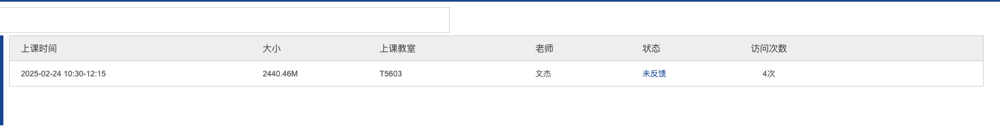
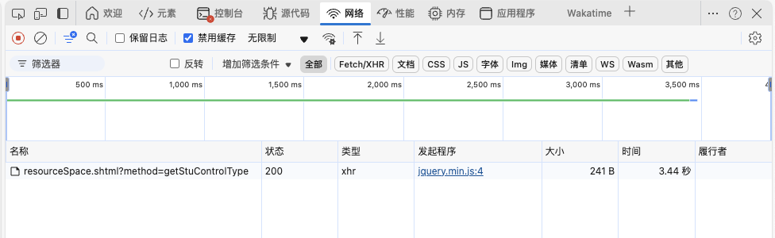
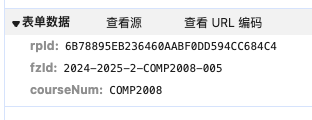

~~学校的网页真的是做的一个比一个差~~

首先进入你想听的课的视频列表

然后按F12进入开发者工具，并点击网络项。在这之后再点击随便一个想看的视频。

之后点击这个类型为xhr的项，再选择负载项，可以看到表单数据。

最后将相关数据按以下格式填入就可以得到视频的网址了，再访问这个网址就可以跳转到视频页面了。

`http://219.223.238.14:88/ve/back/rp/common/rpIndex.shtml?method=studyCourseDeatil&courseId={1}&dataSource=1&courseNum={2}&fzId={3}&rpId={4}&publicRpType=2,3`

一个填写完成的示例是
`http://219.223.238.14:88/ve/back/rp/common/rpIndex.shtml?method=studyCourseDeatil&courseId=16614&dataSource=1&courseNum=COMP2008&fzId=2024-2025-2-COMP2008-005&rpId=6B78895EB236460AABF0DD594CC684C4&publicRpType=2,3`

其中第一个位置的值可以在之前视频列表的url(第一步的那个页面)中找到，后三个都和表单数据一一对应。

~~不鉴权导致的~~