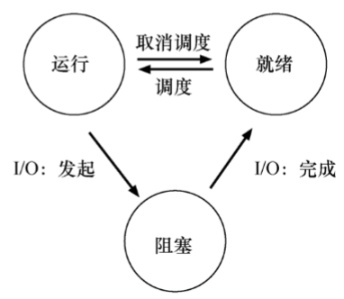
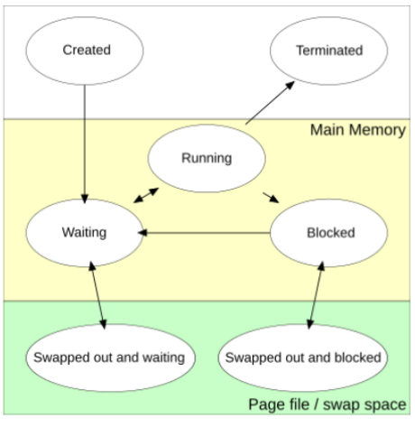

# 入门

## gdb调试与segmentation fault（段错误）

内存访问违例、非法内存访问、栈溢出
gcc -g 生成调试信息
run 运行程序，会停在报错的位置。

## Flops与缓存

常用Flops衡量代码实现的性能，flops表示每秒浮点运算次数
并行优化、访存优化
cache比内存快一个数量级
查看寄存器：

```PowerShell
    gdb ls # 对ls程序进行调试
    starti # 在程序的第一条指令处设置断点并启动程序
    info register # 显示所有通用寄存器、浮点寄存器和其他特殊寄存器的当前值
```

## Makefile

自动确定哪个文件重新编译，并非每次都全量编译
模式规则（自动匹配）
在makefile中链接的库可以不在主程序中显式导入！！！


## 进程





### fork

创建子进程
共享部分数据，写时复制（只有当其中一个进程尝试修改该资源时，系统才会为该进程创建资源的副本，以确保修改不会影响其他进程）

不同进程
能访问相同的变量，分别赋不同的值
实际不同地址空间，数据是独立的

注意父子进程可共享数据，但是不同进程之间不可以共享！

### exec

exec函数族下的函数execvp可以自动从$PATH中找到可执行文件
用指定的程序替换当前进程的镜像（见p3.c），不会执行之后的内容。

以上两者皆为系统调用
不同处理器架构system call的指令不相同

多进程或多进程会导致sys+user>real！！！


## 线程

- 数据可共享,即可以对同一个变量操作

- 同一进程下的不同线程可以并行执行在不同的CPU核上

### 线程相关函数

具体见`t0.c`

- tid:线程标识符,每一个线程都要pid

- 多线程任务CPU利用率可以大于100%

- fork和pthread都是调用的clone，clone是一个底层系统调用，可以用来创建进程或线程。

- 如果不调用`pthread_join`(线程结合)，则会变成“僵尸线程“，每个僵尸线程都会消耗一些系统资源，当有太多的僵尸线程的时候，可能会导致创建线程失败。

- 分离线程（detachd），使用`pthread_detach()`设置线程为分离状态后，线程结束时资源会被系统自动回收， 而不再需要进行 `pthread_join()` 操作。

### 多线程矩阵运算加速

分为固定大小的小块可以提高缓存的利用率！


## OpenMP

自动创建线程自动并行化
代码中加入`#pragma omp parallel`
用`gcc -fopenmp hello.c -o hello-omp`编译

### OpenMP参数

- parallel 用在一个代码块之前，表示这段代码将被多个线程并行执行，不涉及任务拆分

- 工作分发/工作共享

    - for 用于for循环之前，将循环分配到多个线程中并行执行（由编译器自行决定如何切分）

        - 使用时必须用`#pragma omp parallel for`

    - single

    - sections

    - workshare

### 常用子句

- private：指定变量是线程私有的

- shared：指定变量为多个线程间共享

- num_threads：指定线程的个数

使用例子`#pragma omp parallel shared(sharedVar)`

并行区域外定义的变量默认为多个线程shared，并行区域内定义的变量默认为多个线程private。

两层for循环中，若之前j未被定义，那么j就是private，若已经被定义，那么j就是shared，循环会提前结束。
如何解决？ 使用`#pragma omp parallel for collapse(2)`命令。`collaps`用于指定展开的层级。

注意，使用openmp时出入口不能是分支，如`break`等，但可以有exit等进程退出的指令。
`OMP_NUM_THREADS`环境变量用于指定线程数量

### 常用Runtime库函数

- omp_get_thread_num() 返回调用该函数的线程的线程号（ID）

- omp_get_num_threads() 返回当前并行区域中线程的总数


## MPI

主流的用法：MPI+OpenMP混合编程

- 多机之间MPI通信，单台节点上使用OpenMP

### 常用命令

- `mpicc`：`mpicc hellow.c -o hellow`

- `mpirun`:`mpirun -n 4 ./hellow` 启用多个进程

### 常用函数

示例见hellow.c

- MPI_Init:初始化MPI环境

    - 创建全局变量、创建通信器(MPI_COMM_WORLD)

    - 通信子中的每个进程都有一个ID，即秩（Rank）

    - 直接用`mpicc`就是多进程！不用由该函数启动。

- MPI_Finalize:终止MPI环境

    - 只是结束MPI的运行环境，之后还是多进程

### 点对点通信

- MPI_Send:发送消息

- MPI_Recv:接受消息

### 集合通信

- broadcast：将数据复制发送出去

- scatter：将数据拆分为多段发送出去

- gather：接收不同发送者的数据段拼接

- reduction：接收不同发送者的数据累加


## CPU浮点性能计算

1. AVX2：寄存器是256位，一次可以进行256/64=4个浮点操作

2. 有FMA，一条指令最多2条浮点操作，乘以2

3. 如果包含两个执行单元（EUs），能同时执行两条AVX指令，继续乘以2

4. 再乘以频率（AVX工作时的频率）、乘以物理核心数

## HPL测试

- 通过LU分解求解一个稠密线性方程组测试64位浮点峰值性能

    - 依赖BLAS库

- 专注于分布式内存系统的性能测试

    - 依赖MPI实现

    

    HPL.dat的写法及其使用（自动调参工具[https://www.advancedclustering.com/act_kb/tune-hpl-dat-file/](https://www.advancedclustering.com/act_kb/tune-hpl-dat-file/)）

